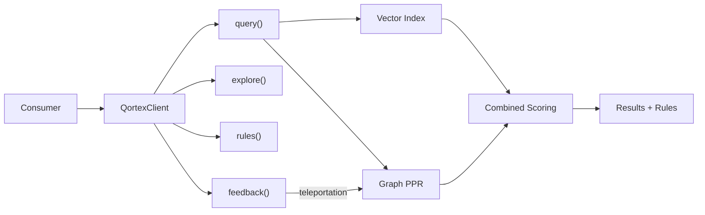
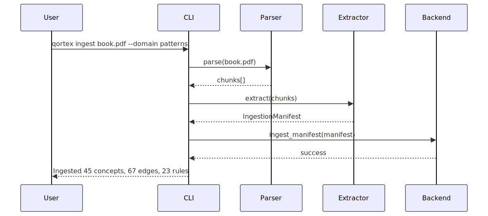
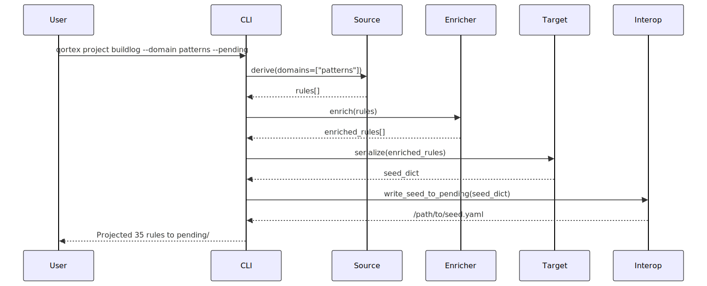

# Architecture Overview

qortex is persistent, learning memory for AI agents. It builds a knowledge graph from your content and combines vector similarity with graph traversal so retrieval improves from every feedback signal.

## High-Level Architecture



## Design Principles

### 1. Separation of Concerns

Each layer has a single responsibility:

| Layer | Responsibility |
|-------|----------------|
| Ingestion | Parse sources, extract concepts, produce manifests |
| Knowledge Graph | Store concepts/edges/rules, provide queries |
| Projection | Transform KG into consumable formats (rules, seeds, schemas) |
| Interop | Distribute outputs, coordinate consumers |

### 2. Protocol-Driven Design

Core abstractions are Python protocols, enabling:

- Multiple backend implementations (InMemory, Memgraph, future: Neo4j)
- Enrichment backends are pluggable: Template for deterministic output, Anthropic for LLM-powered context
- Projection targets (Buildlog, flat, JSON) are defined by the `ProjectionTarget` protocol

```python
class GraphBackend(Protocol):
    def connect(self) -> None: ...
    def add_node(self, node: ConceptNode) -> None: ...
    # ...

class ProjectionSource(Protocol):
    def derive(self, domains: list[str] | None) -> list[Rule]: ...

class Enricher(Protocol):
    def enrich(self, rules: list[Rule]) -> list[EnrichedRule]: ...
```

### 3. Manifest as Boundary

The `IngestionManifest` is the contract between ingestion and storage:

```python
@dataclass
class IngestionManifest:
    source: SourceMetadata
    domain: str
    concepts: list[ConceptNode]
    edges: list[ConceptEdge]
    rules: list[ExplicitRule]
```

This allows:
- Ingestors to be developed independently
- KG to be agnostic of source formats
- Future: ingestion as a separate microservice

### 4. Query Layer

The query layer provides graph-enhanced retrieval through QortexClient:



Unlike flat vector stores, qortex combines vector similarity with Personalized PageRank over typed edges. Feedback adjusts teleportation factors, creating a continuous learning loop.

### 5. Universal Schema

All outputs follow a single schema that any consumer can validate:

```yaml
persona: <flat string>
version: <integer>
rules:
  - rule: <text>
    category: <string>
    provenance: {...}
metadata: {...}
```

Benefits:
- Language-agnostic validation via JSON Schema
- Forward compatibility (additive changes only)
- Clear contract between qortex and consumers

## Package Structure

```
qortex/
├── core/
│   ├── models.py          # ConceptNode, ConceptEdge, Rule, etc.
│   ├── backend.py         # GraphBackend protocol, MemgraphBackend
│   ├── memory.py          # InMemoryBackend
│   ├── templates.py       # 30 edge rule templates
│   └── rules.py           # collect_rules_for_concepts()
├── client.py              # QortexClient protocol + LocalQortexClient
├── vec/
│   └── index.py           # NumpyVectorIndex, SqliteVecIndex
├── hippocampus/           # GraphRAG pipeline (PPR, combined scoring)
├── adapters/
│   ├── langchain.py           # QortexRetriever (BaseRetriever)
│   ├── langchain_vectorstore.py  # QortexVectorStore (VectorStore)
│   ├── crewai.py              # QortexKnowledgeStorage
│   ├── agno.py                # QortexKnowledge
│   └── mastra.py              # QortexVectorStore (MastraVector)
├── mcp/
│   └── server.py          # MCP tools (query, explore, rules, feedback...)
├── projectors/
│   ├── base.py            # ProjectionSource, Enricher, ProjectionTarget
│   ├── models.py          # EnrichedRule, ProjectionFilter
│   ├── projection.py      # Projection orchestrator
│   ├── sources/
│   │   └── flat.py        # FlatRuleSource
│   ├── enrichers/
│   │   └── template.py    # TemplateEnricher
│   └── targets/
│       ├── buildlog_seed.py  # BuildlogSeedTarget
│       └── _serialize.py     # serialize_ruleset()
├── enrichment/
│   ├── base.py            # EnrichmentBackend protocol
│   ├── anthropic.py       # AnthropicEnrichmentBackend
│   └── pipeline.py        # EnrichmentPipeline
├── interop.py             # Consumer interop protocol
├── interop_schemas.py     # JSON Schema definitions
└── cli/
    ├── __init__.py        # Typer app
    ├── infra.py           # qortex infra
    ├── ingest.py          # qortex ingest
    ├── project.py         # qortex project
    ├── inspect_cmd.py     # qortex inspect
    ├── viz.py             # qortex viz
    └── interop_cmd.py     # qortex interop
```

## Data Flow

### Ingestion Flow



### Projection Flow



## Key Abstractions

### GraphBackend

The storage abstraction with two implementations:

| Implementation | Use Case | Features |
|----------------|----------|----------|
| `InMemoryBackend` | Testing, development | Fast, no setup |
| `MemgraphBackend` | Production | Persistence, Cypher, MAGE algorithms |

### Projection Pipeline

Composable pipeline: Source → Enricher → Target

```python
projection = Projection(
    source=FlatRuleSource(backend),
    enricher=TemplateEnricher(domain),  # Optional
    target=BuildlogSeedTarget(persona),
)
result = projection.project(domains=["patterns"])
```

### Edge Rule Templates

30 templates (3 variants × 10 relation types) for deriving rules from edges:

| Relation | imperative | conditional | warning |
|----------|------------|-------------|---------|
| REQUIRES | "Ensure A has B" | "When using A, ensure B" | "A without B may fail" |
| CONTRADICTS | "Choose A or B, not both" | "If using A, avoid B" | "A and B conflict" |
| ... | ... | ... | ... |

### QortexClient

The consumer-facing query interface:

| Method | Purpose |
|--------|---------|
| `query(context, domains, top_k)` | Vec + PPR combined search, returns results + auto-surfaced rules |
| `explore(node_id, depth)` | Traverse typed edges, surface neighbors + linked rules |
| `rules(domains, concept_ids, categories)` | Get projected rules filtered by criteria |
| `feedback(query_id, outcomes)` | Report accepted/rejected outcomes, adjust teleportation factors |

One implementation (`LocalQortexClient`) for in-process use. The MCP server exposes the same methods as JSON-RPC tools for cross-language consumers.

### Framework Adapters

Drop-in replacements that wrap QortexClient:

| Adapter | Target Framework | Replaces |
|---------|-----------------|----------|
| `QortexVectorStore` | LangChain | Chroma, FAISS, Pinecone |
| `QortexRetriever` | LangChain | Any BaseRetriever |
| `QortexKnowledgeStorage` | CrewAI | ChromaDB default |
| `QortexKnowledge` | Agno | Any KnowledgeProtocol |
| MCP tools | Mastra (TS) | Any MastraVector impl |

### Consumer Interop

Hybrid pull/push model for any consumer:

- **Pull**: Consumers scan `pending/` directory
- **Push**: Consumers tail `signals/projections.jsonl`
- **Validation**: JSON Schema for any-language validation

## Extension Points

### Custom Backend

```python
class MyBackend:
    def connect(self) -> None: ...
    def add_node(self, node: ConceptNode) -> None: ...
    # Implement GraphBackend protocol
```

### Custom Enrichment

```python
class MyEnrichmentBackend:
    def enrich_batch(self, rules: list[Rule], domain: str) -> list[RuleEnrichment]:
        # Your enrichment logic
```

### Custom Projection Target

```python
class MyTarget:
    def serialize(self, rules: list[EnrichedRule]) -> MyOutputFormat:
        # Your serialization logic
```

## Roadmap

### Phase 2: HippoRAG-Style Retrieval (Implemented)

Graph-enhanced retrieval using Personalized PageRank for combined scoring:


Implemented in `src/qortex/hippocampus/`. The pipeline: vector search → PPR over typed edges → combined scoring → results with auto-surfaced rules. Feedback adjusts teleportation factors via the interoception layer.

See [Querying Guide](../guides/querying.md) for usage.

### Phase 3: Causal DAG

Confidence feedback loops from reward events:


See [GitHub Issues](https://github.com/Peleke/qortex/issues) for detailed roadmap.

## Next Steps

- [Projection Pipeline](projection-pipeline.md) - Deep dive into projection
- [Data Models](../reference/models.md) - Model reference
- [Consumer Integration](../guides/consumer-integration.md) - Interop details
