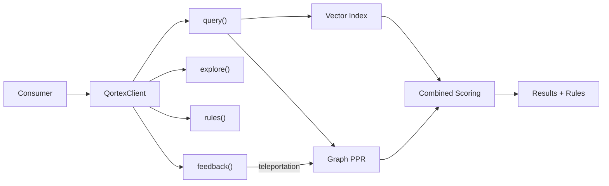
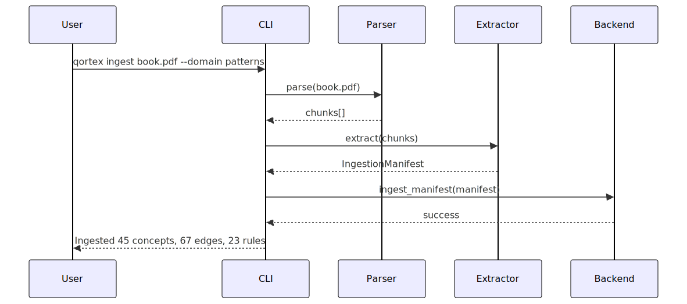
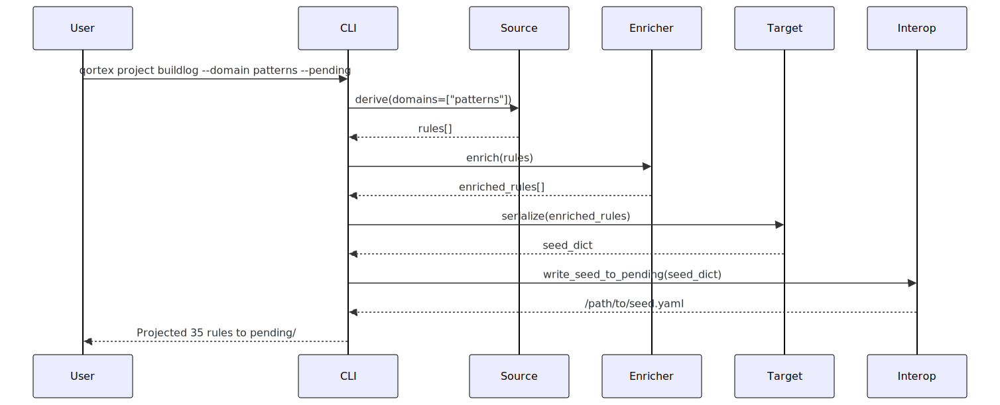

# Architecture Overview

qortex is persistent, learning memory for AI agents. It builds a knowledge graph from your content and combines vector similarity with graph traversal so retrieval improves from every feedback signal.

## High-Level Architecture



## REST API Layer


As of v0.8.0, qortex exposes a full REST API via `qortex serve`. The API is a Starlette ASGI application that delegates to `QortexService`, which in turn manages all backend connections.

```
                    ┌─────────────────────┐
                    │   MCP Clients       │
                    │  (Claude, Cursor)   │
                    └────────┬────────────┘
                             │ JSON-RPC (stdio/SSE)
                    ┌────────▼────────────┐
                    │   MCP Server        │
                    └────────┬────────────┘
                             │
┌───────────────┐   ┌───────▼─────────────┐   ┌───────────────────┐
│ HttpQortex    │──►│   QortexService     │◄──│ Framework Adapters│
│ Client        │   │ async_from_env()    │   │ (agno, LangChain) │
└───────────────┘   └───────┬─────────────┘   └───────────────────┘
  HTTP/REST                 │
  ┌─────────────────────────┼─────────────────────────┐
  │                         │                         │
  ▼                         ▼                         ▼
┌──────────┐     ┌──────────────────┐     ┌──────────────────┐
│PgVector  │     │PostgresLearning  │     │PostgresIntero-   │
│Index     │     │Store             │     │ceptionStore      │
└────┬─────┘     └────────┬─────────┘     └────────┬─────────┘
     │                    │                         │
     └────────────────────┼─────────────────────────┘
                          │
                 ┌────────▼─────────┐
                 │ Shared asyncpg   │
                 │ Pool (pool.py)   │
                 └────────┬─────────┘
                          │
                 ┌────────▼─────────┐
                 │   PostgreSQL     │
                 │   + pgvector     │
                 └──────────────────┘
```

The REST API supports two authentication modes:

- **API Key**: `Authorization: Bearer <key>` (set `QORTEX_API_KEY`)
- **HMAC-SHA256**: Request signing with `X-Qortex-Signature` and `X-Qortex-Timestamp` headers (set `QORTEX_HMAC_SECRET`). Replay protection enforces a 60-second timestamp window.

CORS is configurable via `QORTEX_CORS_ORIGINS` (comma-separated list of allowed origins).

## PostgreSQL Backend Stack

When `QORTEX_STORE=postgres` is set, all persistent state moves to PostgreSQL:

| Store | Class | What it persists |
|-------|-------|-----------------|
| Vectors | `PgVectorIndex` | Embeddings via pgvector extension |
| Learning | `PostgresLearningStore` | Thompson Sampling arm states (alpha, beta, pulls) |
| Interoception | `PostgresInteroceptionStore` | PPR teleportation factors + online edge buffer |

All three stores share a single asyncpg connection pool managed by `src/qortex/core/pool.py`. The pool is created once at startup by `QortexService.async_from_env()` and passed to each store. This avoids per-store connection overhead and simplifies transaction coordination.

```python
# How the shared pool is wired (simplified):
pool = await get_shared_pool(database_url)
vec_index = PgVectorIndex(pool=pool, dimensions=384)
learning_store = PostgresLearningStore(pool=pool)
interoception_store = PostgresInteroceptionStore(pool=pool)
```

## Design Principles

### 1. Separation of Concerns

Each layer has a single responsibility:

| Layer | Responsibility |
|-------|----------------|
| REST API | HTTP transport, authentication, CORS |
| Service | Backend wiring, lifecycle management |
| Ingestion | Parse sources, extract concepts, produce manifests |
| Knowledge Graph | Store concepts/edges/rules, provide queries |
| Projection | Transform KG into consumable formats (rules, seeds, schemas) |
| Interop | Distribute outputs, coordinate consumers |

### 2. Protocol-Driven Design

Core abstractions are Python protocols, enabling:

- Multiple backend implementations (InMemory, Memgraph, future: Neo4j)
- Enrichment backends are pluggable: Template for deterministic output, Anthropic for LLM-powered context
- Projection targets (Buildlog, flat, JSON) are defined by the `ProjectionTarget` protocol

```python
class GraphBackend(Protocol):
    def connect(self) -> None: ...
    def add_node(self, node: ConceptNode) -> None: ...
    # ...

class ProjectionSource(Protocol):
    def derive(self, domains: list[str] | None) -> list[Rule]: ...

class Enricher(Protocol):
    def enrich(self, rules: list[Rule]) -> list[EnrichedRule]: ...
```

### 3. Manifest as Boundary

The `IngestionManifest` is the contract between ingestion and storage:

```python
@dataclass
class IngestionManifest:
    source: SourceMetadata
    domain: str
    concepts: list[ConceptNode]
    edges: list[ConceptEdge]
    rules: list[ExplicitRule]
```

This allows:
- Ingestors to be developed independently
- KG to be agnostic of source formats
- Future: ingestion as a separate microservice

### 4. Query Layer

The query layer provides graph-enhanced retrieval through QortexClient:


```mermaid
graph LR
    CONSUMER[Consumer] --> CLIENT[QortexClient]
    CLIENT --> QUERY["query()"]
    CLIENT --> EXPLORE["explore()"]
    CLIENT --> RULES["rules()"]
    CLIENT --> FEEDBACK["feedback()"]
    QUERY --> VEC[Vector Index]
    QUERY --> PPR[Graph PPR]
    VEC --> COMBINE[Combined Scoring]
    PPR --> COMBINE
    COMBINE --> RESULTS[Results + Rules]
    FEEDBACK -->|teleportation| PPR
```

Unlike flat vector stores, qortex combines vector similarity with Personalized PageRank over typed edges. Feedback adjusts teleportation factors, creating a continuous learning loop.

### 5. Universal Schema

All outputs follow a single schema that any consumer can validate:

```yaml
persona: <flat string>
version: <integer>
rules:
  - rule: <text>
    category: <string>
    provenance: {...}
metadata: {...}
```

Benefits:
- Language-agnostic validation via JSON Schema
- Forward compatibility (additive changes only)
- Clear contract between qortex and consumers

## Package Structure

```
qortex/
├── core/
│   ├── models.py          # ConceptNode, ConceptEdge, Rule, etc.
│   ├── backend.py         # GraphBackend protocol, MemgraphBackend
│   ├── memory.py          # InMemoryBackend
│   ├── pool.py            # Shared asyncpg pool singleton
│   ├── templates.py       # 30 edge rule templates
│   └── rules.py           # collect_rules_for_concepts()
├── client.py              # QortexClient protocol + LocalQortexClient
├── http_client.py         # HttpQortexClient (async remote client)
├── service.py             # QortexService + async_from_env() factory
├── serve/
│   ├── app.py             # Starlette ASGI application
│   ├── auth.py            # API key + HMAC middleware
│   ├── routes.py          # REST API route handlers
│   └── cors.py            # CORS configuration
├── vec/
│   ├── index.py           # NumpyVectorIndex, SqliteVecIndex
│   └── pgvector.py        # PgVectorIndex (async, pgvector backend)
├── hippocampus/           # GraphRAG pipeline (PPR, combined scoring)
├── interoception/
│   └── postgres.py        # PostgresInteroceptionStore
├── adapters/
│   ├── langchain.py           # QortexRetriever (BaseRetriever)
│   ├── langchain_vectorstore.py  # QortexVectorStore (VectorStore)
│   ├── crewai.py              # QortexKnowledgeStorage
│   ├── agno.py                # QortexKnowledge
│   └── mastra.py              # QortexVectorStore (MastraVector)
├── mcp/
│   └── server.py          # MCP tools (query, explore, rules, feedback...)
├── projectors/
│   ├── base.py            # ProjectionSource, Enricher, ProjectionTarget
│   ├── models.py          # EnrichedRule, ProjectionFilter
│   ├── projection.py      # Projection orchestrator
│   ├── sources/
│   │   └── flat.py        # FlatRuleSource
│   ├── enrichers/
│   │   └── template.py    # TemplateEnricher
│   └── targets/
│       ├── buildlog_seed.py  # BuildlogSeedTarget
│       └── _serialize.py     # serialize_ruleset()
├── enrichment/
│   ├── base.py            # EnrichmentBackend protocol
│   ├── anthropic.py       # AnthropicEnrichmentBackend
│   └── pipeline.py        # EnrichmentPipeline
├── interop.py             # Consumer interop protocol
├── interop_schemas.py     # JSON Schema definitions
└── cli/
    ├── __init__.py        # Typer app (+ qortex serve, qortex migrate)
    ├── infra.py           # qortex infra
    ├── ingest.py          # qortex ingest
    ├── project.py         # qortex project
    ├── inspect_cmd.py     # qortex inspect
    ├── viz.py             # qortex viz
    └── interop_cmd.py     # qortex interop

packages/
├── qortex-learning/       # Standalone PyPI package
│   └── src/qortex/learning/
│       ├── learner.py     # Async Learner.create(), select, observe
│       ├── store.py       # LearningStore protocol, SqliteLearningStore
│       ├── postgres.py    # PostgresLearningStore
│       ├── strategy.py    # ThompsonSampling
│       └── types.py       # Arm, ArmOutcome, ArmState
├── qortex-observe/        # Observability (events, metrics, traces)
├── qortex-ingest/         # Content ingestion
└── qortex-online/         # Online indexing pipeline
```

## Data Flow

### Ingestion Flow



### Projection Flow



## Abstractions

### GraphBackend

The storage abstraction with two implementations:

| Implementation | Use Case | Features |
|----------------|----------|----------|
| `InMemoryBackend` | Testing, development | Fast, no setup |
| `MemgraphBackend` | Production | Persistence, Cypher, MAGE algorithms |

### Storage Backends (v0.8.0+)

When `QORTEX_STORE=postgres`, all persistent stores use PostgreSQL via a shared asyncpg pool:

| Store | SQLite (default) | PostgreSQL |
|-------|------------------|------------|
| Vectors | `SqliteVecIndex` | `PgVectorIndex` (pgvector) |
| Learning | `SqliteLearningStore` | `PostgresLearningStore` |
| Interoception | In-memory | `PostgresInteroceptionStore` |

The `PgVectorIndex` supports the full `VectorIndex` protocol plus `iter_all()` for streaming reads (used by `qortex migrate vec`).

The `PostgresInteroceptionStore` persists PPR teleportation factors and the online edge promotion buffer across restarts, which was previously lost on shutdown.

The `PostgresLearningStore` persists Thompson Sampling arm states (alpha, beta, pulls, total_reward) and supports the same async `LearningStore` protocol as `SqliteLearningStore`.

### Projection Pipeline

Composable pipeline: Source → Enricher → Target

```python
projection = Projection(
    source=FlatRuleSource(backend),
    enricher=TemplateEnricher(domain),  # Optional
    target=BuildlogSeedTarget(persona),
)
result = projection.project(domains=["patterns"])
```

### Edge Rule Templates

30 templates (3 variants × 10 relation types) for deriving rules from edges:

| Relation | imperative | conditional | warning |
|----------|------------|-------------|---------|
| REQUIRES | "Ensure A has B" | "When using A, ensure B" | "A without B may fail" |
| CONTRADICTS | "Choose A or B, not both" | "If using A, avoid B" | "A and B conflict" |
| ... | ... | ... | ... |

### QortexClient

The consumer-facing query interface:

| Method | Purpose |
|--------|---------|
| `query(context, domains, top_k)` | Vec + PPR combined search, returns results + auto-surfaced rules |
| `explore(node_id, depth)` | Traverse typed edges, surface neighbors + linked rules |
| `rules(domains, concept_ids, categories)` | Get projected rules filtered by criteria |
| `feedback(query_id, outcomes)` | Report accepted/rejected outcomes, adjust teleportation factors |

Two implementations ship with qortex:

- `LocalQortexClient` for in-process use (no network)
- `HttpQortexClient` for remote access via the REST API (async, protocol-compatible)

The MCP server exposes the same methods as JSON-RPC tools for cross-language consumers.

### Framework Adapters

Drop-in replacements that wrap QortexClient:

| Adapter | Target Framework | Replaces |
|---------|-----------------|----------|
| `QortexVectorStore` | LangChain | Chroma, FAISS, Pinecone |
| `QortexRetriever` | LangChain | Any BaseRetriever |
| `QortexKnowledgeStorage` | CrewAI | ChromaDB default |
| `QortexKnowledge` | Agno | Any KnowledgeProtocol |
| MCP tools | Mastra (TS) | Any MastraVector impl |

### Consumer Interop

Hybrid pull/push model for any consumer:

- **Pull**: Consumers scan `pending/` directory
- **Push**: Consumers tail `signals/projections.jsonl`
- **Validation**: JSON Schema for any-language validation

## Extension Points

### Custom Backend

```python
class MyBackend:
    def connect(self) -> None: ...
    def add_node(self, node: ConceptNode) -> None: ...
    # Implement GraphBackend protocol
```

### Custom Enrichment

```python
class MyEnrichmentBackend:
    def enrich_batch(self, rules: list[Rule], domain: str) -> list[RuleEnrichment]:
        # Your enrichment logic
```

### Custom Projection Target

```python
class MyTarget:
    def serialize(self, rules: list[EnrichedRule]) -> MyOutputFormat:
        # Your serialization logic
```

## Roadmap

### Phase 2: HippoRAG-Style Retrieval (Implemented)

Graph-enhanced retrieval using Personalized PageRank for combined scoring:


Implemented in `src/qortex/hippocampus/`. The pipeline: vector search → PPR over typed edges → combined scoring → results with auto-surfaced rules. Feedback adjusts teleportation factors via the interoception layer.

See [Querying Guide](../guides/querying.md) for usage.

### Phase 3: Causal DAG

Confidence feedback loops from reward events:


See [GitHub Issues](https://github.com/Peleke/qortex/issues) for detailed roadmap.

## Next Steps

- [Projection Pipeline](projection-pipeline.md) - Deep dive into projection
- [Data Models](../reference/models.md) - Model reference
- [Consumer Integration](../guides/consumer-integration.md) - Interop details
