# Projection Pipeline

The projection pipeline transforms knowledge graph data into actionable rules for consumers.

## Pipeline Stages



| Stage | Input | Output | Responsibility |
|-------|-------|--------|----------------|
| **Source** | KG backend | `list[Rule]` | Extract explicit + derived rules |
| **Enricher** | `list[Rule]` | `list[EnrichedRule]` | Add context, antipattern, rationale |
| **Target** | `list[EnrichedRule]` | Format-specific | Serialize to output format |

## Projection Orchestrator

The `Projection` class composes the pipeline:

```python
@dataclass
class Projection(Generic[T]):
    source: ProjectionSource
    target: ProjectionTarget[T]
    enricher: Enricher | None = None

    def project(
        self,
        domains: list[str] | None = None,
        filters: ProjectionFilter | None = None,
    ) -> T:
        rules = self.source.derive(domains=domains, filters=filters)
        if self.enricher:
            enriched = self.enricher.enrich(rules)
            return self.target.serialize(enriched)
        return self.target.serialize(rules)
```

## Source Stage

### FlatRuleSource

The default source extracts:

1. **Explicit rules**: Directly from `ExplicitRule` records
2. **Derived rules**: Generated from edges using templates



### Rule Derivation

For each edge, the source:

1. Selects a template based on relation type and variant
2. Renders the template with concept names
3. Creates a `Rule` with full provenance

```python
def _derive_one(self, edge: ConceptEdge, source: ConceptNode, target: ConceptNode) -> Rule:
    template = select_template(edge, variant="imperative")
    text = template.render(source_name=source.name, target_name=target.name)

    return Rule(
        id=f"derived:{edge.source_id}->{edge.target_id}:{template.variant}",
        text=text,
        domain=source.domain,
        derivation="derived",
        source_concepts=[edge.source_id, edge.target_id],
        confidence=edge.confidence,
        metadata={
            "relation_type": edge.relation_type.value,
            "template_id": template.id,
            "template_variant": template.variant,
            "template_severity": template.severity,
        },
    )
```

### Filtering

The `ProjectionFilter` controls which rules are extracted:

```python
@dataclass
class ProjectionFilter:
    min_confidence: float = 0.0      # Minimum confidence threshold
    categories: list[str] | None = None  # Filter by category
    exclude_derived: bool = False    # Exclude derived rules
```

## Enricher Stage

### Template Enrichment

Fast, deterministic enrichment using templates:

```python
def _enrich_one(self, rule: Rule) -> RuleEnrichment:
    tags = [rule.domain]
    if rule.category:
        tags.append(rule.category)
    if rule.derivation == "derived":
        tags.append("derived")

    return RuleEnrichment(
        context=f"When working in the {rule.domain} domain",
        antipattern="Violating this rule",
        rationale=rule.text,
        tags=tags,
        enrichment_version=1,
        enriched_at=datetime.now(timezone.utc),
        enrichment_source="template",
    )
```

### LLM Enrichment

Rich, contextual enrichment using Claude:



The `EnrichmentPipeline` handles:

- Batching for API efficiency
- Automatic fallback on failure
- Statistics tracking

```python
pipeline = EnrichmentPipeline(
    backend=AnthropicEnrichmentBackend(),
)
enriched = pipeline.enrich(rules, domain="error_handling")

# Check what happened
print(f"Succeeded: {pipeline.stats.succeeded}")
print(f"Failed (used fallback): {pipeline.stats.failed}")
```

### Re-Enrichment

When new context becomes available:

```python
new_enrichment = fallback.re_enrich(
    rule=rule,
    existing=current_enrichment,
    new_context="Also applies to async operations",
)
# Increments enrichment_version
# Appends to source_contexts history
```

## Target Stage

### Serialization

The target serializes enriched rules to the universal schema:

```python
def serialize(self, rules: list[EnrichedRule]) -> dict[str, Any]:
    return {
        "persona": self.persona_name,
        "version": self.version,
        "rules": [self._rule_to_seed(r) for r in rules],
        "metadata": {
            "source": "qortex",
            "source_version": self.source_version,
            "projected_at": datetime.now(timezone.utc).isoformat(),
            "rule_count": len(rules),
        },
    }
```

### Provenance Threading

Template metadata flows from derivation through to output:


```yaml
provenance:
  id: derived:circuit_breaker->timeout:imperative
  domain: error_handling
  derivation: derived
  confidence: 0.95
  source_concepts: [circuit_breaker, timeout]
  relation_type: requires        # From edge
  template_id: requires:imperative  # From template
  template_variant: imperative   # From template
  template_severity: null        # From template
  graph_version: "2026-02-05T12:00:00Z"  # From caller
```

## Pipeline Composition

### Full Pipeline

```python
projection = Projection(
    source=FlatRuleSource(backend=backend),
    enricher=TemplateEnricher(domain="error_handling"),
    target=BuildlogSeedTarget(persona_name="rules"),
)
result = projection.project(domains=["error_handling"])
```

### Without Enrichment

```python
projection = Projection(
    source=FlatRuleSource(backend=backend),
    enricher=None,  # Skip enrichment
    target=BuildlogSeedTarget(persona_name="rules"),
)
```

### With LLM Enrichment

```python
projection = Projection(
    source=FlatRuleSource(backend=backend),
    enricher=EnrichmentPipeline(backend=AnthropicEnrichmentBackend()),
    target=BuildlogSeedTarget(persona_name="rules"),
)
```

## Extension Points

### Custom Source

Implement `ProjectionSource`:

```python
class ContextAwareSource:
    """HippoRAG-style retrieval source."""

    def __init__(self, backend: GraphBackend, query: str):
        self.backend = backend
        self.query = query

    def derive(
        self,
        domains: list[str] | None = None,
        filters: ProjectionFilter | None = None,
    ) -> list[Rule]:
        # Use PPR to find relevant concepts
        scores = self.backend.personalized_pagerank(
            source_ids=self._match_query(),
        )
        # Return rules related to high-scoring concepts
        return self._rules_for_concepts(scores)
```

### Custom Enricher

Implement `Enricher`:

```python
class DomainSpecificEnricher:
    """Enricher with domain-specific knowledge."""

    def enrich(self, rules: list[Rule]) -> list[EnrichedRule]:
        return [self._enrich_one(r) for r in rules]

    def _enrich_one(self, rule: Rule) -> EnrichedRule:
        # Domain-specific enrichment logic
        ...
```

### Custom Target

Implement `ProjectionTarget`:

```python
class MarkdownTarget:
    """Output rules as Markdown."""

    def serialize(self, rules: list[EnrichedRule]) -> str:
        lines = ["# Rules\n"]
        for r in rules:
            lines.append(f"## {r.rule.id}\n")
            lines.append(f"{r.rule.text}\n")
            if r.enrichment:
                lines.append(f"\n**Context:** {r.enrichment.context}\n")
        return "\n".join(lines)
```

## Performance Considerations

### Batching

LLM enrichment batches rules for efficiency:

```python
# Good: batch enrichment
enriched = pipeline.enrich(rules, domain="error_handling")

# Avoid: individual enrichment calls
for rule in rules:
    enriched.append(pipeline.enrich([rule], domain)[0])
```

### Filtering Early

Apply filters at the source stage to reduce downstream processing:

```python
# Good: filter at source
rules = source.derive(
    domains=["error_handling"],
    filters=ProjectionFilter(min_confidence=0.8),
)

# Avoid: filter after enrichment
rules = source.derive(domains=["error_handling"])
rules = [r for r in rules if r.confidence >= 0.8]  # Wasted enrichment
```

### Parallel Domains

Project multiple domains in parallel:

```python
import asyncio

async def project_all():
    domains = ["error_handling", "testing", "security"]
    tasks = [project_domain(d) for d in domains]
    return await asyncio.gather(*tasks)
```

## Debugging

### Inspect Derived Rules

```python
source = FlatRuleSource(backend=backend)
rules = source.derive(domains=["error_handling"])

for rule in rules:
    if rule.derivation == "derived":
        print(f"Rule: {rule.text}")
        print(f"  Template: {rule.metadata.get('template_id')}")
        print(f"  Concepts: {rule.source_concepts}")
```

### Check Enrichment Stats

```python
pipeline = EnrichmentPipeline(backend=anthropic_backend)
enriched = pipeline.enrich(rules, domain="error_handling")

print(f"Total: {pipeline.stats.total}")
print(f"Succeeded: {pipeline.stats.succeeded}")
print(f"Failed: {pipeline.stats.failed}")
print(f"Skipped: {pipeline.stats.skipped}")
```

### Validate Output

```python
from qortex.interop_schemas import validate_seed

result = projection.project(domains=["error_handling"])
errors = validate_seed(result)
if errors:
    print(f"Invalid output: {errors}")
```

## Next Steps

- [Architecture Overview](overview.md) - System design
- [Projecting Rules](../guides/projecting-rules.md) - Usage guide
- [API Reference](../reference/api.md) - Detailed API docs
