# Core Concepts

qortex is built around a knowledge graph that stores concepts and typed relationships. The graph also records feedback signals, so retrieval improves over time. Rules are one output format; the graph itself is the persistent layer.

## The Knowledge Graph



## Domains

A **domain** is an isolated subgraph, like a schema in a database. Each domain contains concepts, edges, and rules that belong together semantically.

```python
backend.create_domain("error_handling", "Error handling patterns")
backend.create_domain("testing", "Testing strategies")
```

!!! tip "Domain Isolation"
    Concepts in different domains don't interact by default. This allows you to ingest multiple books or sources without cross-contamination.

## Concepts (Nodes)

A **concept** represents an idea, pattern, or entity extracted from source material.

```python
from qortex.core.models import ConceptNode

node = ConceptNode(
    id="circuit_breaker",           # Unique within the graph
    name="Circuit Breaker",         # Human-readable name
    description="Pattern that...",  # Full description
    domain="error_handling",        # Which domain it belongs to
    source_id="patterns_book",      # Provenance
    source_location="Chapter 3",    # Optional: where in source
    confidence=0.95,                # Extraction confidence
)
```

## Edges (Relationships)

An **edge** connects two concepts with a semantic relationship type.

```python
from qortex.core.models import ConceptEdge, RelationType

edge = ConceptEdge(
    source_id="circuit_breaker",
    target_id="timeout",
    relation_type=RelationType.REQUIRES,
    confidence=0.9,
)
```

### Relation Types

qortex supports 10 semantic relation types:

| Type | Meaning | Example |
|------|---------|---------|
| `REQUIRES` | A needs B to work | Circuit Breaker requires Timeout |
| `CONTRADICTS` | A and B are mutually exclusive | Retry contradicts Fail Fast |
| `REFINES` | A is a specific form of B | JWT refines Authentication |
| `IMPLEMENTS` | A is a concrete form of B | Redis implements Cache |
| `PART_OF` | A is a component of B | Handler is part of Middleware |
| `USES` | A depends on B | Service uses Database |
| `SIMILAR_TO` | A and B are analogous | Saga similar to Transaction |
| `ALTERNATIVE_TO` | A can substitute for B | gRPC alternative to REST |
| `SUPPORTS` | A provides evidence for B | Benchmark supports Optimization |
| `CHALLENGES` | A provides counter-evidence for B | Edge Case challenges Assumption |

## Rules

Rules are actionable guidelines extracted or derived from the knowledge graph.

### Explicit Rules

Rules stated directly in source material:

```python
from qortex.core.models import ExplicitRule

rule = ExplicitRule(
    id="rule:timeout",
    text="Always configure timeouts for external calls",
    domain="error_handling",
    source_id="patterns_book",
    concept_ids=["timeout", "circuit_breaker"],  # Related concepts
    category="architectural",
    confidence=1.0,
)
```

### Derived Rules

Rules generated from edges using templates. qortex has 30 built-in templates (3 variants × 10 relation types):

| Variant | Style | Example |
|---------|-------|---------|
| `imperative` | Direct command | "Ensure Circuit Breaker has Timeout configured" |
| `conditional` | When/then | "When using Circuit Breaker, ensure Timeout is available" |
| `warning` | Caution | "Using Circuit Breaker without Timeout may cause issues" |

## The Projection Pipeline



1. **Source**: Extracts rules from the graph (explicit + derived)
2. **Enricher**: Adds context, antipatterns, rationale, tags
3. **Target**: Serializes to output format

See [Projecting Rules](../guides/projecting-rules.md) for details.

## Universal Rule Set Schema

All projected rules follow a universal schema that any consumer can validate:

```yaml
persona: my_rules        # Flat string identifier
version: 1               # Integer version
rules:
  - rule: "The rule text"
    category: architectural
    context: "When this applies"
    antipattern: "What violating looks like"
    rationale: "Why this matters"
    tags: [error_handling, patterns]
    provenance:
      id: rule:timeout
      domain: error_handling
      derivation: explicit  # or "derived"
      confidence: 0.95
metadata:
  source: qortex
  rule_count: 10
```

See [Interop Schema](../reference/interop-schema.md) for the full JSON Schema definition.

## Vector Indexing

qortex maintains a vector layer independent of the graph layer. Two implementations are available:

- **NumpyVectorIndex**: In-memory cosine similarity. Fast, no dependencies beyond numpy. Data is lost on restart.
- **SqliteVecIndex**: SQLite-backed persistence via `sqlite-vec`. Vectors survive restarts. Install with `pip install qortex[vec-sqlite]`.

The MCP server also exposes a separate registry of **named vector indexes** (the `qortex_vector_*` tools) for raw-vector consumers like MastraVector. These are independent of the text-level index used by `qortex_query`.

## Adaptive Learning

qortex includes a Thompson Sampling-based learning module that improves retrieval quality over time.

- **Learner**: Manages a pool of "arms" (candidate items). Uses Beta-Bernoulli posteriors to balance exploration (trying new items) vs exploitation (using known-good items).
- **LearningStore protocol**: Pluggable persistence for arm states. Two backends: `SqliteLearningStore` (ACID, concurrent-safe) and `JsonLearningStore` (simple, no locking).
- **Credit propagation**: When feedback is recorded, credit can cascade through the causal DAG to update posteriors of upstream concepts.

The learning layer is exposed via MCP tools (`qortex_learning_select`, `qortex_learning_observe`, etc.) and the Python `Learner` API.

## Observability (qortex-observe)

`qortex-observe` is a workspace package that provides structured logging, event emission, and optional OpenTelemetry integration. It is a core dependency of qortex.

- **Structured logging**: `get_logger(__name__)` returns a logger with structured key-value output.
- **Event system**: `emit(event)` publishes typed events (e.g., `CreditPropagated`, `QueryServed`) to configurable subscribers.
- **Subscribers**: JSONL file sink, stdout sink, structlog, OpenTelemetry span exporter, and alert rules.
- **MCP tracing**: `mcp_trace_middleware` wraps each MCP tool call with distributed trace context.
- **Carbon tracking**: Optional GHG Protocol-aligned carbon footprint estimation for LLM calls.

Install `pip install qortex[observability]` for OpenTelemetry exporters. The base logging and event system works without extras.
