# Consumer Integration

qortex uses a consumer interop protocol that allows ANY system to consume projected rules, not just buildlog.

## Architecture



## The Protocol

The interop protocol is a **hybrid pull/push** model:

| Model | How It Works | Use Case |
|-------|--------------|----------|
| **Pull** | Consumers scan `pending/` on their schedule | Batch processing, CI/CD |
| **Push** | Consumers tail `signals/projections.jsonl` | Real-time ingestion |
| **Audit** | Full history in append-only signal log | Debugging, compliance |

## Quick Start

### 1. Initialize Directories

```bash
qortex interop init
```

Creates:
- `~/.qortex/seeds/pending/` - New seeds land here
- `~/.qortex/seeds/processed/` - Successfully ingested seeds
- `~/.qortex/seeds/failed/` - Seeds that failed validation
- `~/.qortex/signals/projections.jsonl` - Event log

### 2. Project to Pending

```bash
# Project rules to pending directory
qortex project buildlog --domain error_handling --pending

# Check what's pending
qortex interop pending
```

### 3. Consumer Picks Up

Consumers scan `pending/`:

```python
from qortex.interop import list_pending_seeds, get_interop_config
import yaml

config = get_interop_config()
for seed_path in list_pending_seeds(config):
    seed = yaml.safe_load(seed_path.read_text())
    # Process seed...
    # Move to processed/ or failed/
```

Or watch the signal log:

```python
from qortex.interop import read_signals
from datetime import datetime, timezone

# Get recent events
events = read_signals(since=datetime.now(timezone.utc))
for event in events:
    if event.event == "projection_complete":
        print(f"New seed: {event.path}")
```

## Universal Schema

Seeds follow a universal schema that any consumer can validate:

```yaml
persona: error_handling_rules    # Flat string identifier
version: 1                       # Integer version
rules:
  - rule: "Always configure timeouts"
    category: error_handling
    context: "When making external calls"
    antipattern: "No timeout on HTTP requests"
    rationale: "Prevents cascading failures"
    tags: [timeout, resilience]
    provenance:
      id: rule:timeout
      domain: error_handling
      derivation: explicit
      confidence: 1.0
metadata:
  source: qortex
  rule_count: 1
```

### JSON Schema Validation

Export schemas for any-language validation:

```bash
qortex interop schema --output ./schemas/
```

Creates:
- `schemas/seed.v1.schema.json` - Seed file schema
- `schemas/event.v1.schema.json` - Signal event schema

Validate in any language:

```python
# Python
import jsonschema
import json

schema = json.load(open("seed.v1.schema.json"))
jsonschema.validate(seed, schema)
```

```javascript
// JavaScript
const Ajv = require("ajv");
const ajv = new Ajv();
const validate = ajv.compile(require("./seed.v1.schema.json"));
validate(seed);
```

## Configuration

Configure paths via `~/.claude/qortex-consumers.yaml`:

```yaml
seeds:
  pending: ~/.qortex/seeds/pending
  processed: ~/.qortex/seeds/processed
  failed: ~/.qortex/seeds/failed
signals:
  projections: ~/.qortex/signals/projections.jsonl
```

Or programmatically:

```python
from qortex.interop import InteropConfig, SeedsConfig, SignalsConfig

config = InteropConfig(
    seeds=SeedsConfig(
        pending="/custom/pending",
        processed="/custom/processed",
        failed="/custom/failed",
    ),
    signals=SignalsConfig(
        projections="/custom/signals.jsonl",
    ),
)
```

## Signal Events

The signal log is append-only JSONL:

```json
{"event": "projection_complete", "persona": "error_rules", "domain": "error_handling", "path": "/...yaml", "rule_count": 5, "ts": "2026-02-05T12:00:00Z", "source": "qortex"}
```

Event types:

| Event | Emitter | Description |
|-------|---------|-------------|
| `projection_complete` | qortex | New seed written to pending |
| `seed_ingested` | consumer | Seed successfully processed |
| `seed_failed` | consumer | Seed validation failed |

### Subscribing to Events

```python
from qortex.interop import read_signals
from datetime import datetime, timezone

# Poll for new events
last_check = datetime.now(timezone.utc)
while True:
    events = read_signals(since=last_check)
    for event in events:
        handle_event(event)
    last_check = datetime.now(timezone.utc)
    time.sleep(60)
```

Or tail the file:

```bash
tail -f ~/.qortex/signals/projections.jsonl | while read line; do
    echo "New event: $line"
done
```

## Security Considerations

!!! warning "Hot Injection Point"
    The pending directory is a potential injection vector for malicious agents. Consumers MUST validate seed contents before processing.

### Protections in qortex

- Filenames are sanitized (no path traversal)
- Paths are validated to stay within directories
- Signal log is append-only

### Consumer Responsibilities

1. **Validate against schema** before processing
2. **Sanitize rule text** before using in prompts
3. **Set appropriate permissions** on interop directories (0700 recommended)
4. **Don't trust provenance blindly** - it's informational only

```python
from qortex.interop_schemas import validate_seed

errors = validate_seed(seed)
if errors:
    raise ValueError(f"Invalid seed: {errors}")
```

## buildlog Integration

buildlog is the primary consumer. After projecting:

```bash
# qortex side
qortex project buildlog --domain error_handling --pending

# buildlog side (automatic pickup)
buildlog_gauntlet_rules()  # Includes pending seeds
```

buildlog:
1. Scans pending directory
2. Validates each seed
3. Converts to skills
4. Uses confidence for ranking

## CLI Commands

```bash
# Check interop status
qortex interop status

# List pending seeds
qortex interop pending

# List recent signals
qortex interop signals

# Export schemas
qortex interop schema --output ./schemas/

# Validate a seed file
qortex interop validate seed.yaml

# Show current config
qortex interop config
```

## Writing Your Own Consumer

```python
from pathlib import Path
import yaml
import shutil
from qortex.interop import (
    get_interop_config,
    list_pending_seeds,
    append_signal,
    ProjectionEvent,
)
from qortex.interop_schemas import validate_seed
from datetime import datetime, timezone

def process_pending_seeds():
    config = get_interop_config()

    for seed_path in list_pending_seeds(config):
        try:
            seed = yaml.safe_load(seed_path.read_text())

            # Validate
            errors = validate_seed(seed)
            if errors:
                raise ValueError(f"Invalid: {errors}")

            # Process (your logic here)
            process_rules(seed["rules"])

            # Move to processed
            dest = config.seeds.processed / seed_path.name
            shutil.move(seed_path, dest)

            # Emit success signal
            append_signal(ProjectionEvent(
                event="seed_ingested",
                persona=seed["persona"],
                path=str(dest),
                ts=datetime.now(timezone.utc).isoformat(),
                source="my_consumer",
            ), config)

        except Exception as e:
            # Move to failed with error sidecar
            dest = config.seeds.failed / seed_path.name
            shutil.move(seed_path, dest)
            (dest.with_suffix(".error")).write_text(str(e))

            append_signal(ProjectionEvent(
                event="seed_failed",
                persona=seed.get("persona", "unknown"),
                path=str(dest),
                ts=datetime.now(timezone.utc).isoformat(),
                source="my_consumer",
                extra={"error": str(e)},
            ), config)
```

## Next Steps

- [Interop Schema](../reference/interop-schema.md) - Full schema specification
- [CLI Reference](../reference/cli.md) - All interop commands
- [Using Memgraph](memgraph.md) - Production deployment
