# Rule Enrichment

Enrichment transforms raw rules into actionable guidelines with context, examples, and rationale.

## Why Enrichment?

Raw rules like "Use timeouts" become rich guidelines:

| Field | Raw | Enriched |
|-------|-----|----------|
| Rule | Use timeouts | Use timeouts |
| Context | - | When making HTTP requests or database queries |
| Antipattern | - | Calling external services without timeout limits |
| Rationale | - | Prevents cascading failures and resource exhaustion |
| Tags | - | [timeout, resilience, error_handling] |

## Enrichment Pipeline



```python
from qortex.enrichment.pipeline import EnrichmentPipeline
from qortex.enrichment.anthropic import AnthropicEnrichmentBackend

pipeline = EnrichmentPipeline(
    backend=AnthropicEnrichmentBackend(),
)

enriched = pipeline.enrich(rules, domain="error_handling")
```

## Backend Options

### Template Backend (Default)

Fast, deterministic, no API calls:

```python
from qortex.enrichment.pipeline import TemplateEnrichmentFallback

fallback = TemplateEnrichmentFallback()
enrichments = fallback.enrich_batch(rules, domain="error_handling")
```

Template output:

```yaml
context: "When working in the error_handling domain"
antipattern: "Violating this rule"
rationale: "<rule text>"
tags: [error_handling, <category>]
```

### Anthropic Backend

Rich, contextual enrichment using Claude:

```python
from qortex.enrichment.anthropic import AnthropicEnrichmentBackend

backend = AnthropicEnrichmentBackend(
    model="claude-sonnet-4-20250514",
    max_tokens=1024,
)
```

Set your API key:

```bash
export ANTHROPIC_API_KEY=sk-ant-...
```

## Batch Processing

Enrichment processes rules in batches for efficiency:

```python
from qortex.enrichment.pipeline import EnrichmentPipeline, EnrichmentStats

pipeline = EnrichmentPipeline(backend=backend)
enriched = pipeline.enrich(rules, domain="error_handling")

# Check stats
print(f"Total: {pipeline.stats.total}")
print(f"Succeeded: {pipeline.stats.succeeded}")
print(f"Failed: {pipeline.stats.failed}")
print(f"Skipped: {pipeline.stats.skipped}")
```

## Re-Enrichment

Update enrichments with new context:

```python
existing_enrichment = enriched_rule.enrichment
new_enrichment = fallback.re_enrich(
    rule=enriched_rule.rule,
    existing=existing_enrichment,
    new_context="Also applies to WebSocket connections",
)
```

Re-enrichment:
- Preserves existing fields
- Appends new context to rationale
- Increments `enrichment_version`
- Tracks `source_contexts` history

## Enrichment Data Model

```python
@dataclass
class RuleEnrichment:
    context: str               # When this rule applies
    antipattern: str           # What violating looks like
    rationale: str             # Why this matters
    tags: list[str]            # Searchable keywords

    # Metadata
    enrichment_version: int    # Incremented on re-enrichment
    enriched_at: datetime      # UTC timestamp
    enrichment_source: str     # "anthropic" or "template"
    source_contexts: list[str] # Re-enrichment history
```

## Using with Projection

Enrichment integrates with the projection pipeline:

```python
from qortex.projectors.projection import Projection
from qortex.projectors.enrichers.template import TemplateEnricher

projection = Projection(
    source=FlatRuleSource(backend=backend),
    enricher=TemplateEnricher(domain="error_handling"),
    target=BuildlogSeedTarget(persona_name="rules"),
)

result = projection.project(domains=["error_handling"])
```

## Skipping Enrichment

For raw rules without enrichment:

```python
projection = Projection(
    source=FlatRuleSource(backend=backend),
    enricher=None,  # No enrichment
    target=BuildlogSeedTarget(persona_name="rules"),
)
```

Or via CLI:

```bash
qortex project buildlog --domain error_handling --no-enrich
```

## Error Handling

The pipeline automatically falls back to templates on LLM failure:

```python
pipeline = EnrichmentPipeline(backend=anthropic_backend)

# If Anthropic fails, automatically uses TemplateEnrichmentFallback
enriched = pipeline.enrich(rules, domain="error_handling")

# Check what happened
if pipeline.stats.failed > 0:
    print("Some rules used template fallback")
```

## Custom Backends

Implement the `EnrichmentBackend` protocol:

```python
from qortex.enrichment.base import EnrichmentBackend
from qortex.projectors.models import RuleEnrichment

class CustomBackend(EnrichmentBackend):
    def enrich_batch(
        self,
        rules: list[Rule],
        domain: str,
    ) -> list[RuleEnrichment]:
        # Your enrichment logic
        return [self._enrich_one(rule) for rule in rules]
```

## Next Steps

- [Projecting Rules](projecting-rules.md) - Full projection pipeline
- [Consumer Integration](consumer-integration.md) - Deliver enriched rules
- [API Reference](../reference/api.md) - Enrichment API details
