# Projecting Rules

The projection pipeline transforms your knowledge graph into actionable rules for AI agents and other consumers.

## Pipeline Architecture



The pipeline has three stages:

1. **Source**: Extracts rules from the graph (explicit + derived from edges)
2. **Enricher**: Adds context, antipatterns, rationale, and tags
3. **Target**: Serializes to the universal schema

## Basic Usage

```python
from qortex.core.memory import InMemoryBackend
from qortex.projectors.sources.flat import FlatRuleSource
from qortex.projectors.enrichers.template import TemplateEnricher
from qortex.projectors.targets.buildlog_seed import BuildlogSeedTarget
from qortex.projectors.projection import Projection

# Set up backend
backend = InMemoryBackend()
backend.connect()
# ... add data ...

# Create projection
projection = Projection(
    source=FlatRuleSource(backend=backend),
    enricher=TemplateEnricher(domain="error_handling"),
    target=BuildlogSeedTarget(persona_name="error_rules"),
)

# Run projection
result = projection.project(domains=["error_handling"])
```

## Sources

### FlatRuleSource

The default source that extracts:

- **Explicit rules**: Rules stated directly in your source material
- **Derived rules**: Rules generated from edges using the 30 built-in templates

```python
from qortex.projectors.sources.flat import FlatRuleSource

source = FlatRuleSource(backend=backend)
rules = source.derive(domains=["error_handling"])
```

### Filtering

You can filter which rules are extracted:

```python
from qortex.projectors.models import ProjectionFilter

filters = ProjectionFilter(
    min_confidence=0.8,           # Only high-confidence rules
    categories=["architectural"], # Specific categories
    exclude_derived=False,        # Include derived rules
)

rules = source.derive(domains=["error_handling"], filters=filters)
```

## Enrichers

Enrichers add semantic context to rules:

| Field | Description |
|-------|-------------|
| `context` | When this rule applies |
| `antipattern` | What violating the rule looks like |
| `rationale` | Why the rule matters |
| `tags` | Searchable keywords |

### TemplateEnricher

Fast, deterministic enrichment using templates:

```python
from qortex.projectors.enrichers.template import TemplateEnricher

enricher = TemplateEnricher(domain="error_handling")
enriched_rules = enricher.enrich(rules)
```

### LLMEnricher

Rich, contextual enrichment using an LLM:

```python
from qortex.enrichment.anthropic import AnthropicEnrichmentBackend
from qortex.enrichment.pipeline import EnrichmentPipeline

pipeline = EnrichmentPipeline(
    backend=AnthropicEnrichmentBackend(),
)
enriched_rules = pipeline.enrich(rules, domain="error_handling")
```

### Fallback Behavior

The `EnrichmentPipeline` automatically falls back to template enrichment if the LLM backend fails:

```python
pipeline = EnrichmentPipeline(
    backend=AnthropicEnrichmentBackend(),  # Primary
    # Falls back to TemplateEnrichmentFallback automatically
)
```

## Targets

Targets serialize enriched rules to the universal schema.

### BuildlogSeedTarget

The primary target for buildlog and other consumers:

```python
from qortex.projectors.targets.buildlog_seed import BuildlogSeedTarget

target = BuildlogSeedTarget(
    persona_name="error_handling_rules",
    version=1,
)
result = target.serialize(enriched_rules)
```

Output follows the [universal schema](../reference/interop-schema.md):

```yaml
persona: error_handling_rules
version: 1
rules:
  - rule: "Always configure timeouts for external calls"
    category: error_handling
    context: "When making HTTP requests or database queries"
    antipattern: "Calling external services without timeout limits"
    rationale: "Prevents cascading failures and resource exhaustion"
    tags: [timeout, resilience]
    provenance:
      id: rule:timeout
      domain: error_handling
      derivation: explicit
      confidence: 1.0
metadata:
  source: qortex
  rule_count: 1
```

## Derived Rules

When edges exist between concepts, qortex generates derived rules using 30 templates (3 variants x 10 relation types).

### Template Variants

| Variant | Style | Example |
|---------|-------|---------|
| `imperative` | Direct command | "Ensure Circuit Breaker has Timeout" |
| `conditional` | When/then | "When using Circuit Breaker, ensure Timeout is available" |
| `warning` | Caution | "Using Circuit Breaker without Timeout may cause issues" |

### Relation Types

Each relation type has different template text:

```python
# REQUIRES: A needs B
edge = ConceptEdge(
    source_id="circuit_breaker",
    target_id="timeout",
    relation_type=RelationType.REQUIRES,
)
# -> "Circuit Breaker requires Timeout to function correctly"

# CONTRADICTS: A and B conflict
edge = ConceptEdge(
    source_id="retry",
    target_id="fail_fast",
    relation_type=RelationType.CONTRADICTS,
)
# -> "Retry and Fail Fast are incompatible; choose one approach"
```

### Provenance Tracking

Derived rules include full provenance:

```yaml
provenance:
  id: derived:circuit_breaker->timeout:imperative
  domain: error_handling
  derivation: derived
  confidence: 0.95
  source_concepts: [circuit_breaker, timeout]
  relation_type: requires
  template_id: requires:imperative
  template_variant: imperative
```

## CLI Usage

Project rules using the CLI:

```bash
# Project to stdout
qortex project buildlog --domain error_handling

# Project to file
qortex project buildlog --domain error_handling -o rules.yaml

# Project with enrichment disabled
qortex project buildlog --domain error_handling --no-enrich

# Project to interop pending directory
qortex project buildlog --domain error_handling --pending
```

## Multi-Domain Projections

Project from multiple domains:

```python
result = projection.project(domains=["error_handling", "testing"])
```

Or project from all domains:

```python
result = projection.project()  # All domains
```

## Next Steps

- [Rule Enrichment](enrichment.md) - Deep dive into enrichment options
- [Consumer Integration](consumer-integration.md) - Connect to buildlog and other tools
- [Interop Schema](../reference/interop-schema.md) - Full schema specification
