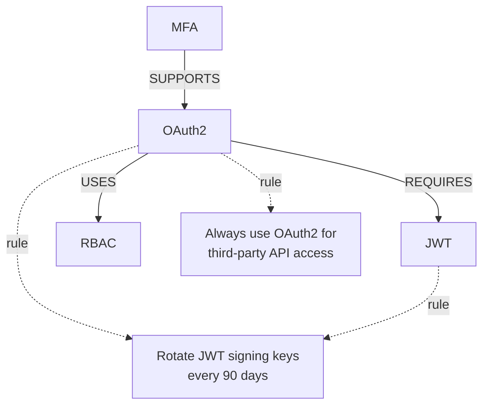

# Querying the Knowledge Graph

The query layer combines vector similarity with graph traversal to surface structurally relevant results. You can explore the graph from any result and submit feedback that updates retrieval weights.

## Architecture

```mermaid
graph LR
    Q[Query] --> VEC[Vector Search]
    Q --> PPR[Graph PPR]
    VEC --> COMBINE[Combined Scoring]
    PPR --> COMBINE
    COMBINE --> RESULTS[Ranked Results + Rules]
    RESULTS --> EXPLORE[explore&#40;node_id&#41;]
    RESULTS --> FEEDBACK[feedback&#40;outcomes&#41;]
    FEEDBACK -->|adjusts weights| PPR
```



The query pipeline combines vector similarity with graph structure. Unlike flat vector stores (Chroma, Pinecone, FAISS), qortex uses **Personalized PageRank** over typed edges to surface concepts that are structurally important, not just textually similar.

## QortexClient

`QortexClient` is the protocol that all consumers target. It has one in-process implementation (`LocalQortexClient`) and one over-the-wire implementation (MCP server).

```python
from qortex.client import LocalQortexClient
from qortex.core.memory import InMemoryBackend
from qortex.vec.index import NumpyVectorIndex

# Set up
vector_index = NumpyVectorIndex(dimensions=384)
backend = InMemoryBackend(vector_index=vector_index)
backend.connect()

client = LocalQortexClient(
    vector_index=vector_index,
    backend=backend,
    embedding_model=my_embedding,  # Any model with .embed(texts) -> list[list[float]]
    mode="graph",                  # "vec" for vector-only, "graph" for graph-enhanced
)
```

### Modes

| Mode | What It Does | When to Use |
|------|-------------|-------------|
| `"vec"` | Pure vector similarity search | Simple use cases, testing, Level 0 parity |
| `"graph"` | Vec + PPR combined scoring | Production (the differentiator) |

## Searching: `query()`

```python
result = client.query(
    context="How to implement authentication?",
    domains=["security"],
    top_k=5,
    min_confidence=0.0,
)

# Result shape
print(result.query_id)     # Unique ID for this query (used in feedback)
print(len(result.items))   # Number of results

for item in result.items:
    print(item.id)         # Unique item ID
    print(item.content)    # "OAuth2: OAuth2 authorization framework for..."
    print(item.score)      # 0.0–1.0 relevance score
    print(item.domain)     # "security"
    print(item.node_id)    # Graph node ID (use for explore())
    print(item.metadata)   # Dict of additional metadata

# Rules auto-surfaced in query results
for rule in result.rules:
    print(rule.id)              # "rule:use-oauth"
    print(rule.text)            # "Always use OAuth2 for third-party API access"
    print(rule.relevance)       # How relevant this rule is to the query
    print(rule.source_concepts) # Which query results linked to this rule
```

Rules are surfaced automatically with zero consumer effort. If the query activates concepts that have linked rules, those rules appear in the response.

## Exploring: `explore()`

After a query, you can traverse the graph from any result node:

```python
# Take a node_id from query results
node_id = result.items[0].node_id

explore = client.explore(node_id, depth=1)

# The node itself
print(explore.node.name)         # "OAuth2"
print(explore.node.description)  # Full description

# Typed edges (structurally related, not just textually similar)
for edge in explore.edges:
    print(f"{edge.source_id} --{edge.relation_type}--> {edge.target_id}")
    # "sec:oauth --REQUIRES--> sec:jwt"
    # "sec:oauth --USES--> sec:rbac"

# Neighbor nodes
for neighbor in explore.neighbors:
    print(f"{neighbor.name}: {neighbor.description}")

# Rules linked to this concept
for rule in explore.rules:
    print(f"[{rule.category}] {rule.text}")
```



### Depth

`explore()` supports depth 1–3:

| Depth | What You Get | Use Case |
|-------|-------------|----------|
| 1 (default) | Immediate neighbors | Quick context |
| 2 | 2-hop neighborhood | Understand a cluster |
| 3 | 3-hop neighborhood | Full subgraph exploration |

If the node doesn't exist, `explore()` returns `None`.

## Projecting Rules: `rules()`

Get rules from the knowledge graph, filtered by domain, concept, or category:

```python
# All rules
all_rules = client.rules()

# Rules for specific concepts (e.g., activated by a query)
activated_ids = [item.node_id for item in result.items]
relevant_rules = client.rules(concept_ids=activated_ids)

# Rules by category
arch_rules = client.rules(categories=["architectural"])

# Rules by domain
security_rules = client.rules(domains=["security"])
```

The result includes metadata:

```python
print(relevant_rules.projection)    # "rules"
print(relevant_rules.domain_count)  # Number of distinct domains

for rule in relevant_rules.rules:
    print(rule.id)              # "rule:rbac-first"
    print(rule.text)            # "Define RBAC roles before writing authorization code"
    print(rule.domain)          # "security"
    print(rule.category)        # "architectural"
    print(rule.source_concepts) # ["sec:rbac"]
    print(rule.relevance)       # Score based on concept activation
```

## Feedback: Closing the Loop

After using query results, tell qortex what worked:

```python
client.feedback(
    query_id=result.query_id,
    outcomes={
        result.items[0].id: "accepted",   # This was useful
        result.items[-1].id: "rejected",  # This was not
    },
    source="my-app",
)
```



```mermaid
graph LR
    QUERY[query&#40;&#41;] --> USE[Use Results]
    USE --> FEEDBACK[feedback&#40;outcomes&#41;]
    FEEDBACK --> TELEPORT[Update PPR<br/>Teleportation Factors]
    TELEPORT --> QUERY

    style FEEDBACK fill:#2d5,stroke:#333
    style TELEPORT fill:#25d,stroke:#333
```

In graph mode, feedback adjusts the **Personalized PageRank teleportation factors**. Accepted concepts get higher teleportation probability on future queries. Over time, the system learns which concepts are actually useful, not just textually similar.

| Outcome | Effect |
|---------|--------|
| `"accepted"` | Increases concept's teleportation factor |
| `"rejected"` | Decreases concept's teleportation factor |

This is a continuous signal, not a one-time benchmark. Every query-feedback pair makes future queries better.

## Over MCP

All client methods are available as MCP tools for cross-language consumers:

| Client Method | MCP Tool | Use Case |
|--------------|----------|----------|
| `client.query()` | `qortex_query` | Search |
| `client.explore()` | `qortex_explore` | Graph traversal |
| `client.rules()` | `qortex_rules` | Rule projection |
| `client.feedback()` | `qortex_feedback` | Learning loop |
| `client.status()` | `qortex_status` | Health check |
| `client.domains()` | `qortex_domains` | List domains |
| `client.ingest()` | `qortex_ingest` | Ingest content |

Configure qortex as an MCP server:

```json
{
  "mcpServers": {
    "qortex": {
      "command": "uv",
      "args": ["run", "--directory", "/path/to/qortex", "qortex-mcp"]
    }
  }
}
```

Then any MCP client (Claude Desktop, Mastra TS, custom agents) can use the full query pipeline.

See [MCP Tools Reference](../reference/mcp-tools.md) for detailed tool schemas.

## Framework Adapters

Instead of using QortexClient directly, use framework-native adapters:

| Framework | Adapter | What It Replaces |
|-----------|---------|-----------------|
| LangChain | [`QortexVectorStore`](../tutorials/case-studies/langchain-vectorstore.md) | Chroma, FAISS, Pinecone |
| LangChain | [`QortexRetriever`](../tutorials/case-studies/langchain-base-retriever.md) | Any BaseRetriever |
| Mastra | [MCP tools](../tutorials/case-studies/mastra-mcp-vector-store.md) | Any MastraVector impl |
| CrewAI | [`QortexKnowledgeStorage`](../tutorials/case-studies/crewai-knowledge-storage.md) | ChromaDB default |
| Agno | [`QortexKnowledge`](../tutorials/case-studies/agno-knowledge-protocol.md) | Any KnowledgeProtocol |

All adapters expose the same qortex extras: `explore()`, `rules()`, and `feedback()`.

## Next Steps

- [API Reference](../reference/api.md): full protocol and type reference
- [LangChain VectorStore](../tutorials/case-studies/langchain-vectorstore.md): drop-in for Chroma/FAISS
- [Mastra MCP](../tutorials/case-studies/mastra-mcp-vector-store.md): cross-language integration
- [Architecture Overview](../architecture/overview.md): how it all fits together
