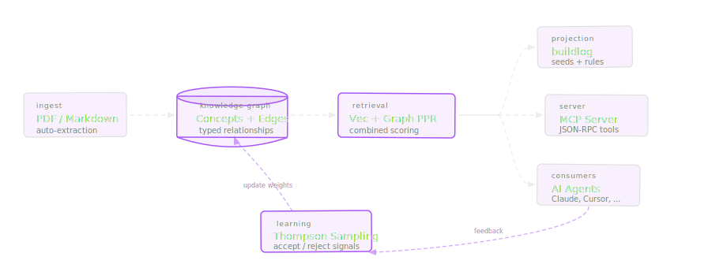

# qortex

**Knowledge graph ingestion engine for automated rule generation.**

qortex transforms unstructured content (books, docs, PDFs) into a knowledge graph, then projects actionable rules for AI agents, buildlog, and other consumers.



## Features

- **Graph-Enhanced Retrieval**: Vector similarity + Personalized PageRank over typed edges
- **Explore & Navigate**: Traverse typed edges, discover neighbors and linked rules from any search result
- **Rules Auto-Surfaced**: Query results include linked rules with relevance scores — zero consumer effort
- **Feedback-Driven Learning**: Consumer outcomes adjust PPR teleportation factors — results improve over time
- **Framework Adapters**: Drop-in for LangChain VectorStore, Mastra MCP, CrewAI, Agno — same API, graph extras for free
- **Flexible Ingestion**: PDF, Markdown, and text sources into a unified knowledge graph
- **Rich Type System**: 10 semantic relation types with 30 edge rule templates
- **Projection Pipeline**: Source → Enricher → Target architecture for rule generation
- **Universal Schema**: JSON Schema artifacts for any-language validation
- **Multiple Backends**: InMemory (testing), Memgraph (production with MAGE algorithms)

## Quick Example

### Search, explore, learn

```python
from qortex.client import LocalQortexClient

client = LocalQortexClient(vector_index, backend, embedding, mode="graph")

# Search — vec + graph combined scoring, rules auto-surfaced
result = client.query("OAuth2 authorization", domains=["security"], top_k=5)

# Explore — traverse typed edges from any result
explore = client.explore(result.items[0].node_id)
for edge in explore.edges:
    print(f"{edge.source_id} --{edge.relation_type}--> {edge.target_id}")

# Feedback — close the learning loop
client.feedback(result.query_id, {result.items[0].id: "accepted"})
```

### LangChain VectorStore (drop-in)

```python
from qortex.adapters.langchain_vectorstore import QortexVectorStore

vs = QortexVectorStore.from_texts(texts, embedding, domain="security")
docs = vs.similarity_search("authentication", k=5)
retriever = vs.as_retriever()
```

### Project rules

```python
from qortex.projectors.projection import Projection
from qortex.projectors.sources.flat import FlatRuleSource
from qortex.projectors.targets.buildlog_seed import BuildlogSeedTarget

projection = Projection(
    source=FlatRuleSource(backend=backend),
    target=BuildlogSeedTarget(persona_name="my_rules"),
)
result = projection.project(domains=["my_domain"])
```

Or use the CLI:

```bash
qortex project buildlog --domain my_domain --pending
```

## Installation

```bash
pip install qortex

# With Memgraph support
pip install qortex[memgraph]

# With all optional dependencies
pip install qortex[all]
```

## Next Steps

<div class="grid cards" markdown>

-   :material-clock-fast:{ .lg .middle } **Getting Started**

    ---

    Install qortex and project your first rules in under 5 minutes

    [:octicons-arrow-right-24: Quick Start](getting-started/quickstart.md)

-   :material-magnify:{ .lg .middle } **Querying**

    ---

    Search, explore, and learn from your knowledge graph

    [:octicons-arrow-right-24: Querying Guide](guides/querying.md)

-   :material-graph:{ .lg .middle } **Core Concepts**

    ---

    Understand domains, concepts, edges, and rules

    [:octicons-arrow-right-24: Concepts](getting-started/concepts.md)

-   :material-connection:{ .lg .middle } **Framework Adapters**

    ---

    Drop-in for LangChain, Mastra, CrewAI, and Agno

    [:octicons-arrow-right-24: Case Studies](tutorials/case-studies/index.md)

</div>

## License

MIT License. See [LICENSE](https://github.com/Peleke/qortex/blob/main/LICENSE) for details.
