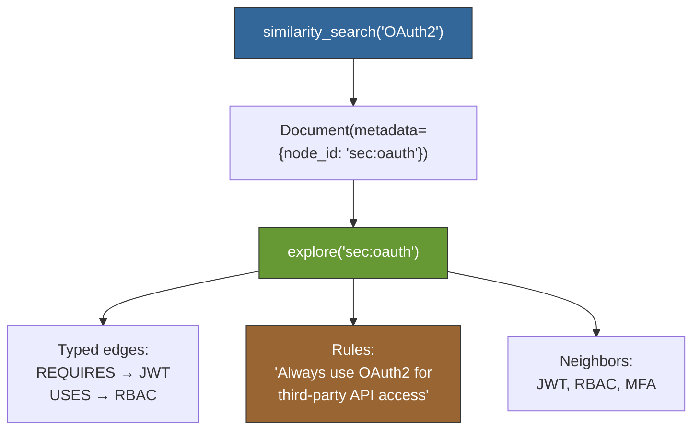

# Case Study: QortexVectorStore — Drop-In for Chroma/FAISS

> **Status**: E2E proven — `tests/test_langchain_vectorstore.py` (38 tests), `tests/test_langchain_e2e_dogfood.py` (14 tests)
>
> **The hook**: `QortexVectorStore` IS a `VectorStore`. It works anywhere LangChain expects one: `similarity_search()`, `from_texts()`, `as_retriever()`, chains, agents. isinstance check passes. Plus: graph exploration, rules, and a feedback loop.

## What LangChain Has

LangChain's `VectorStore` is the universal storage interface. Every vector database (Chroma, FAISS, Pinecone, Weaviate, Qdrant...) implements it. The API is standardized:

| LangChain VectorStore | QortexVectorStore |
|----------------------|-------------------|
| `VectorStore.from_texts(texts, embedding)` | Same — zero-config setup |
| `vs.similarity_search(query, k)` | Same — returns `list[Document]` |
| `vs.similarity_search_with_score(query, k)` | Same — returns `list[tuple[Document, float]]` |
| `vs.add_texts(texts, metadatas)` | Same — incremental ingestion |
| `vs.as_retriever()` | Same — works in any LCEL chain |
| `vs.get_by_ids(ids)` | Same — fetch by node ID |
| — (nothing) | `vs.explore(node_id)` — graph traversal |
| — (nothing) | `vs.rules(concept_ids=[...])` — projected rules |
| — (nothing) | `vs.feedback({id: "accepted"})` — learning loop |

The last three rows are the point.

## The Swap

### One-liner (like Chroma.from_texts)

```python
# Before (Chroma):
from langchain_chroma import Chroma
vs = Chroma.from_texts(texts, embedding)

# After (qortex):
from qortex.adapters.langchain_vectorstore import QortexVectorStore
vs = QortexVectorStore.from_texts(texts, embedding, domain="security")

# Everything downstream stays the same
docs = vs.similarity_search("authentication tokens", k=5)
retriever = vs.as_retriever(search_kwargs={"k": 10})
chain = retriever | format_docs | prompt | llm
```

### From existing client (graph-enhanced)

```python
from qortex.client import LocalQortexClient
from qortex.adapters.langchain_vectorstore import QortexVectorStore

# Client with graph + rules already set up
client = LocalQortexClient(
    vector_index=vector_index,
    backend=backend,
    embedding_model=embedding,
    mode="graph",
)

vs = QortexVectorStore(client=client, domain="security")
```

## Standard VectorStore API

### similarity_search

```python
docs = vs.similarity_search("OAuth2 authorization", k=3)
for doc in docs:
    print(doc.page_content)              # "OAuth2: OAuth2 authorization framework..."
    print(doc.metadata["domain"])         # "security"
    print(doc.metadata["node_id"])        # "sec:oauth" — use for explore()
    print(doc.metadata["score"])          # 0.94
```

### similarity_search_with_score

```python
results = vs.similarity_search_with_score("JWT tokens", k=3)
for doc, score in results:
    print(f"{score:.2f}: {doc.page_content}")
# Scores are descending (most similar first)
```

### as_retriever

```python
retriever = vs.as_retriever(search_kwargs={"k": 5})
docs = retriever.invoke("how to authenticate API requests")

# Works in LCEL chains
from langchain_core.runnables import RunnableLambda
chain = retriever | RunnableLambda(lambda docs: "\n".join(d.page_content for d in docs))
```

### add_texts

```python
ids = vs.add_texts(
    ["Zero-trust architecture assumes no implicit trust"],
    metadatas=[{"source": "research-paper"}],
)
# New concepts are immediately searchable
```

## The Differentiators

### Graph exploration from search results

```python
# 1. Search (standard VectorStore API)
docs = vs.similarity_search("OAuth2 authorization", k=3)

# 2. Explore (qortex extra)
node_id = docs[0].metadata["node_id"]
explore = vs.explore(node_id)

# 3. See typed edges
for edge in explore.edges:
    print(f"{edge.source_id} --{edge.relation_type}--> {edge.target_id}")
# sec:oauth --REQUIRES--> sec:jwt
# sec:oauth --USES--> sec:rbac

# 4. Navigate to neighbors
for neighbor in explore.neighbors:
    print(f"{neighbor.name}: {neighbor.description}")

# 5. See linked rules
for rule in explore.rules:
    print(f"[{rule.category}] {rule.text}")
```



### Rules in query results

Rules are auto-surfaced in Document metadata when concepts have linked rules:

```python
results = vs.similarity_search_with_score("OAuth2 authorization", k=4)
for doc, score in results:
    if "rules" in doc.metadata:
        for rule in doc.metadata["rules"]:
            print(f"  Rule: {rule['text']} (relevance: {rule['relevance']:.2f})")
```

### Rules projection

```python
# Get rules for all retrieved concepts
activated = [doc.metadata["node_id"] for doc in docs]
rules_result = vs.rules(concept_ids=activated)
for rule in rules_result.rules:
    print(f"[{rule.category}] {rule.text}")
# [security] Always use OAuth2 for third-party API access
# [operations] Rotate JWT signing keys every 90 days
# [architectural] Define RBAC roles before writing authorization code
```

### Feedback loop

```python
# 1. Search
docs = vs.similarity_search("authentication protocol", k=4)

# 2. Use results in your application...

# 3. Tell qortex what worked
vs.feedback({
    docs[0].id: "accepted",   # This was useful
    docs[-1].id: "rejected",  # This was not
})

# 4. Future searches improve based on feedback
docs2 = vs.similarity_search("authentication protocol", k=4)
```

In graph mode, feedback adjusts PPR teleportation factors. Accepted concepts get higher teleportation probability. The system learns which concepts are actually useful.

## What We Proved

**Real VectorStore**: `isinstance(vs, VectorStore)` is `True`. Not a duck type.

**from_texts() zero-config**: One line creates a full backend, indexes texts, returns a ready VectorStore.

**as_retriever()**: Works in any LCEL chain — pipe operators, RunnableParallel, the works.

**Graph exploration**: Search → take `node_id` → explore → typed edges + neighbors + rules.

**Rules auto-surfaced**: query() includes rules in results with zero extra effort from the consumer.

**Feedback loop**: search → outcomes → recorded → future searches adjust.

**JSON roundtrip**: All results survive `json.dumps()`/`json.loads()` for serialization.

## What qortex Adds to LangChain

LangChain's VectorStore is a brilliant abstraction — it unifies dozens of vector databases behind one API. qortex implements that same API and layers graph structure on top:

| Dimension | Standard VectorStore (solid foundation) | QortexVectorStore (augmentation) |
|-----------|----------------------------------------|--------------------------------|
| Search | Cosine similarity | Vec + PPR combined scoring |
| Structure | Flat documents | Typed edges (REQUIRES, USES...) |
| Navigation | — | `explore(node_id)` graph traversal |
| Rules | — | Auto-surfaced in results |
| Feedback | — | Outcomes → teleportation updates |
| Learning | Static | Continuous improvement |
| API | VectorStore ABC | Same VectorStore ABC |

## Ejection Path

QortexVectorStore is designed to be ejectable as a standalone `langchain-qortex` package (like `langchain-openai`, `langchain-chroma`). See [GitHub Issue #45](https://github.com/Peleke/qortex/issues/45) for the ejection plan.

## Next Steps

- [Querying Guide](../../guides/querying.md) — Full query pipeline reference
- [BaseRetriever Integration](langchain-base-retriever.md) — Lighter-weight retriever adapter
- [Mastra MCP](mastra-mcp-vector-store.md) — Cross-language integration
- [API Reference](../../reference/api.md) — QortexClient protocol and types
