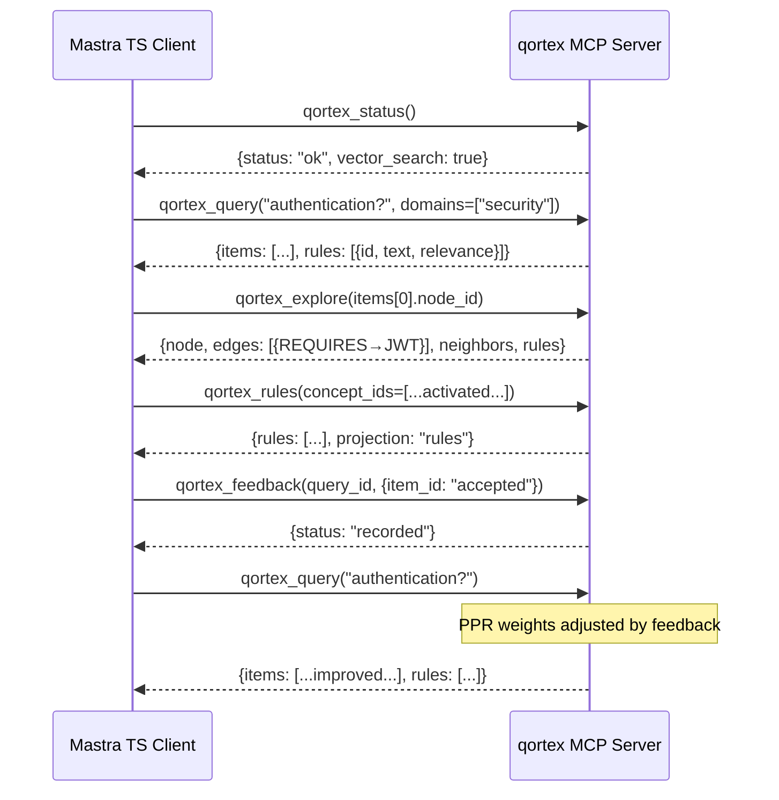

# Case Study: Replacing Mastra's Vector Store via MCP

> **Status**: E2E proven — `tests/test_e2e_mastra.py` (13 tests, real embeddings), `tests/test_mastra_mcp_dogfood.py` (19 tests, graph-enhanced pipeline)
>
> **The hook**: Mastra is TypeScript. qortex is Python. MCP bridges the gap. One config change gives any Mastra app graph-enhanced retrieval with graph exploration, projected rules, and a feedback loop — things Mastra's own GraphRAG can't do.

## What Mastra Has

Mastra provides `MastraVector`, an abstract class with 22 implementations (PgVector, Chroma, Pinecone, Qdrant, etc.). Their `GraphRAG` builds an in-memory cosine similarity graph at query time — O(N²), no persistence, no learning.

| MastraVector Method | qortex MCP Equivalent |
|--------------------|----------------------|
| `query(indexName, queryVector, topK)` | `qortex_query(context, domains, top_k)` — includes rules |
| `listIndexes()` | `qortex_domains()` |
| `describeIndex(name)` | `qortex_domains()` + filter |
| `upsert(indexName, vectors)` | `qortex_ingest(source_path, domain)` |
| `createIndex(name, dimension)` | Auto-created on ingest |
| — (nothing) | `qortex_explore(node_id, depth)` — graph traversal |
| — (nothing) | `qortex_rules(domains, concept_ids)` — projected rules |
| — (nothing) | `qortex_feedback(query_id, outcomes)` — learning loop |

The last three rows are what qortex adds on top. Mastra's vector store API is excellent for standard retrieval — qortex augments it with graph structure, rules, and a learning loop.

## The Swap

<!-- TODO: Show the TypeScript side — @qortex/mastra MastraVector implementation -->
<!-- TODO: Show the MCP server config in claude_desktop_config.json or equivalent -->
<!-- TODO: Before/after code comparison -->

### Python Side (proven)

```python
from qortex.adapters.mastra import QortexVectorStore
from qortex.client import LocalQortexClient

client = LocalQortexClient(vector_index, backend, embedding_model)
store = QortexVectorStore(client=client)

# Exact same API as any MastraVector
results = store.query(index_name="security", query_text="OAuth2 auth", top_k=3)
# → [{"id": "...", "score": 0.94, "metadata": {...}, "document": "..."}]

# The upgrade Mastra can't do
store.feedback({results[0]["id"]: "accepted"})
```

### MCP Server (proven)

The MCP server exposes the same operations over JSON-RPC. A TypeScript Mastra client calls:

```json
{"method": "tools/call", "params": {"name": "qortex_query", "arguments": {"context": "OAuth2 auth", "domains": ["security"], "top_k": 3}}}
```

Response maps 1:1 to Mastra's `QueryResult[]` shape.

## Graph-Enhanced MCP Pipeline

The graph-enhanced pipeline adds typed edges, rules, and exploration to MCP:



### Rules in query results

`qortex_query` now auto-surfaces linked rules:

```json
{
  "query_id": "q-abc123",
  "items": [
    {"id": "i-1", "content": "OAuth2: ...", "score": 0.94, "node_id": "sec:oauth"}
  ],
  "rules": [
    {
      "id": "rule:use-oauth",
      "text": "Always use OAuth2 for third-party API access",
      "domain": "security",
      "category": "security",
      "relevance": 0.94,
      "source_concepts": ["sec:oauth"]
    }
  ]
}
```

### Graph exploration

Navigate typed edges from any query result:

```json
// Request
{"method": "tools/call", "params": {"name": "qortex_explore", "arguments": {"node_id": "sec:oauth"}}}

// Response
{
  "node": {"id": "sec:oauth", "name": "OAuth2", "description": "..."},
  "edges": [
    {"source_id": "sec:oauth", "target_id": "sec:jwt", "relation_type": "REQUIRES"},
    {"source_id": "sec:oauth", "target_id": "sec:rbac", "relation_type": "USES"}
  ],
  "neighbors": [
    {"id": "sec:jwt", "name": "JWT", "description": "..."},
    {"id": "sec:rbac", "name": "RBAC", "description": "..."}
  ],
  "rules": [
    {"id": "rule:use-oauth", "text": "Always use OAuth2 for third-party API access"}
  ]
}
```

## What We Proved

**Real embeddings**: sentence-transformers/all-MiniLM-L6-v2 (384 dimensions). Not mocks.

**Real ingestion**: Text document → concept extraction → embedding generation → vector index + graph storage.

**Real semantic search**: Query "How does OAuth2 work?" → top result contains OAuth2 content (verified).

**Graph exploration**: query → take node_id → explore → typed edges + neighbors + linked rules.

**Rules auto-surfaced**: query results include linked rules with relevance scores.

**Rules projection**: qortex_rules returns filtered rules by domain, concept, or category.

**Real feedback loop**: Query → accept/reject outcomes → recorded for future PPR weight adjustment.

**JSON serializable**: Every MCP response round-trips through `json.dumps()`/`json.loads()`.

## What qortex Adds to Mastra

Mastra's `MastraVector` is a clean, well-designed abstraction with 22 implementations. qortex augments it with capabilities that complement what Mastra already does well:

| Dimension | Mastra (great foundation) | qortex (augmentation) |
|-----------|--------------------------|----------------------|
| Graph edges | Cosine sim threshold (auto-constructed) | Typed edges (REQUIRES, REFINES...) from source material |
| Graph construction | Dynamic, per-query | Persistent KG + dynamic gap-filling |
| Walk algorithm | Monte Carlo random walk | PPR power iteration (deterministic) |
| Persistence | In-memory per query | SqliteVec + Memgraph across sessions |
| Learning | — | Teleportation factors from feedback |
| Rules | — | Auto-surfaced from knowledge graph |
| Exploration | — | Typed edge traversal from results |

## Next Steps

<!-- TODO: Build @qortex/mastra TypeScript package -->
<!-- TODO: Publish to npm -->
<!-- TODO: Record demo video: Mastra app → swap config → show improved retrieval -->
<!-- TODO: Benchmark: qortex PPR vs Mastra Monte Carlo random walks on same dataset -->
