# Not All Edges Are Created Equal

You ingest a textbook on software design patterns. Out come 200 edges. REQUIRES, SUPPORTS, IMPLEMENTS, SIMILAR_TO. They all have the same shape: a source node, a target node, a confidence score between 0 and 1. Your graph database treats them identically.

But try removing "Encapsulation REQUIRES Information Hiding" and watch half your downstream rules collapse. Now remove "Singleton SIMILAR_TO Factory" and... nothing happens. Same graph, same confidence scores, completely different structural importance. The confidence number didn't warn you. It couldn't.

Pull up a chair. We're going to figure out which edges are load-bearing walls and which are decorative trim.

## Your first look at the mapping

Before we name anything, let's just look at what the code already knows:

```python
from qortex.causal.types import RELATION_CAUSAL_DIRECTION

for relation, (direction, strength) in RELATION_CAUSAL_DIRECTION.items():
    print(f"{relation:<15} -> direction={direction.value:<15} strength={strength}")
```

```text
requires        -> direction=forward         strength=0.9
implements      -> direction=reverse         strength=0.85
refines         -> direction=reverse         strength=0.8
part_of         -> direction=reverse         strength=0.8
uses            -> direction=forward         strength=0.75
supports        -> direction=forward         strength=0.7
challenges      -> direction=forward         strength=0.7
contradicts     -> direction=bidirectional   strength=0.7
similar_to      -> direction=none            strength=0.3
alternative_to  -> direction=none            strength=0.3
```

Ten relation types. Four directions. And the strengths are not all the same. Something is going on here. Let's unpack it.

## Forward, reverse, and the two that don't count

Look at the output above. The edges split into four groups:

| Direction       | Relations                                   | What it means                                        |
|-----------------|---------------------------------------------|------------------------------------------------------|
| `forward`       | requires, uses, supports, challenges        | A causes, needs, or provides evidence for B          |
| `reverse`       | implements, refines, part_of                | B is the causal ancestor; A is downstream of B       |
| `bidirectional` | contradicts                                 | Mutual influence; no single causal arrow              |
| `none`          | similar_to, alternative_to                  | Correlation at best; no causal content whatsoever     |

Here's the key insight. "Encapsulation REQUIRES Information Hiding" points **forward**: Encapsulation can't exist without Information Hiding. Remove the target, and the source breaks. That's a causal dependency.

"Singleton SIMILAR_TO Factory" points **nowhere**. They're related, sure. But neither one causes the other. Neither one breaks if the other disappears. The graph already encoded this distinction. We just never asked it.

!!! note "Why `reverse`?"
    "ArrayList IMPLEMENTS List" means ArrayList is a concrete realization of the List interface. Causally, List came first (the abstraction). ArrayList depends on it. So the causal arrow points from List to ArrayList, which is the **reverse** of the edge direction in the knowledge graph. The `reverse` tag tells the system to flip the arrow when building the causal DAG.

## The CausalDirection enum

Now that you've seen the pattern, here's the type that captures it:

```python
from qortex.causal.types import CausalDirection

# It's a StrEnum, so you can compare with strings
print(CausalDirection.FORWARD)        # "forward"
print(CausalDirection.REVERSE)        # "reverse"
print(CausalDirection.BIDIRECTIONAL)  # "bidirectional"
print(CausalDirection.NONE)           # "none"
```

Four values. That's it. Every edge in your knowledge graph maps to exactly one of these.

## Visualizing a subgraph

Let's make this concrete. Here's a 5-node subgraph from a software design patterns book, colored by causal direction:



Blue nodes sit at the **source** of forward causal edges. Red nodes sit at the **source** of reverse edges (meaning the causal arrow actually points the other way). Gray nodes are connected only by non-causal edges.

!!! warning "Bidirectional and none edges are excluded from the DAG"
    When we build the causal DAG in [Part 2](part2-building-the-dag.md), `contradicts`, `similar_to`, and `alternative_to` edges get dropped entirely. You can't draw a single causal arrow for "X contradicts Y" without more context, and "X is similar to Y" carries no causal information at all. The DAG only keeps `forward` and `reverse` edges (flipping the reverse ones).

## Strength: not confidence, not weight

Notice that each relation type has a **default strength** in the mapping. REQUIRES gets 0.9. SIMILAR_TO gets 0.3. These are not the same as the edge's confidence score from ingestion.

Here's how they combine when building the DAG:

```python
# Inside CausalDAG.from_backend():
strength = edge.confidence * default_strength
```

So an edge with confidence 0.8 and relation type `requires` (default strength 0.9) gets a final strength of `0.8 * 0.9 = 0.72`. The same confidence on a `uses` edge (default 0.75) yields `0.8 * 0.75 = 0.60`.

This means REQUIRES edges are systematically stronger than USES edges at the same confidence level. The relation type encodes a prior about how much causal weight that kind of relationship carries.

## The full reference table

Here's every relation type with its direction, default strength, and what happens when the DAG is built:

| Relation Type   | Direction       | Default Strength | DAG behavior                          |
|-----------------|-----------------|------------------|---------------------------------------|
| `requires`      | forward         | 0.9              | Edge kept as-is                       |
| `implements`    | reverse         | 0.85             | Edge direction flipped                |
| `refines`       | reverse         | 0.8              | Edge direction flipped                |
| `part_of`       | reverse         | 0.8              | Edge direction flipped                |
| `uses`          | forward         | 0.75             | Edge kept as-is                       |
| `supports`      | forward         | 0.7              | Edge kept as-is                       |
| `challenges`    | forward         | 0.7              | Edge kept as-is                       |
| `contradicts`   | bidirectional   | 0.7              | **Excluded from DAG**                 |
| `similar_to`    | none            | 0.3              | **Excluded from DAG**                 |
| `alternative_to`| none            | 0.3              | **Excluded from DAG**                 |

Three relation types never make it into the causal graph. The other seven do, with four pointing forward and three getting flipped.

## Classifying edges from a real graph

Let's load edges from a graph backend and classify them:

```python
from qortex.causal.types import RELATION_CAUSAL_DIRECTION, CausalDirection

def classify_edges(backend, domain: str) -> dict[str, list]:
    """Group a domain's edges by causal direction."""
    buckets: dict[str, list] = {
        "forward": [],
        "reverse": [],
        "bidirectional": [],
        "none": [],
    }

    for node in backend.find_nodes(domain=domain, limit=100_000):
        for edge in backend.get_edges(node.id, direction="out"):
            rel = (
                edge.relation_type.value
                if hasattr(edge.relation_type, "value")
                else str(edge.relation_type)
            )
            if rel in RELATION_CAUSAL_DIRECTION:
                direction, _ = RELATION_CAUSAL_DIRECTION[rel]
                buckets[direction.value].append(edge)

    return buckets

# Usage:
buckets = classify_edges(backend, domain="design_patterns")
for direction, edges in buckets.items():
    print(f"{direction:<15} {len(edges)} edges")
```

```text
forward         87 edges
reverse         52 edges
bidirectional   18 edges
none            43 edges
```

87 forward edges. 52 reverse edges. That's 139 edges that carry causal information. The other 61 (bidirectional + none) are structurally present but causally silent.

!!! note "Your numbers will differ"
    The exact counts depend on your ingested data. The ratio is what matters: typically 60-70% of edges in a well-structured textbook KG carry causal information.

## Recap: what just happened

Let's be explicit about what we covered, because Part 2 builds directly on this.

1. Every edge in the knowledge graph has a **relation type** (requires, supports, implements, etc.)
2. Each relation type maps to a **causal direction** (forward, reverse, bidirectional, none) and a **default strength**
3. This mapping lives in `RELATION_CAUSAL_DIRECTION` in `qortex.causal.types`
4. Forward edges become causal arrows pointing source-to-target
5. Reverse edges get **flipped**: the causal arrow points target-to-source
6. Bidirectional and none edges are **excluded** from the causal DAG entirely
7. Final edge strength = edge confidence * default relation strength

The direction mapping was hiding in the relation types all along.

## Exercise: classify a new domain

Take a knowledge graph domain you've ingested (or use the Chapter 5 fixture data) and answer these questions:

1. How many edges fall into each direction bucket?
2. What's the average confidence score for `requires` edges vs `similar_to` edges?
3. Which single edge has the highest final strength (confidence * default)?

??? success "Solution"
    ```python
    from qortex.causal.types import RELATION_CAUSAL_DIRECTION
    import statistics

    def analyze_domain(backend, domain: str):
        confidence_by_type: dict[str, list[float]] = {}
        max_strength = 0.0
        max_edge = None

        for node in backend.find_nodes(domain=domain, limit=100_000):
            for edge in backend.get_edges(node.id, direction="out"):
                rel = (
                    edge.relation_type.value
                    if hasattr(edge.relation_type, "value")
                    else str(edge.relation_type)
                )
                if rel not in RELATION_CAUSAL_DIRECTION:
                    continue

                confidence_by_type.setdefault(rel, []).append(edge.confidence)

                _, default_strength = RELATION_CAUSAL_DIRECTION[rel]
                final = edge.confidence * default_strength
                if final > max_strength:
                    max_strength = final
                    max_edge = edge

        # Average confidence by type
        for rel, confidences in sorted(confidence_by_type.items()):
            avg = statistics.mean(confidences)
            print(f"{rel:<15} avg_confidence={avg:.3f}  n={len(confidences)}")

        if max_edge:
            print(f"\nStrongest edge: {max_edge.source_id} -> {max_edge.target_id}")
            print(f"  relation={max_edge.relation_type}, final_strength={max_strength:.3f}")

    analyze_domain(backend, domain="design_patterns")
    ```

    You should find that `requires` edges have noticeably higher average confidence than `similar_to` edges. This isn't a coincidence: the LLM that extracted these edges assigns higher confidence to strong logical dependencies than to loose analogies. The relation type mapping amplifies this signal further.

## What you learned

- The `RELATION_CAUSAL_DIRECTION` mapping classifies every relation type into forward, reverse, bidirectional, or none
- Forward and reverse edges carry causal information; bidirectional and none edges don't
- Edge strength combines ingestion confidence with a relation-type prior
- The `CausalDirection` enum is a StrEnum with four values

## Next up

We have directions. We have strengths. But we don't have a DAG yet, because real knowledge graphs have cycles. "Encapsulation REQUIRES Information Hiding" and "Information Hiding USES Encapsulation" are both true, but they form a loop. Causal reasoning can't handle loops. In [Part 2: The Shape of What You Know](part2-building-the-dag.md), we break cycles and build the structure that makes everything else possible.
