# The Shape of What You Know

You've ingested a textbook on object-oriented design. You classified every edge by causal direction ([Part 1](part1-edge-directions.md)). You know that REQUIRES points forward, IMPLEMENTS points backward, and SIMILAR_TO carries no causal signal at all.

Now you try to trace a causal path: "Does Encapsulation depend on Access Modifiers?" You follow the edges. Encapsulation REQUIRES Information Hiding. Information Hiding USES Encapsulation. Wait. That's a loop. You're back where you started, and you haven't answered anything.

Real knowledge graphs have cycles. Causal reasoning can't.

## Why cycles break everything

Let's see it happen. Here are four edges that form a cycle:

```python
from qortex.causal.types import CausalEdge, CausalDirection

edges = [
    CausalEdge(
        source_id="encapsulation",
        target_id="info_hiding",
        relation_type="requires",
        direction=CausalDirection.FORWARD,
        strength=0.9,
    ),
    CausalEdge(
        source_id="info_hiding",
        target_id="encapsulation",
        relation_type="uses",
        direction=CausalDirection.FORWARD,
        strength=0.6,
    ),
    CausalEdge(
        source_id="encapsulation",
        target_id="access_modifiers",
        relation_type="uses",
        direction=CausalDirection.FORWARD,
        strength=0.75,
    ),
    CausalEdge(
        source_id="access_modifiers",
        target_id="info_hiding",
        relation_type="supports",
        direction=CausalDirection.FORWARD,
        strength=0.7,
    ),
]
```

Here's the cycle, before we break it:


The red nodes form the cycle: Encapsulation to Information Hiding to Encapsulation. Follow the arrows and you go in circles forever. You can't compute ancestors (everyone is everyone's ancestor). You can't compute a topological ordering (there isn't one). You can't run d-separation (it assumes acyclicity).

Causal reasoning on directed graphs requires the "A" in DAG: **acyclic**.

## Building a CausalDAG (and watching cycles break)

The `CausalDAG` class handles this for you. Let's build one from those edges and see what happens:

```python
from qortex.causal.dag import CausalDAG
from qortex.causal.types import CausalEdge, CausalDirection
import logging

# Turn on logging so we can see the cycle-breaking
logging.basicConfig(level=logging.INFO)

edges = [
    CausalEdge(
        source_id="encapsulation",
        target_id="info_hiding",
        relation_type="requires",
        direction=CausalDirection.FORWARD,
        strength=0.9,
    ),
    CausalEdge(
        source_id="info_hiding",
        target_id="encapsulation",
        relation_type="uses",
        direction=CausalDirection.FORWARD,
        strength=0.6,
    ),
    CausalEdge(
        source_id="encapsulation",
        target_id="access_modifiers",
        relation_type="uses",
        direction=CausalDirection.FORWARD,
        strength=0.75,
    ),
    CausalEdge(
        source_id="access_modifiers",
        target_id="info_hiding",
        relation_type="supports",
        direction=CausalDirection.FORWARD,
        strength=0.7,
    ),
]

dag = CausalDAG.from_edges(edges)
```

```text
INFO:qortex.causal.dag:Breaking cycle: removing edge info_hiding→encapsulation (strength=0.600)
```

It found the cycle. It removed the weakest edge. Let's verify:

```python
print(f"Nodes: {sorted(dag.node_ids)}")
print(f"Edges: {dag.edge_count}")
print(f"Is valid DAG: {dag.is_valid_dag()}")
print(f"Topological order: {dag.topological_order()}")
```

```text
Nodes: ['access_modifiers', 'encapsulation', 'info_hiding']
Edges: 3
Is valid DAG: True
Topological order: ['encapsulation', 'access_modifiers', 'info_hiding']
```

Started with 4 edges, ended with 3. The cycle is gone. The graph is a DAG. Topological ordering works.

## How cycle-breaking works

The algorithm is simple and transparent. Here it is in pseudocode:

1. Find a cycle in the graph (using `networkx.find_cycle`)
2. Look at every edge in that cycle
3. Remove the one with the **lowest strength**
4. Repeat until no cycles remain

That's it. No hidden heuristics, no machine learning, no randomness. The weakest link gets cut.

!!! warning "Cycle-breaking is a design decision, not a mathematical truth"
    Both "Encapsulation REQUIRES Information Hiding" and "Information Hiding USES Encapsulation" are true statements about the world. But a DAG can only keep one direction. The weakest-edge heuristic is one reasonable choice. Another system might use domain knowledge, recency, or user overrides. The important thing is that `CausalDAG` is transparent about what it removed.

Let's look at what was kept vs. what was cut:

| Edge                                      | Strength | Status  |
|-------------------------------------------|----------|---------|
| Encapsulation -> Information Hiding       | 0.9      | Kept    |
| Encapsulation -> Access Modifiers         | 0.75     | Kept    |
| Access Modifiers -> Information Hiding    | 0.7      | Kept    |
| Information Hiding -> Encapsulation       | 0.6      | **Removed** |

The weakest edge (0.6) was the one broken. The three remaining edges form a clean DAG.

## Before and after

Here's the graph after cycle-breaking:



Compare with the earlier diagram. The red cycle is gone. What remains is a clean flow: Encapsulation sits at the top. It depends on both Information Hiding (directly) and Access Modifiers (which in turn supports Information Hiding).

The topological order tells the story: `encapsulation` comes first (no incoming causal edges), then `access_modifiers`, then `info_hiding` (receives from both).

## Building from a real graph backend

In practice, you don't hand-craft edges. You load them from the graph backend that holds your ingested knowledge graph. The `from_backend` class method handles everything we covered in Part 1 (direction mapping, edge flipping, strength calculation) plus cycle-breaking:

```python
from qortex.causal.dag import CausalDAG

# Assuming you have a connected GraphBackend instance
dag = CausalDAG.from_backend(backend, domain="design_patterns")

print(f"Nodes: {len(dag.node_ids)}")
print(f"Edges: {dag.edge_count}")
print(f"Is valid DAG: {dag.is_valid_dag()}")
```

```text
Nodes: 42
Edges: 87
Is valid DAG: True
```

!!! note "Recap from Part 1"
    `from_backend` does three things under the hood: (1) maps each relation type to a causal direction using `RELATION_CAUSAL_DIRECTION`, (2) drops bidirectional and none edges, (3) flips reverse edges. Then it breaks any remaining cycles. The output is always a valid DAG.

## What you can do with a DAG

Once you have a `CausalDAG`, the accessor methods open up:

```python
# Who depends on "info_hiding"? (direct children)
children = dag.children("info_hiding")
print(f"Children of info_hiding: {children}")

# Who does "encapsulation" depend on? (direct parents)
parents = dag.parents("encapsulation")
print(f"Parents of encapsulation: {parents}")

# All transitive ancestors of a concept
ancestors = dag.ancestors("info_hiding")
print(f"Ancestors of info_hiding: {ancestors}")

# All transitive descendants
descendants = dag.descendants("encapsulation")
print(f"Descendants of encapsulation: {descendants}")

# The topological order (causes before effects)
order = dag.topological_order()
print(f"First 5 in topological order: {order[:5]}")
```

```text
Children of info_hiding: frozenset()
Parents of encapsulation: frozenset()
Ancestors of info_hiding: frozenset({'encapsulation', 'access_modifiers'})
Descendants of encapsulation: frozenset({'info_hiding', 'access_modifiers'})
First 5 in topological order: ['encapsulation', 'access_modifiers', 'info_hiding']
```

`info_hiding` has no children (it's a leaf, a terminal effect). `encapsulation` has no parents (it's a root cause in this subgraph). The topological order puts causes before their effects.

## Edge strength after construction

You can query the strength of any edge in the DAG:

```python
s = dag.edge_strength("encapsulation", "info_hiding")
print(f"encapsulation -> info_hiding: strength={s}")

s = dag.edge_strength("info_hiding", "encapsulation")
print(f"info_hiding -> encapsulation: strength={s}")
```

```text
encapsulation -> info_hiding: strength=0.9
info_hiding -> encapsulation: strength=0.0
```

The broken edge returns 0.0. It's gone. The DAG remembers the decision.

## Multiple cycles

Real graphs often have more than one cycle. The algorithm handles this iteratively: find a cycle, break it, find the next, break it, repeat. Each iteration removes exactly one edge (the weakest in that cycle). If cycles share edges, breaking one cycle might also break another.

```python
from qortex.causal.types import CausalEdge, CausalDirection

# Two overlapping cycles
edges = [
    CausalEdge("A", "B", "requires", CausalDirection.FORWARD, strength=0.9),
    CausalEdge("B", "C", "requires", CausalDirection.FORWARD, strength=0.8),
    CausalEdge("C", "A", "uses",     CausalDirection.FORWARD, strength=0.4),  # Cycle 1: A->B->C->A
    CausalEdge("B", "D", "uses",     CausalDirection.FORWARD, strength=0.7),
    CausalEdge("D", "A", "supports", CausalDirection.FORWARD, strength=0.5),  # Cycle 2: A->B->D->A
]

dag = CausalDAG.from_edges(edges)
print(f"Edges remaining: {dag.edge_count}")
print(f"Valid DAG: {dag.is_valid_dag()}")
```

```text
INFO:qortex.causal.dag:Breaking cycle: removing edge C→A (strength=0.400)
INFO:qortex.causal.dag:Breaking cycle: removing edge D→A (strength=0.500)
Edges remaining: 3
Valid DAG: True
```

Two cycles, two breaks. Both times the weakest edge in the cycle was removed.

## Recap

Quick refresher on everything so far:

1. **Part 1**: Edges have causal directions (forward, reverse, bidirectional, none) and default strengths
2. **This chapter**: Real graphs have cycles. `CausalDAG` breaks them by removing the weakest edge in each cycle
3. The result is a valid DAG with a topological ordering, ancestor/descendant relationships, and no loops
4. `CausalDAG.from_edges()` builds from explicit edges (testing). `CausalDAG.from_backend()` builds from a graph backend (production)
5. Cycle-breaking is logged and deterministic: weakest edge in each cycle gets removed

## Exercise: build and inspect your own DAG

Load a domain from your knowledge graph and answer these questions:

1. How many edges were in the original graph (forward + reverse types only)?
2. How many edges survived into the DAG?
3. How many cycles were broken? (Hint: the difference in edge count tells you)
4. What's the topological ordering? Does the "first" concept make sense as a root cause?

??? success "Solution"
    ```python
    from qortex.causal.dag import CausalDAG
    import logging

    logging.basicConfig(level=logging.INFO)

    dag = CausalDAG.from_backend(backend, domain="design_patterns")

    print(f"Nodes: {len(dag.node_ids)}")
    print(f"Edges in DAG: {dag.edge_count}")
    print(f"Valid DAG: {dag.is_valid_dag()}")
    print(f"\nTopological order (first 10):")
    for i, node_id in enumerate(dag.topological_order()[:10]):
        node = dag.nodes.get(node_id)
        name = node.name if node else node_id
        n_children = len(dag.children(node_id))
        n_parents = len(dag.parents(node_id))
        print(f"  {i+1}. {name} (parents={n_parents}, children={n_children})")
    ```

    The nodes at the top of the topological order have zero parents: they're root causes in your domain. In a software design patterns book, you'll often see foundational concepts like "Abstraction" or "Encapsulation" at the top, with specific patterns like "Observer" or "Strategy" further down.

    To count broken cycles, compare the number of causal-direction edges in the raw graph (from Part 1's classification exercise) with `dag.edge_count`. The difference is the number of edges removed during cycle-breaking.

## What you learned

- Real knowledge graphs have cycles; causal reasoning requires acyclicity
- `CausalDAG` breaks cycles by iteratively removing the weakest edge in each cycle
- `from_edges()` and `from_backend()` are the two construction paths
- After construction: `parents()`, `children()`, `ancestors()`, `descendants()`, `topological_order()` all work
- Edge strengths are preserved for kept edges, 0.0 for broken ones

## Next up

We have a DAG. It has structure: parents, children, ancestors, descendants. But structure tells us more than just "who connects to whom." It tells us which information paths are open and which are blocked. In [Part 3: What Can You Learn From Here?](part3-d-separation.md), we use d-separation to answer the question: "If I already know about X and Z, does learning about Y tell me anything new?"
