# What Can You Learn From Here?

You're standing at a node in your causal DAG. You know about Encapsulation. You know about Access Modifiers. Now someone asks: "Does learning about Information Hiding tell you anything new, given what you already know?"

Your gut says yes. Information Hiding is important. But "important" isn't the question. The question is whether Information Hiding carries information that isn't already carried by the nodes you know about. And that question has a precise, structural answer that requires zero statistics, zero data, zero LLM calls. Just the shape of the graph.

## Three structures you need to know

Before we touch the code, let's look at three tiny graphs. They're the building blocks of every DAG, and they each handle information flow differently.

### The Chain


A causes B, B causes C. If you know B, does learning about A tell you anything new about C?

**No.** B already tells you everything A could tell you about C, because A's influence on C goes *through* B. Knowing A adds nothing once B is known.

In the jargon we're about to earn: A and C are **d-separated** given B.

```python
from qortex.causal.dag import CausalDAG
from qortex.causal.dsep import DSeparationEngine
from qortex.causal.types import CausalEdge, CausalDirection

edges = [
    CausalEdge("A", "B", "requires", CausalDirection.FORWARD, 0.9),
    CausalEdge("B", "C", "requires", CausalDirection.FORWARD, 0.9),
]
dag = CausalDAG.from_edges(edges)
engine = DSeparationEngine(dag=dag)

result = engine.is_d_separated(
    x=frozenset({"A"}),
    y=frozenset({"C"}),
    z=frozenset({"B"}),  # conditioning on B
)
print(f"A independent of C given B? {result.is_independent}")
```

```text
A independent of C given B? True
```

Conditioning on the middle node in a chain **blocks** the information flow. Makes sense: if you already know what's in the middle, knowing the beginning doesn't help predict the end.

### The Fork



B causes both A and C. A and C are correlated (they share a common cause), but if you know B, that correlation disappears.

```python
edges = [
    CausalEdge("B", "A", "requires", CausalDirection.FORWARD, 0.9),
    CausalEdge("B", "C", "requires", CausalDirection.FORWARD, 0.9),
]
dag = CausalDAG.from_edges(edges)
engine = DSeparationEngine(dag=dag)

# Without conditioning: A and C are dependent (common cause B)
result_open = engine.is_d_separated(
    x=frozenset({"A"}),
    y=frozenset({"C"}),
    z=frozenset(),  # no conditioning
)
print(f"A independent of C (no conditioning)? {result_open.is_independent}")

# Conditioning on B: blocks the path
result_blocked = engine.is_d_separated(
    x=frozenset({"A"}),
    y=frozenset({"C"}),
    z=frozenset({"B"}),
)
print(f"A independent of C given B? {result_blocked.is_independent}")
```

```text
A independent of C (no conditioning)? False
A independent of C given B? True
```

Same pattern as the chain: conditioning on the middle node blocks information flow. So far, so intuitive.

### The Collider (this is the one that gets you)



A and C both cause B. B is a "collider" because two arrows collide at it. Here's where intuition breaks down.

Without conditioning on B, A and C are independent. They have nothing to do with each other.

But if you condition on B (you learn that B happened), A and C **become dependent**. Knowing about A now tells you something about C, because if B happened and A didn't cause it, then C must have.

```python
edges = [
    CausalEdge("A", "B", "requires", CausalDirection.FORWARD, 0.9),
    CausalEdge("C", "B", "requires", CausalDirection.FORWARD, 0.9),
]
dag = CausalDAG.from_edges(edges)
engine = DSeparationEngine(dag=dag)

# Without conditioning: A and C are independent
result_open = engine.is_d_separated(
    x=frozenset({"A"}),
    y=frozenset({"C"}),
    z=frozenset(),
)
print(f"A independent of C (no conditioning)? {result_open.is_independent}")

# Conditioning on B: OPENS the path!
result_opened = engine.is_d_separated(
    x=frozenset({"A"}),
    y=frozenset({"C"}),
    z=frozenset({"B"}),
)
print(f"A independent of C given B? {result_opened.is_independent}")
```

```text
A independent of C (no conditioning)? True
A independent of C given B? False
```

!!! warning "The collider reversal"
    This is the single most counterintuitive fact in causal reasoning. In chains and forks, conditioning **blocks** information flow. In colliders, conditioning **opens** it. If you remember one thing from this chapter, make it this: **conditioning can create dependencies that didn't exist before**.

## Naming the concept: d-separation

Now you've earned it. What we've been doing is called **d-separation** (the "d" stands for "directional"). Two sets of nodes X and Y are d-separated given a set Z if every path between them is blocked. A path is blocked if it contains:

- A chain or fork where the middle node is in Z (conditioned on), or
- A collider where the middle node (and all its descendants) are NOT in Z

That's the whole rule. Three structures, two blocking conditions. Everything else is just applying these rules to larger graphs.

## The DSeparationEngine

Let's use this on a more realistic graph:

```python
from qortex.causal.dag import CausalDAG
from qortex.causal.dsep import DSeparationEngine
from qortex.causal.types import CausalEdge, CausalDirection

# A 6-node DAG modeling software concepts
edges = [
    CausalEdge("abstraction", "encapsulation", "requires", CausalDirection.FORWARD, 0.9),
    CausalEdge("abstraction", "polymorphism", "requires", CausalDirection.FORWARD, 0.85),
    CausalEdge("encapsulation", "info_hiding", "requires", CausalDirection.FORWARD, 0.9),
    CausalEdge("polymorphism", "info_hiding", "supports", CausalDirection.FORWARD, 0.7),
    CausalEdge("info_hiding", "access_modifiers", "uses", CausalDirection.FORWARD, 0.75),
    CausalEdge("encapsulation", "access_modifiers", "uses", CausalDirection.FORWARD, 0.7),
]

dag = CausalDAG.from_edges(edges)
engine = DSeparationEngine(dag=dag)
```

Here's the graph we just built:



Now let's ask some questions:

```python
# Is Polymorphism independent of Access Modifiers given Encapsulation?
r1 = engine.is_d_separated(
    frozenset({"polymorphism"}),
    frozenset({"access_modifiers"}),
    frozenset({"encapsulation"}),
)
print(f"Polymorphism _||_ Access Modifiers | Encapsulation? {r1.is_independent}")

# Is Polymorphism independent of Encapsulation given Abstraction?
r2 = engine.is_d_separated(
    frozenset({"polymorphism"}),
    frozenset({"encapsulation"}),
    frozenset({"abstraction"}),
)
print(f"Polymorphism _||_ Encapsulation | Abstraction? {r2.is_independent}")
```

```text
Polymorphism _||_ Access Modifiers | Encapsulation? False
Polymorphism _||_ Encapsulation | Abstraction? True
```

The first result says: even if you know about Encapsulation, Polymorphism still tells you something about Access Modifiers. Why? Because there's a path through Information Hiding (Polymorphism -> Info Hiding -> Access Modifiers) that Encapsulation doesn't block.

The second result says: if you know about Abstraction (the common cause), Polymorphism and Encapsulation become independent. This is the fork pattern from earlier. Abstraction causes both, so conditioning on it breaks the correlation.

## Finding minimal conditioning sets

Sometimes you want to ask: "What's the smallest set of concepts I need to hold fixed to make X and Y independent?" The `DSeparationEngine` can find this:

```python
# What's the smallest set that d-separates Polymorphism from Access Modifiers?
minimal = engine.find_minimal_conditioning_set("polymorphism", "access_modifiers")
print(f"Minimal set: {minimal}")
```

```text
Minimal set: frozenset({'info_hiding', 'encapsulation'})
```

You need to condition on both `info_hiding` and `encapsulation` to block all paths from Polymorphism to Access Modifiers. Conditioning on just one isn't enough (as we saw above, Encapsulation alone doesn't do it).

!!! note "Why minimal matters"
    The minimal conditioning set tells you exactly which concepts you need to hold fixed to isolate a causal effect. Everything else is noise. If you're running an experiment (or a rule evaluation), this is the set of variables to control for.

## Finding ALL d-separations

For small graphs, you can enumerate every d-separation relationship:

```python
all_dseps = engine.find_all_d_separations(max_conditioning_size=2)
print(f"Found {len(all_dseps)} d-separation relationships\n")

for ds in all_dseps[:5]:  # Show first 5
    x_str = ", ".join(sorted(ds.x))
    y_str = ", ".join(sorted(ds.y))
    z_str = ", ".join(sorted(ds.z)) if ds.z else "(none)"
    print(f"  {x_str}  _||_  {y_str}  |  {z_str}")
```

```text
Found 12 d-separation relationships

  abstraction  _||_  access_modifiers  |  encapsulation, info_hiding
  abstraction  _||_  info_hiding  |  encapsulation, polymorphism
  encapsulation  _||_  polymorphism  |  abstraction
  ...
```

!!! warning "Combinatorial explosion"
    `find_all_d_separations` checks every pair of nodes against every subset of remaining nodes up to `max_conditioning_size`. For a graph with N nodes, that's O(N^2 * C(N, k)) tests. Fine for graphs under ~50 nodes. For larger graphs, use targeted queries with `is_d_separated()` or `find_minimal_conditioning_set()` instead.

## Using it with the CausalQuery API

The d-separation engine also accepts structured `CausalQuery` objects, which is how the dispatcher routes queries in production:

```python
from qortex.causal.types import CausalQuery, QueryType

query = CausalQuery(
    query_type=QueryType.OBSERVATIONAL,
    target_nodes=frozenset({"polymorphism"}),
    conditioning_nodes=frozenset({"encapsulation"}),
)

result = engine.query(query)
print(f"Backend: {result.backend_used}")
print(f"Capabilities: {result.capabilities_used}")
for ind in result.independences:
    print(f"  Independent: {ind.is_independent}")
```

```text
Backend: networkx
Capabilities: ['d_separation']
Independences: [is_independent=False]
```

!!! note "Phase 1 only supports OBSERVATIONAL queries"
    Trying `QueryType.INTERVENTIONAL` or `QueryType.COUNTERFACTUAL` will raise `NotImplementedError`. Those require the Pyro/ChiRho backends coming in Phase 2+. We cover the roadmap in [Part 5](part5-degradation-chain.md).

## Recap: the three structures

Let's make sure these are locked in, because Part 4 (credit assignment) depends on understanding information flow.

| Structure | Shape       | Without conditioning | Conditioning on middle |
|-----------|-------------|---------------------|----------------------|
| Chain     | A -> B -> C | A and C dependent   | A and C **independent** (blocked) |
| Fork      | A <- B -> C | A and C dependent   | A and C **independent** (blocked) |
| Collider  | A -> B <- C | A and C **independent** | A and C dependent (opened!) |

Chains and forks: conditioning blocks. Colliders: conditioning opens. That's the whole theory.

## Exercise: map the independence structure

Take the 6-node DAG from this chapter (or your own from the Part 2 exercise) and:

1. Find all d-separation relationships with `max_conditioning_size=2`
2. Identify which ones are "surprising" (collider-based, where conditioning opened a path)
3. Find the minimal conditioning set for the two most distant nodes in the topological ordering

??? success "Solution"
    ```python
    from qortex.causal.dag import CausalDAG
    from qortex.causal.dsep import DSeparationEngine
    from qortex.causal.types import CausalEdge, CausalDirection

    edges = [
        CausalEdge("abstraction", "encapsulation", "requires", CausalDirection.FORWARD, 0.9),
        CausalEdge("abstraction", "polymorphism", "requires", CausalDirection.FORWARD, 0.85),
        CausalEdge("encapsulation", "info_hiding", "requires", CausalDirection.FORWARD, 0.9),
        CausalEdge("polymorphism", "info_hiding", "supports", CausalDirection.FORWARD, 0.7),
        CausalEdge("info_hiding", "access_modifiers", "uses", CausalDirection.FORWARD, 0.75),
        CausalEdge("encapsulation", "access_modifiers", "uses", CausalDirection.FORWARD, 0.7),
    ]

    dag = CausalDAG.from_edges(edges)
    engine = DSeparationEngine(dag=dag)

    # 1. All d-separations
    all_dseps = engine.find_all_d_separations(max_conditioning_size=2)
    print(f"Total d-separation relationships: {len(all_dseps)}\n")

    for ds in all_dseps:
        x_str = ", ".join(sorted(ds.x))
        y_str = ", ".join(sorted(ds.y))
        z_str = ", ".join(sorted(ds.z)) if ds.z else "(none)"
        print(f"  {x_str}  _||_  {y_str}  |  {z_str}")

    # 2. Check for collider effects
    # info_hiding is a collider: encapsulation -> info_hiding <- polymorphism
    # Without conditioning on info_hiding:
    r = engine.is_d_separated(
        frozenset({"encapsulation"}),
        frozenset({"polymorphism"}),
        frozenset(),
    )
    print(f"\nEncaps _||_ Poly (unconditional)? {r.is_independent}")

    # With conditioning on info_hiding:
    r2 = engine.is_d_separated(
        frozenset({"encapsulation"}),
        frozenset({"polymorphism"}),
        frozenset({"info_hiding"}),
    )
    print(f"Encaps _||_ Poly | info_hiding? {r2.is_independent}")
    # If False, you've found a collider effect!

    # 3. Minimal set for most distant pair
    topo = dag.topological_order()
    first, last = topo[0], topo[-1]
    minimal = engine.find_minimal_conditioning_set(first, last)
    print(f"\nMinimal set for {first} _||_ {last}: {minimal}")
    ```

    Look for pairs where conditioning on a node **creates** a dependency (d-separated without conditioning, but NOT d-separated with conditioning). Those are collider effects. In this graph, `info_hiding` is a collider (both `encapsulation` and `polymorphism` point into it), so conditioning on it can open paths.

## What you learned

- D-separation is a purely structural test: no statistics, no data, just graph shape
- Three canonical structures: chain, fork, collider
- Chains and forks: conditioning on the middle **blocks** information flow
- Colliders: conditioning on the middle **opens** information flow
- `DSeparationEngine.is_d_separated()` tests a single query
- `find_minimal_conditioning_set()` finds the smallest blocking set
- `find_all_d_separations()` enumerates all independence relationships (use sparingly)

## Next up

D-separation tells you which information paths exist. But when a rule succeeds, you need to know which concepts get credit for that success. The rule involves three concepts. Only one is directly linked. The other two are ancestors in the DAG. Who gets rewarded, and how much? In [Part 4: Propagating What Works](part4-credit-assignment.md), we send credit flowing through the DAG.
