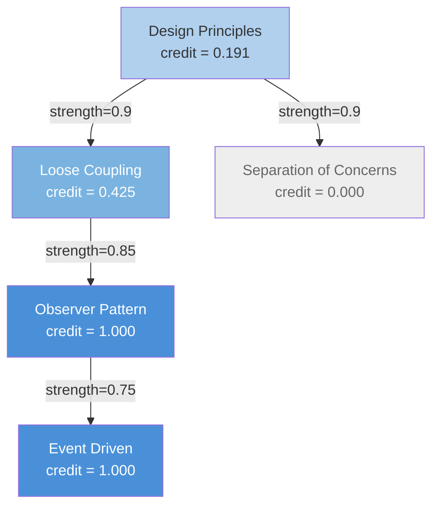
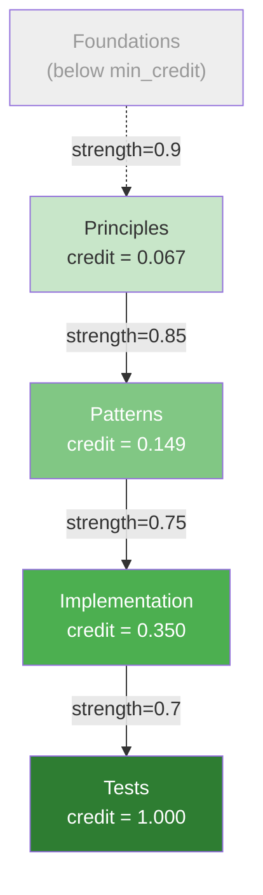

# Propagating What Works

A rule fires. It says: "Observer Pattern REQUIRES loose coupling between subject and observer." The rule works. The downstream system scores it as a success. The Thompson Sampling bandit bumps its score.

But that rule didn't come from nowhere. It was derived from three concepts: Observer Pattern, Loose Coupling, and Event-Driven Architecture. The bandit gives credit to the rule. But which *concept* should get credit? Observer Pattern, because it's named first? All three equally? Just the one most recently updated?

None of those answers are principled. But the causal DAG gives you one that is.

## Direct credit first

The simplest part: concepts that are directly linked to the rule get full credit.

```python
from qortex.causal.dag import CausalDAG
from qortex.causal.credit import CreditAssigner
from qortex.causal.types import CausalEdge, CausalDirection

# Build a small DAG
edges = [
    CausalEdge("design_principles", "loose_coupling", "requires", CausalDirection.FORWARD, 0.9),
    CausalEdge("loose_coupling", "observer_pattern", "requires", CausalDirection.FORWARD, 0.85),
    CausalEdge("observer_pattern", "event_driven", "uses", CausalDirection.FORWARD, 0.75),
    CausalEdge("design_principles", "separation_of_concerns", "requires", CausalDirection.FORWARD, 0.9),
]

dag = CausalDAG.from_edges(edges)
assigner = CreditAssigner(dag=dag, decay_factor=0.5)

# The rule involves these concepts directly
rule_concepts = ["observer_pattern", "event_driven"]
reward = 1.0  # Success!

assignments = assigner.assign_credit(rule_concepts, reward=reward)

for a in assignments:
    print(f"  {a.concept_id:<25} credit={a.credit:.4f}  method={a.method:<8}  path={a.path}")
```

```text
  observer_pattern          credit=1.0000  method=direct    path=['observer_pattern']
  event_driven              credit=1.0000  method=direct    path=['event_driven']
  loose_coupling            credit=0.4250  method=ancestor  path=['loose_coupling', 'observer_pattern']
  design_principles         credit=0.1913  method=ancestor  path=['design_principles', 'loose_coupling', 'observer_pattern']
```

The two rule concepts get full credit (1.0 each). Their ancestors get decayed credit that drops with every hop.

## The decay formula

Here's what's happening at each step. For an ancestor reached by following parent edges:

```
ancestor_credit = current_credit * decay_factor * edge_weight
```

Let's trace the `design_principles` assignment:

1. `observer_pattern` gets direct credit: **1.0**
2. `loose_coupling` is a parent of `observer_pattern` with edge weight 0.85:
   `1.0 * 0.5 * 0.85 = 0.425`
3. `design_principles` is a parent of `loose_coupling` with edge weight 0.9:
   `0.425 * 0.5 * 0.9 = 0.19125`

Each hop multiplies by the decay factor (0.5) and the edge strength. Strong edges pass more credit. Weak edges pass less. Deep ancestors get exponentially less.



Notice `separation_of_concerns` gets zero credit. It's an ancestor of `design_principles`, but credit flows **up** from rewarded concepts to their ancestors, not sideways. The DAG structure determines who gets rewarded.

!!! note "Recap: what's an ancestor?"
    From [Part 2](part2-building-the-dag.md): ancestors are transitive parents. If A -> B -> C, then A and B are ancestors of C. Credit flows from C upward to B, then from B upward to A. The DAG guarantees there are no cycles, so credit never loops back on itself.

## The min_credit cutoff

Credit decays exponentially. After enough hops, it becomes negligible. The `CreditAssigner` has a `min_credit` threshold (default: 0.01) that stops propagation when credit drops below it:

```python
assigner = CreditAssigner(dag=dag, decay_factor=0.5, min_credit=0.01)
```

If a hop would produce credit below 0.01, that ancestor is skipped entirely. This prevents wasting computation on concepts 10 hops away that would receive 0.00001 credit.

The `max_depth` parameter (default: 50) is a hard safety limit that prevents unbounded recursion regardless of credit values.

## From credit to posterior updates

Credit assignments are nice, but the Thompson Sampling bandit doesn't speak "credit." It speaks Beta distribution parameters: alpha (success count) and beta (failure count). The `to_posterior_updates()` static method converts:

```python
updates = CreditAssigner.to_posterior_updates(assignments)

for concept_id, deltas in updates.items():
    print(f"  {concept_id:<25} alpha_delta={deltas['alpha_delta']:.4f}  beta_delta={deltas['beta_delta']:.4f}")
```

```text
  observer_pattern          alpha_delta=1.0000  beta_delta=0.0000
  event_driven              alpha_delta=1.0000  beta_delta=0.0000
  loose_coupling            alpha_delta=0.4250  beta_delta=0.0000
  design_principles         alpha_delta=0.1913  beta_delta=0.0000
```

Positive credit becomes `alpha_delta` (evidence of success). The bandit's Beta distribution shifts toward higher expected reward.

What about failures? Same system, negative reward:

```python
# The rule failed this time
failure_assignments = assigner.assign_credit(rule_concepts, reward=-1.0)
failure_updates = CreditAssigner.to_posterior_updates(failure_assignments)

for concept_id, deltas in failure_updates.items():
    print(f"  {concept_id:<25} alpha_delta={deltas['alpha_delta']:.4f}  beta_delta={deltas['beta_delta']:.4f}")
```

```text
  observer_pattern          alpha_delta=0.0000  beta_delta=1.0000
  event_driven              alpha_delta=0.0000  beta_delta=1.0000
  loose_coupling            alpha_delta=0.0000  beta_delta=0.4250
  design_principles         alpha_delta=0.0000  beta_delta=0.1913
```

Negative credit becomes `beta_delta` (evidence of failure). The distribution shifts toward lower expected reward. Same structure, opposite direction.

!!! note "The connection to Thompson Sampling"
    The bandit maintains a Beta(alpha, beta) distribution for each concept. When a rule succeeds, alpha goes up. When it fails, beta goes up. The bandit samples from this distribution to decide which rules to try next. Credit assignment through the DAG means that when a rule about Observer Pattern succeeds, Loose Coupling also gets a little more optimistic, because the causal structure says they're related.

## Credit flow through a deeper DAG

Let's see credit flowing through four levels:

```python
edges = [
    CausalEdge("foundations",  "principles",  "requires", CausalDirection.FORWARD, 0.9),
    CausalEdge("principles",   "patterns",    "requires", CausalDirection.FORWARD, 0.85),
    CausalEdge("patterns",     "implementation", "uses",  CausalDirection.FORWARD, 0.75),
    CausalEdge("implementation", "tests",     "uses",     CausalDirection.FORWARD, 0.7),
]

dag = CausalDAG.from_edges(edges)
assigner = CreditAssigner(dag=dag, decay_factor=0.5)

assignments = assigner.assign_credit(["tests"], reward=1.0)

print("Credit flow (4 levels):")
for a in assignments:
    depth = len(a.path) - 1
    indent = "  " * depth
    print(f"  {indent}{a.concept_id:<20} credit={a.credit:.4f}  (depth {depth})")
```

```text
Credit flow (4 levels):
  tests                credit=1.0000  (depth 0)
    implementation       credit=0.3500  (depth 1)
      patterns             credit=0.1488  (depth 2)
        principles           credit=0.0669  (depth 3)
```



Notice `foundations` didn't make the cut. Let's check why:

```
principles credit = 0.0669
foundations would be: 0.0669 * 0.5 * 0.9 = 0.0301
```

0.0301 is above the default `min_credit` of 0.01, so it actually would appear. But with a slightly lower decay factor or edge weight, it would vanish. That's the exponential decay at work: four hops deep, and you're already at 3% of the original credit.

## Experimenting with decay factors

The `decay_factor` controls how far credit propagates. Let's compare three settings:

```python
for decay in [0.3, 0.5, 0.8]:
    assigner = CreditAssigner(dag=dag, decay_factor=decay)
    assignments = assigner.assign_credit(["tests"], reward=1.0)

    total_credit = sum(a.credit for a in assignments)
    deepest = max(len(a.path) for a in assignments) - 1
    print(f"  decay={decay}  total_credit={total_credit:.3f}  concepts_credited={len(assignments)}  deepest_hop={deepest}")
```

```text
  decay=0.3  total_credit=1.185  concepts_credited=3  deepest_hop=2
  decay=0.5  total_credit=1.565  concepts_credited=4  deepest_hop=3
  decay=0.8  total_credit=2.098  concepts_credited=5  deepest_hop=4
```

| Decay Factor | Total Credit Distributed | Concepts Credited | Deepest Hop |
|--------------|-------------------------|-------------------|-------------|
| 0.3          | 1.185                   | 3                 | 2           |
| 0.5          | 1.565                   | 4                 | 3           |
| 0.8          | 2.098                   | 5                 | 4           |

Low decay (0.3): credit barely leaves the immediate neighborhood. High decay (0.8): credit spreads far and wide. The default (0.5) is a middle ground.

!!! warning "Higher decay is not always better"
    With decay=0.8, distant ancestors get meaningful credit for things they barely influenced. With decay=0.3, important parent concepts might get ignored. The right value depends on your domain. For tightly coupled knowledge (math proofs), higher decay makes sense. For loosely structured knowledge (survey courses), lower decay prevents noise.

## Putting it together

Here's the full workflow, from rule reward to posterior updates:

```python
from qortex.causal.dag import CausalDAG
from qortex.causal.credit import CreditAssigner
from qortex.causal.types import CausalEdge, CausalDirection

# 1. Build the DAG (once, at startup)
dag = CausalDAG.from_backend(backend, domain="design_patterns")

# 2. Create the assigner
assigner = CreditAssigner(dag=dag, decay_factor=0.5)

# 3. A rule succeeds (or fails)
rule_concept_ids = ["observer_pattern", "loose_coupling", "event_driven"]
reward = 1.0  # or -1.0 for failure

# 4. Assign credit
assignments = assigner.assign_credit(rule_concept_ids, reward=reward)

# 5. Convert to posterior updates
updates = CreditAssigner.to_posterior_updates(assignments)

# 6. Feed to the bandit
for concept_id, deltas in updates.items():
    # bandit.update(concept_id, deltas["alpha_delta"], deltas["beta_delta"])
    print(f"  Update {concept_id}: +{deltas['alpha_delta']:.3f}a / +{deltas['beta_delta']:.3f}b")
```

The DAG answers "who is causally upstream?" The decay formula answers "how much credit do they deserve?" The posterior conversion answers "how does the bandit's belief change?"

## Recap

Let's lock in the key ideas:

1. Direct rule concepts get **full credit** (credit = reward * magnitude)
2. Ancestors get **decayed credit**: `current * decay_factor * edge_weight` per hop
3. Credit below `min_credit` (default 0.01) is dropped; `max_depth` (default 50) prevents runaway recursion
4. Positive credit becomes `alpha_delta` (success evidence); negative becomes `beta_delta` (failure evidence)
5. The DAG structure determines who gets credit; the decay factor determines how much

## Exercise: tune the decay

Using the 4-level DAG from this chapter:

1. At what `decay_factor` does `foundations` (the deepest ancestor) first receive credit above `min_credit=0.01`?
2. If you set `min_credit=0.001`, how does the number of credited concepts change at `decay_factor=0.3`?
3. Run credit assignment for both a success (reward=1.0) and failure (reward=-1.0) on the same concepts. Verify that the posterior updates are symmetric.

??? success "Solution"
    ```python
    from qortex.causal.dag import CausalDAG
    from qortex.causal.credit import CreditAssigner
    from qortex.causal.types import CausalEdge, CausalDirection

    edges = [
        CausalEdge("foundations",  "principles",  "requires", CausalDirection.FORWARD, 0.9),
        CausalEdge("principles",   "patterns",    "requires", CausalDirection.FORWARD, 0.85),
        CausalEdge("patterns",     "implementation", "uses",  CausalDirection.FORWARD, 0.75),
        CausalEdge("implementation", "tests",     "uses",     CausalDirection.FORWARD, 0.7),
    ]

    dag = CausalDAG.from_edges(edges)

    # Question 1: find the threshold decay for foundations
    for decay in [i / 100 for i in range(10, 100, 5)]:
        assigner = CreditAssigner(dag=dag, decay_factor=decay, min_credit=0.01)
        assignments = assigner.assign_credit(["tests"], reward=1.0)
        credited_ids = {a.concept_id for a in assignments}
        if "foundations" in credited_ids:
            foundations_credit = next(a.credit for a in assignments if a.concept_id == "foundations")
            print(f"  decay={decay:.2f}: foundations credit = {foundations_credit:.4f}")
            break

    # Question 2: lower min_credit at decay=0.3
    for mc in [0.01, 0.001]:
        assigner = CreditAssigner(dag=dag, decay_factor=0.3, min_credit=mc)
        assignments = assigner.assign_credit(["tests"], reward=1.0)
        print(f"  min_credit={mc}: {len(assignments)} concepts credited")

    # Question 3: symmetry check
    assigner = CreditAssigner(dag=dag, decay_factor=0.5)

    success = CreditAssigner.to_posterior_updates(
        assigner.assign_credit(["tests"], reward=1.0)
    )
    failure = CreditAssigner.to_posterior_updates(
        assigner.assign_credit(["tests"], reward=-1.0)
    )

    for cid in success:
        s_alpha = success[cid]["alpha_delta"]
        f_beta = failure[cid]["beta_delta"]
        print(f"  {cid}: success alpha={s_alpha:.4f}, failure beta={f_beta:.4f}, symmetric={abs(s_alpha - f_beta) < 1e-10}")
    ```

    You should find that `alpha_delta` from success exactly equals `beta_delta` from failure for every concept. The system is symmetric: success and failure carry the same magnitude of evidence, just in opposite directions.

## What you learned

- `CreditAssigner` propagates reward from rule concepts to their causal ancestors
- The decay formula: `ancestor_credit = current * decay_factor * edge_weight`
- `to_posterior_updates()` converts credit into Thompson Sampling parameters (alpha/beta deltas)
- Decay factor controls propagation depth; `min_credit` stops negligible credit; `max_depth` prevents runaway recursion
- The DAG structure (from Parts 1-2) determines the credit flow paths; d-separation (Part 3) told us which paths carry information; credit assignment uses those same paths to distribute reward

## Next up

Credit assignment outputs alpha_delta and beta_delta. Those are updates to Beta distributions. But Beta distributions live on a specific kind of mathematical surface called a manifold, and alpha/beta updates are movement on that surface. In [Part 5: The Degradation Chain](part5-degradation-chain.md), we look at where the causal module hands off to the geometry module, and what's waiting in the type system for Phase 2.
