# The Degradation Chain

We've been using networkx for everything. D-separation, cycle-breaking, ancestor lookups. It works. But if you look at the type system closely, there are empty slots everywhere. `CausalNode` has a `distribution_family` field set to None. `CausalEdge` has `functional_form` and `learned_params`, both None. The `CausalDispatcher` checks for four libraries in order and only the last one actually runs.

Those aren't bugs. They're landing pads.

## The dispatcher's fallback sequence

Here's what `CausalDispatcher.auto_detect()` actually does:

```python
from qortex.causal.dispatch import CausalDispatcher
from qortex.causal.dag import CausalDAG
from qortex.causal.types import CausalEdge, CausalDirection

# Build any DAG
edges = [
    CausalEdge("A", "B", "requires", CausalDirection.FORWARD, 0.9),
    CausalEdge("B", "C", "uses", CausalDirection.FORWARD, 0.75),
]
dag = CausalDAG.from_edges(edges)

dispatcher = CausalDispatcher.auto_detect(dag)
print(f"Backend: {dispatcher.backend_name}")
print(f"Capabilities: {dispatcher.capabilities()}")
```

```text
Backend: networkx
Capabilities: frozenset({'d_separation'})
```

One backend active, one capability available. But the dispatcher tried three others first:

| Priority | Library  | Phase   | Capabilities                                       | Status          |
|----------|----------|---------|---------------------------------------------------|-----------------|
| 1        | ChiRho   | Phase 3 | SCM, counterfactuals, do-calculus                  | Stub (not implemented) |
| 2        | Pyro     | Phase 2 | Learned structural equations, probabilistic inference | Stub (not implemented) |
| 3        | DoWhy    | Phase 1.5 | Causal identification, effect estimation          | Stub (not implemented) |
| 4        | NetworkX | Phase 1 | D-separation                                       | **Active**      |

The dispatcher probes each library with `importlib.util.find_spec()` (no actual import, just checking availability). If ChiRho is installed, it would be selected first. Since it isn't (and its backend isn't implemented yet), the dispatcher falls through to Pyro, then DoWhy, then NetworkX.



This is the degradation chain. The system always uses the most capable available backend, and gracefully falls back when a library isn't installed.

## The Pyro-aware type system

Now look at the data types. `CausalNode` has two fields that are always None right now:

```python
from qortex.causal.types import CausalNode

node = CausalNode(
    id="observer_pattern",
    name="Observer Pattern",
    domain="design_patterns",
)

print(f"distribution_family: {node.distribution_family}")  # None
print(f"parameter_priors: {node.parameter_priors}")        # None
```

```text
distribution_family: None
parameter_priors: None
```

And `CausalEdge` has two more:

```python
from qortex.causal.types import CausalEdge, CausalDirection

edge = CausalEdge(
    source_id="A",
    target_id="B",
    relation_type="requires",
    direction=CausalDirection.FORWARD,
    strength=0.9,
)

print(f"functional_form: {edge.functional_form}")   # None
print(f"learned_params: {edge.learned_params}")      # None
```

```text
functional_form: None
learned_params: None
```

These are the Phase 2 slots:

| Field                | Lives on    | Phase 2 purpose                                          |
|----------------------|-------------|----------------------------------------------------------|
| `distribution_family`| CausalNode  | What kind of distribution this node follows (e.g., "beta", "normal") |
| `parameter_priors`   | CausalNode  | Prior parameters for the distribution                     |
| `functional_form`    | CausalEdge  | How the parent influences the child (e.g., "linear", "logistic") |
| `learned_params`     | CausalEdge  | Parameters learned from data (weights, biases)            |

When Phase 2 lands, the Pyro backend will populate these fields. A `CausalEdge` with `functional_form="linear"` and `learned_params={"weight": 0.73, "bias": -0.1}` describes a structural equation: `child = 0.73 * parent - 0.1 + noise`. That's a full probabilistic model, not just a direction and a strength.

## The binding surface

Here's where the causal module connects to what comes next.

In [Part 4](part4-credit-assignment.md), we saw that `CreditAssigner.to_posterior_updates()` outputs alpha_delta and beta_delta for each concept. Those deltas update a Beta distribution.

A Beta distribution lives on a statistical manifold. The alpha_delta and beta_delta values are a direction of movement on that manifold. In differential geometry terms, they're components of a tangent vector at the current point in belief space.



The causal DAG chooses **where** to send credit (which concepts, through which paths). The Fisher manifold (covered in the next tutorial series) determines **how far** each update actually moves the system's beliefs. The binding point is `to_posterior_updates()`: it's the last thing the causal module produces and the first thing the geometry module consumes.

!!! note "You don't need to understand manifolds yet"
    The Fisher information series will build up from scratch, the same way we built up d-separation from three tiny graphs. For now, the key point is: the causal module's output format was designed to plug directly into the geometry module's input format. The alpha/beta deltas aren't just numbers; they're coordinates in a space that has curvature, distance, and volume. Phase 2 will make that explicit.

## What's waiting for Phase 2

A quick summary of what changes when each library's backend is implemented:

| Phase   | Library  | What it adds                                                     |
|---------|----------|------------------------------------------------------------------|
| Phase 1 | NetworkX | D-separation, topological ordering, ancestor/descendant queries  |
| Phase 1.5 | DoWhy  | Causal identification (backdoor/frontdoor criteria), effect estimation |
| Phase 2 | Pyro     | Learned structural equations, probabilistic inference, sample sites |
| Phase 3 | ChiRho   | Structural causal models, counterfactual reasoning, do-calculus  |

Each phase is a strict superset of the previous one. Phase 1.5 can do everything Phase 1 does plus effect estimation. Phase 2 adds learned parameters. Phase 3 adds world-splitting counterfactuals ("what would have happened if X were different?").

The type system is ready for all of them. The dispatcher will route to the best available backend automatically. Your code that calls `CausalDispatcher.auto_detect(dag)` won't need to change.

## The capability system

Each backend declares what it can do:

```python
from qortex.causal.types import CausalCapability

# All five capabilities in the enum
for cap in CausalCapability:
    print(f"  {cap.value}")
```

```text
  d_separation
  ci_testing
  probabilistic_inference
  intervention
  counterfactual
```

The NetworkX backend claims only `d_separation`. A future DoWhy backend would add `ci_testing`. Pyro would add `probabilistic_inference`. ChiRho would add `intervention` and `counterfactual`.

The dispatcher checks capabilities before routing queries, so you get clear error messages instead of silent failures:

```python
from qortex.causal.types import CausalQuery, QueryType

query = CausalQuery(
    query_type=QueryType.INTERVENTIONAL,
    target_nodes=frozenset({"B"}),
    intervention_nodes=frozenset({"A"}),
    intervention_values={"A": 1.0},
)

try:
    result = dispatcher.query(query)
except NotImplementedError as e:
    print(f"Error: {e}")
```

```text
Error: interventional queries require Phase 2+ backends (Pyro/ChiRho)
```

No silent degradation. No wrong answers. Just a clear message about what's needed.

## Recap

1. `CausalDispatcher` probes libraries in order: ChiRho, Pyro, DoWhy, NetworkX
2. Phase 1 runs on NetworkX only (d-separation)
3. The type system has Pyro-aware fields (`distribution_family`, `functional_form`, `learned_params`) waiting for Phase 2
4. `to_posterior_updates()` is the binding surface between the causal module and the information geometry module
5. Each backend declares its capabilities; the dispatcher prevents queries that exceed them

## What you learned (the whole series)

Across all five chapters:

- **Part 1**: Edges have causal directions. `RELATION_CAUSAL_DIRECTION` maps 10 relation types to forward, reverse, bidirectional, or none.
- **Part 2**: Real graphs have cycles. `CausalDAG` breaks them by cutting the weakest edge.
- **Part 3**: D-separation answers "what can I learn from here?" using three structures: chain, fork, collider. Conditioning on a collider *opens* paths.
- **Part 4**: Credit flows from rewarded concepts to their causal ancestors, decaying by `decay_factor * edge_weight` per hop. `to_posterior_updates()` converts credit to Thompson Sampling parameters.
- **Part 5**: The system degrades gracefully across four backends and the type system is ready for the upgrade path.

## Where this leads

The causal layer tells you **which edges matter** and **where to send credit**. The information geometry layer (the [next tutorial series](../fisher-information/index.md)) tells you **how much information each edge carries** and **whether the system's confidence is justified**. The two bind at `to_posterior_updates()`: the causal DAG chooses the direction; the Fisher manifold determines the distance.
