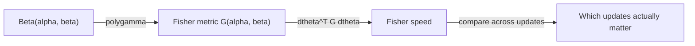

# Your Coordinates Are Lying to You

You built a Thompson Sampling bandit. It picks review rules by sampling from Beta distributions, one per rule. When a rule catches a real bug, you bump alpha. When it misses, you bump beta. Simple enough.

You plot the trajectories: `(alpha, beta)` over time for each rule. Three rules start at `(1, 1)`. After a few reviews, they're at:

- **Rule A:** `(2, 1)`
- **Rule B:** `(3, 2)`
- **Rule C:** `(101, 100)`

Rule A and Rule C both just got a single success. Both moved alpha by 1. The Euclidean distance of that last update is exactly `1.0` for both.

But Rule A went from "I know nothing" to "maybe this rule is good." Rule C went from "I'm extremely confident this rule is average" to "I'm extremely confident this rule is average."

Those are not the same update. Your coordinate system is lying to you.

---

## The Same Step, Two Different Worlds

Let's compute what actually happened. No formulas yet, just code and numbers.

```python
from scipy.special import polygamma
import numpy as np

def fisher_metric(alpha, beta):
    """The 2x2 matrix that measures 'true' distances in Beta-distribution space."""
    psi1_a = polygamma(1, alpha)    # trigamma of alpha
    psi1_b = polygamma(1, beta)     # trigamma of beta
    psi1_ab = polygamma(1, alpha + beta)  # trigamma of (alpha + beta)
    return np.array([
        [psi1_a - psi1_ab,  -psi1_ab],
        [-psi1_ab,           psi1_b - psi1_ab]
    ])

# Look at the metric at three points
print("At Beta(1,1) -- maximum ignorance:")
print(fisher_metric(1.0, 1.0).round(4))
print()
print("At Beta(10,10) -- moderate confidence:")
print(fisher_metric(10.0, 10.0).round(4))
print()
print("At Beta(100,100) -- high confidence:")
print(fisher_metric(100.0, 100.0).round(4))
```

Run that. You'll get something like:

```
At Beta(1,1) -- maximum ignorance:
[[ 1.1449 -0.3951]
 [-0.3951  1.1449]]

At Beta(10,10) -- moderate confidence:
[[ 0.0618 -0.0118]
 [-0.0118  0.0618]]

At Beta(100,100) -- high confidence:
[[ 0.0052 -0.0002]
 [-0.0002  0.0052]]
```

The diagonal entries shrank by a factor of **220x** between `(1,1)` and `(100,100)`. That matrix is the ruler. And the ruler itself changes depending on where you're standing.

!!! note "What is this matrix?"
    It's called the **Fisher information matrix**. We'll earn that name properly in a few sections. For now, just notice: the entries are huge when you don't know much, and tiny when you're confident. It's measuring how *sensitive* the distribution is to parameter changes at that point.

---

## Measuring the "Real" Distance

That matrix turns into a distance measurement. Here's how: take the parameter change `(delta_alpha, delta_beta)`, sandwich it with the matrix, take the square root.

```python
def fisher_speed(a1, b1, a2, b2):
    """How far did we REALLY move in belief space?"""
    G = fisher_metric(a1, b1)
    dtheta = np.array([a2 - a1, b2 - b1])
    return np.sqrt(max(dtheta @ G @ dtheta, 0))

# The "same" update at two very different points
early = fisher_speed(1, 1, 2, 1)          # Ignorance -> first evidence
late  = fisher_speed(100, 100, 101, 100)   # Confident -> slightly more

print(f"Fisher speed near (1,1):     {early:.4f}")
print(f"Fisher speed near (100,100): {late:.4f}")
print(f"Ratio: {early/late:.1f}x")
```

Output:

```
Fisher speed near (1,1):     1.0703
Fisher speed near (100,100): 0.0718
Ratio: 14.9x
```

Same Euclidean step. Nearly **15x** difference in information-geometric distance.

The early update covered a huge region of "belief space." The late update barely moved. This matches intuition perfectly: your first data point changes everything; your hundredth barely matters.

---

## Why the Trigamma Function?

Let's back up. That `polygamma(1, x)` call is computing the *trigamma function*, written as $\psi_1(x)$ or $\psi'(x)$. It's the second derivative of the log-gamma function.

Why does it show up? Here's the chain:

1. The Beta distribution has a log-likelihood that depends on `alpha` and `beta`
2. The Fisher information is the expected value of second derivatives of that log-likelihood
3. For the Beta family, those expectations reduce to trigamma functions

You don't need to memorize the derivation. The key insight is: **trigamma measures curvature of the log-likelihood.** When `alpha` is small, the log-likelihood curves sharply (high trigamma), so small parameter changes make big distributional changes. When `alpha` is large, the log-likelihood is nearly flat (low trigamma), so parameter changes don't do much.

```python
from scipy.special import polygamma

# Trigamma at various points
for x in [0.5, 1.0, 2.0, 5.0, 10.0, 50.0, 100.0]:
    print(f"  psi_1({x:6.1f}) = {polygamma(1, x):.6f}")
```

```
  psi_1(   0.5) = 4.934802
  psi_1(   1.0) = 1.644934
  psi_1(   2.0) = 0.644934
  psi_1(   5.0) = 0.221323
  psi_1(  10.0) = 0.105166
  psi_1(  50.0) = 0.020206
  psi_1( 100.0) = 0.010050
```

It falls off roughly like $1/x$. That's why the metric shrinks so fast.

---

## Now Name the Thing

What we just computed has a name. The space of all Beta distributions, equipped with the Fisher information matrix as its distance-measuring device, is a **statistical manifold**.

Think of it like the surface of the Earth:

| Earth's surface | Beta manifold |
|---|---|
| Points are locations (lat, lon) | Points are distributions Beta(alpha, beta) |
| Distance depends on curvature | Distance depends on Fisher metric |
| Straight lines on a flat map are wrong | Euclidean distances in (alpha, beta) are wrong |
| The metric is the first fundamental form | The metric is the Fisher information matrix |

You wouldn't measure the distance from New York to London on a flat map. Don't measure belief distances in Euclidean (alpha, beta) space.

!!! warning "The uniqueness result"
    This isn't just one of many possible metrics. Chentsov's theorem (1982) proves that the Fisher information metric is the **only** Riemannian metric on a statistical manifold that's invariant under sufficient statistics. There's no other geometrically consistent way to measure distance between probability distributions in this family.

---

## The Metric as a Matrix Field

Let's see how the metric changes across the space. This is not a single matrix. It's a *matrix at every point*.

```python
import matplotlib.pyplot as plt
import numpy as np
from scipy.special import polygamma

def fisher_metric(alpha, beta):
    psi1_a = polygamma(1, alpha)
    psi1_b = polygamma(1, beta)
    psi1_ab = polygamma(1, alpha + beta)
    return np.array([
        [psi1_a - psi1_ab,  -psi1_ab],
        [-psi1_ab,           psi1_b - psi1_ab]
    ])

# Plot the (1,1) entry of G across the space
alphas = np.linspace(0.5, 20, 100)
betas = np.linspace(0.5, 20, 100)
A, B = np.meshgrid(alphas, betas)
G11 = np.zeros_like(A)

for i in range(A.shape[0]):
    for j in range(A.shape[1]):
        G11[i, j] = fisher_metric(A[i, j], B[i, j])[0, 0]

fig, ax = plt.subplots(figsize=(8, 6))
c = ax.pcolormesh(A, B, np.log10(G11), cmap='viridis', shading='auto')
ax.set_xlabel('alpha')
ax.set_ylabel('beta')
ax.set_title('log10(G_11): Fisher metric intensity')
plt.colorbar(c, label='log10(G_11)')
plt.tight_layout()
plt.show()
```

The metric is blazing hot near the origin (small alpha, small beta) and cold everywhere else. That corner is where early learning happens. Every step there is enormous.

---

## Loading Real Bandit Data

Enough theory. Let's look at actual data from a real Thompson Sampling bandit.

```python
import json

def load_bandit_trajectories(path="bandit_state.jsonl"):
    """Load bandit state history, return trajectories keyed by arm."""
    trajectories = {}
    with open(path) as f:
        for line in f:
            record = json.loads(line)
            arm_id = record["arm_id"]
            if arm_id not in trajectories:
                trajectories[arm_id] = []
            trajectories[arm_id].append({
                "alpha": record["alpha"],
                "beta": record["beta"],
                "step": record.get("step", len(trajectories[arm_id])),
            })
    return trajectories

trajectories = load_bandit_trajectories()
print(f"Loaded {len(trajectories)} arms")
for arm_id, traj in list(trajectories.items())[:3]:
    print(f"  {arm_id}: {len(traj)} updates, "
          f"start=({traj[0]['alpha']:.0f},{traj[0]['beta']:.0f}), "
          f"end=({traj[-1]['alpha']:.1f},{traj[-1]['beta']:.1f})")
```

Now compute the Fisher speed for every consecutive update:

```python
speeds = []
for arm_id, traj in trajectories.items():
    for i in range(1, len(traj)):
        a1, b1 = traj[i-1]["alpha"], traj[i-1]["beta"]
        a2, b2 = traj[i]["alpha"],   traj[i]["beta"]
        s = fisher_speed(a1, b1, a2, b2)
        total_evidence = a1 + b1
        speeds.append({
            "arm_id": arm_id,
            "step": i,
            "fisher_speed": s,
            "total_evidence": total_evidence,
        })

# Sort by Fisher speed, descending
speeds.sort(key=lambda x: x["fisher_speed"], reverse=True)

print("Top 5 updates by Fisher speed:")
for s in speeds[:5]:
    print(f"  {s['arm_id']} step {s['step']}: "
          f"speed={s['fisher_speed']:.4f}, "
          f"evidence={s['total_evidence']:.0f}")

print("\nBottom 5:")
for s in speeds[-5:]:
    print(f"  {s['arm_id']} step {s['step']}: "
          f"speed={s['fisher_speed']:.4f}, "
          f"evidence={s['total_evidence']:.0f}")
```

You'll see it immediately: the highest-speed updates all have low total evidence. The lowest-speed updates all have high total evidence. Every. Single. Time.

---

## The Falsifiable Claim

Here's a claim we can test right now:

> **Fisher speed between consecutive bandit updates is negatively correlated with total evidence (alpha + beta) at the starting point.**

```python
from scipy.stats import pearsonr

fisher_speeds = [s["fisher_speed"] for s in speeds]
total_evidences = [s["total_evidence"] for s in speeds]

r, p = pearsonr(fisher_speeds, total_evidences)
print(f"Pearson r = {r:.4f}")
print(f"p-value   = {p:.2e}")
```

If `r` is strongly negative (and it will be), your coordinate system was indeed lying. Updates that look identical in `(alpha, beta)` space carry wildly different amounts of information, and the Fisher metric tells you which ones actually matter.

---

## Recap: What Just Happened

Let's be explicit about what we built:



1. The Fisher information matrix `G(alpha, beta)` is a 2x2 matrix that varies across the parameter space
2. It's built from trigamma functions: `polygamma(1, x)`
3. It measures how sensitive the distribution is to parameter changes at each point
4. Fisher speed `= sqrt(dtheta^T G dtheta)` gives the "true" information distance of an update
5. Early updates (low evidence) have high Fisher speed; late updates (high evidence) have low Fisher speed
6. The ratio can be 10x to 15x or more for the same Euclidean step size

---

## Exercise: Find the Highest-Speed Update

??? success "Exercise: Find the update with the highest Fisher speed in your real bandit data"

    Load `bandit_state.jsonl`, compute Fisher speed for every consecutive update, and find the one that moved the most in information space.

    ```python
    max_speed = 0
    max_update = None

    for arm_id, traj in trajectories.items():
        for i in range(1, len(traj)):
            a1, b1 = traj[i-1]["alpha"], traj[i-1]["beta"]
            a2, b2 = traj[i]["alpha"],   traj[i]["beta"]
            s = fisher_speed(a1, b1, a2, b2)
            if s > max_speed:
                max_speed = s
                max_update = {
                    "arm_id": arm_id,
                    "step": i,
                    "from": (a1, b1),
                    "to": (a2, b2),
                    "fisher_speed": s,
                }

    print(f"Highest Fisher speed update:")
    print(f"  Arm: {max_update['arm_id']}")
    print(f"  Step: {max_update['step']}")
    print(f"  From: Beta({max_update['from'][0]:.1f}, {max_update['from'][1]:.1f})")
    print(f"  To:   Beta({max_update['to'][0]:.1f}, {max_update['to'][1]:.1f})")
    print(f"  Fisher speed: {max_update['fisher_speed']:.4f}")
    ```

    It's almost certainly one of the very first updates, where `alpha + beta` is close to 2. That's where the manifold is steepest.

---

## What You Learned

- Euclidean distance in `(alpha, beta)` space is meaningless for comparing belief changes
- The **Fisher information matrix** is the correct ruler; it's built from trigamma functions
- **Fisher speed** measures the true information-theoretic size of an update
- The metric shrinks dramatically as confidence grows: early updates are geometrically enormous, late updates are tiny
- This is the **only** consistent metric for probability distributions (Chentsov's theorem)

## Bridge to Chapter 2

We can now measure the true distance of a single step. But what about the whole journey? When we trace the bandit's path through belief space, coloring each segment by its Fisher speed, we'll see the learning story unfold: hot red segments at the start (the system is learning fast), cooling to blue as confidence solidifies. Two arms that look close in `(alpha, beta)` coordinates might be far apart in Fisher distance. The trajectories will surprise you. And the shortest path between two beliefs turns out to be curved.
