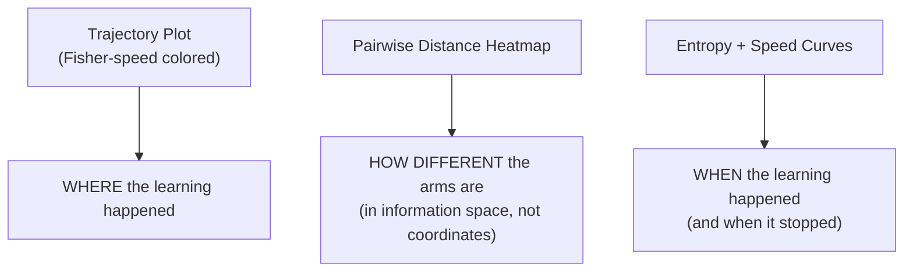

# Paths Through Belief Space

Your bandit has been running for weeks. Each arm started at `Beta(1, 1)` and wandered through parameter space as evidence arrived. You can plot those trajectories as lines in the `(alpha, beta)` plane. Fine.

But after Chapter 1, you know that plot is a lie. Two equal-length segments on that plot might represent a massive learning event and a negligible twitch. The ruler changes depending on where you are.

So let's re-plot the trajectories with a ruler that tells the truth.

---

## Loading and Preparing Trajectories

First, the infrastructure. We need the Fisher metric from Chapter 1, plus a way to load complete arm trajectories.

```python
import json
import numpy as np
from scipy.special import polygamma

def fisher_metric(alpha, beta):
    psi1_a = polygamma(1, alpha)
    psi1_b = polygamma(1, beta)
    psi1_ab = polygamma(1, alpha + beta)
    return np.array([
        [psi1_a - psi1_ab,  -psi1_ab],
        [-psi1_ab,           psi1_b - psi1_ab]
    ])

def fisher_speed(a1, b1, a2, b2):
    G = fisher_metric(a1, b1)
    dtheta = np.array([a2 - a1, b2 - b1])
    return np.sqrt(max(dtheta @ G @ dtheta, 0))

def posterior_entropy(alpha, beta):
    """Shannon entropy of Beta(alpha, beta)."""
    from scipy.special import betaln, digamma
    return (betaln(alpha, beta)
            - (alpha - 1) * digamma(alpha)
            - (beta - 1) * digamma(beta)
            + (alpha + beta - 2) * digamma(alpha + beta))

def load_bandit_trajectories(path="bandit_state.jsonl"):
    trajectories = {}
    with open(path) as f:
        for line in f:
            record = json.loads(line)
            arm_id = record["arm_id"]
            if arm_id not in trajectories:
                trajectories[arm_id] = []
            trajectories[arm_id].append({
                "alpha": record["alpha"],
                "beta": record["beta"],
                "step": record.get("step", len(trajectories[arm_id])),
            })
    return trajectories

trajectories = load_bandit_trajectories()
```

Now enrich every trajectory with Fisher speeds and entropy values:

```python
for arm_id, traj in trajectories.items():
    # Entropy at each point
    for point in traj:
        point["entropy"] = posterior_entropy(point["alpha"], point["beta"])

    # Fisher speed between consecutive points
    traj[0]["fisher_speed"] = 0.0
    for i in range(1, len(traj)):
        traj[i]["fisher_speed"] = fisher_speed(
            traj[i-1]["alpha"], traj[i-1]["beta"],
            traj[i]["alpha"],   traj[i]["beta"]
        )
```

---

## The Fisher-Speed Trajectory Plot

Here's the payoff. We color each trajectory segment by its Fisher speed: hot red means the system learned a lot from that update, cool blue means it barely moved in information space.

```python
import matplotlib.pyplot as plt
from matplotlib.collections import LineCollection
from matplotlib.colors import Normalize

fig, ax = plt.subplots(figsize=(10, 8))
cmap = plt.cm.coolwarm

# Collect all speeds for consistent color normalization
all_speeds = []
for traj in trajectories.values():
    all_speeds.extend([p["fisher_speed"] for p in traj[1:]])
norm = Normalize(vmin=0, vmax=np.percentile(all_speeds, 95))

for arm_id, traj in trajectories.items():
    alphas = [p["alpha"] for p in traj]
    betas  = [p["beta"]  for p in traj]
    speeds = [p["fisher_speed"] for p in traj]

    # Build line segments
    points = np.array(list(zip(alphas, betas))).reshape(-1, 1, 2)
    segments = np.concatenate([points[:-1], points[1:]], axis=1)

    lc = LineCollection(segments, cmap=cmap, norm=norm, linewidth=2, alpha=0.8)
    lc.set_array(np.array(speeds[1:]))
    ax.add_collection(lc)

    # Mark start and end
    ax.plot(alphas[0], betas[0], 'o', color='green', markersize=6, zorder=5)
    ax.plot(alphas[-1], betas[-1], 's', color='black', markersize=6, zorder=5)
    ax.annotate(arm_id, (alphas[-1], betas[-1]), fontsize=7, alpha=0.7)

ax.set_xlabel('alpha')
ax.set_ylabel('beta')
ax.set_title('Bandit Trajectories (colored by Fisher speed)')
ax.autoscale()
plt.colorbar(plt.cm.ScalarMappable(norm=norm, cmap=cmap), ax=ax, label='Fisher speed')
plt.tight_layout()
plt.show()
```

What you'll see: every trajectory starts hot (red/orange near the origin) and cools to blue as evidence accumulates. The system learns the most from its earliest observations. By the time `alpha + beta > 20`, the updates are nearly invisible in Fisher space even though they look the same size on the Euclidean plot.

!!! note "Reading the plot"
    Green circles mark the starting point `(1, 1)` for each arm. Black squares mark the current position. Red segments are where the system was learning fast. Blue segments are where it was coasting.

---

## Pairwise Fisher Distance Heatmap

Two arms might end up at similar `(alpha, beta)` coordinates but have taken completely different paths. Or two arms might look far apart in Euclidean space but be close in Fisher distance.

Let's compute the pairwise Fisher distance between all arm endpoints.

```python
def fisher_distance_approx(a1, b1, a2, b2, n_steps=50):
    """Approximate Fisher distance by integrating speed along the straight-line path."""
    total = 0.0
    for i in range(n_steps):
        t0 = i / n_steps
        t1 = (i + 1) / n_steps
        a_mid = a1 + (a2 - a1) * (t0 + t1) / 2
        b_mid = b1 + (b2 - b1) * (t0 + t1) / 2
        a_s = a1 + (a2 - a1) * t0
        b_s = b1 + (b2 - b1) * t0
        a_e = a1 + (a2 - a1) * t1
        b_e = b1 + (b2 - b1) * t1
        total += fisher_speed(a_s, b_s, a_e, b_e)
    return total

arm_ids = sorted(trajectories.keys())
n = len(arm_ids)
dist_matrix = np.zeros((n, n))

for i in range(n):
    for j in range(i + 1, n):
        end_i = trajectories[arm_ids[i]][-1]
        end_j = trajectories[arm_ids[j]][-1]
        d = fisher_distance_approx(
            end_i["alpha"], end_i["beta"],
            end_j["alpha"], end_j["beta"]
        )
        dist_matrix[i, j] = d
        dist_matrix[j, i] = d

fig, ax = plt.subplots(figsize=(8, 7))
im = ax.imshow(dist_matrix, cmap='YlOrRd')
ax.set_xticks(range(n))
ax.set_yticks(range(n))
ax.set_xticklabels(arm_ids, rotation=45, ha='right', fontsize=7)
ax.set_yticklabels(arm_ids, fontsize=7)
ax.set_title('Pairwise Fisher Distance Between Arm Endpoints')
plt.colorbar(im, label='Fisher distance (approx)')
plt.tight_layout()
plt.show()
```

Look for pairs that are close in the heatmap but far apart in the trajectory plot (or the reverse). Those are cases where the Euclidean picture is maximally misleading.

---

## Entropy and Speed Convergence Curves

Two complementary views of "is the system learning?"

**Entropy** measures how uncertain the posterior is. It should decrease as evidence arrives (if the evidence is consistent).

**Fisher speed** measures how much each update matters. It should decrease as the posterior concentrates.

```python
fig, axes = plt.subplots(1, 2, figsize=(14, 5))

# Panel 1: Entropy over time
ax1 = axes[0]
for arm_id, traj in trajectories.items():
    steps = [p["step"] for p in traj]
    entropies = [p["entropy"] for p in traj]
    ax1.plot(steps, entropies, label=arm_id, alpha=0.7)
ax1.set_xlabel('Step')
ax1.set_ylabel('Posterior entropy (nats)')
ax1.set_title('Entropy convergence per arm')
ax1.legend(fontsize=6, ncol=2)

# Panel 2: Fisher speed over time
ax2 = axes[1]
for arm_id, traj in trajectories.items():
    steps = [p["step"] for p in traj[1:]]
    speeds = [p["fisher_speed"] for p in traj[1:]]
    ax2.plot(steps, speeds, label=arm_id, alpha=0.7)
ax2.set_xlabel('Step')
ax2.set_ylabel('Fisher speed')
ax2.set_title('Fisher speed per update (should decay)')
ax2.legend(fontsize=6, ncol=2)

plt.tight_layout()
plt.show()
```

Both curves should be dropping. If entropy *increases* at any point, that's contradictory evidence: the arm got a result that pushes it away from its current belief. Flag that. It's interesting.

!!! warning "Entropy increase = contradictory evidence"
    For a Beta-Bernoulli model, entropy can increase if the update pushes the posterior toward `alpha = beta` (maximum uncertainty for a given evidence level). This signals that the system's belief is being challenged. In a later chapter, we'll call this *confusion*.

---

## The Visual Summary

Here's what the three plots together tell you:



| Plot | Question it answers | What to look for |
|---|---|---|
| Trajectory (speed-colored) | Where did the system learn? | Red segments near the origin |
| Pairwise distance heatmap | Which arms are truly different? | Surprising pairs: close in coords, far in Fisher |
| Entropy convergence | Is learning monotonic? | Any increases signal contradictory evidence |
| Speed decay | Are we getting diminishing returns? | All arms should cool off over time |

---

## Quick Recap

We started with raw `(alpha, beta)` trajectories. We added three layers of Fisher-aware analysis:

1. **Speed coloring** reveals that early updates dominate the information content
2. **Pairwise distances** show that coordinate proximity is misleading; Fisher distance tells the real story
3. **Entropy and speed curves** track the pace of learning over time, and flag anomalies

All of these use only the Fisher metric from Chapter 1. No new math. Just applying the same ruler to different questions.

---

## The Path Length Question

One more thing before we go. We've been coloring segments by Fisher speed (distance per update). What about the *total* Fisher distance traveled by each arm? That's the cumulative path length.

```python
for arm_id, traj in trajectories.items():
    total_path = sum(p["fisher_speed"] for p in traj[1:])
    n_updates = len(traj) - 1
    print(f"  {arm_id}: {n_updates} updates, "
          f"total Fisher path = {total_path:.3f}, "
          f"avg speed = {total_path/n_updates:.4f}")
```

Arms with longer Fisher paths learned more in total. Arms with short paths were either boring (consistent, already-known behavior) or starved of data.

---

## Exercise: The Most Interesting Arm

??? success "Exercise: Identify the 'most interesting' arm by total Fisher path length"

    The arm with the longest total Fisher path length experienced the most total learning. Find it.

    ```python
    path_lengths = {}
    for arm_id, traj in trajectories.items():
        path_lengths[arm_id] = sum(p["fisher_speed"] for p in traj[1:])

    # Sort by path length
    ranked = sorted(path_lengths.items(), key=lambda x: x[1], reverse=True)

    print("Arms ranked by total Fisher path length:")
    for arm_id, length in ranked:
        traj = trajectories[arm_id]
        print(f"  {arm_id}: path_length={length:.4f}, "
              f"n_updates={len(traj)-1}, "
              f"final=({traj[-1]['alpha']:.1f}, {traj[-1]['beta']:.1f})")
    ```

    The "most interesting" arm is the one where the Fisher path length is highest relative to its number of updates. That means each update carried unusually high information content, or the arm spent a lot of time in the high-curvature region near the origin.

    Bonus: compare this ranking to the Euclidean path length ranking. They won't agree.

---

## What You Learned

- **Fisher-speed coloring** on trajectory plots reveals where learning actually happened (always early, near the origin)
- **Pairwise Fisher distance** between arm endpoints tells you how different arms truly are, regardless of their coordinate proximity
- **Entropy convergence** should be monotonically decreasing; any increase flags contradictory evidence
- **Total Fisher path length** measures cumulative learning; it's the "most interesting arm" metric

## Bridge to Chapter 3

We've been approximating Fisher distance by integrating along straight lines in `(alpha, beta)` space. That approximation is convenient. It's also wrong.

The "true" Fisher distance between two points is the length of the *shortest path* connecting them, and that shortest path is not a straight line. On a curved surface, the shortest path bends. Computing it requires solving a differential equation involving objects called Christoffel symbols, which are built from the *derivatives* of the metric.

The straight-line approximation is an upper bound. The real distance is shorter. Let's find it.
