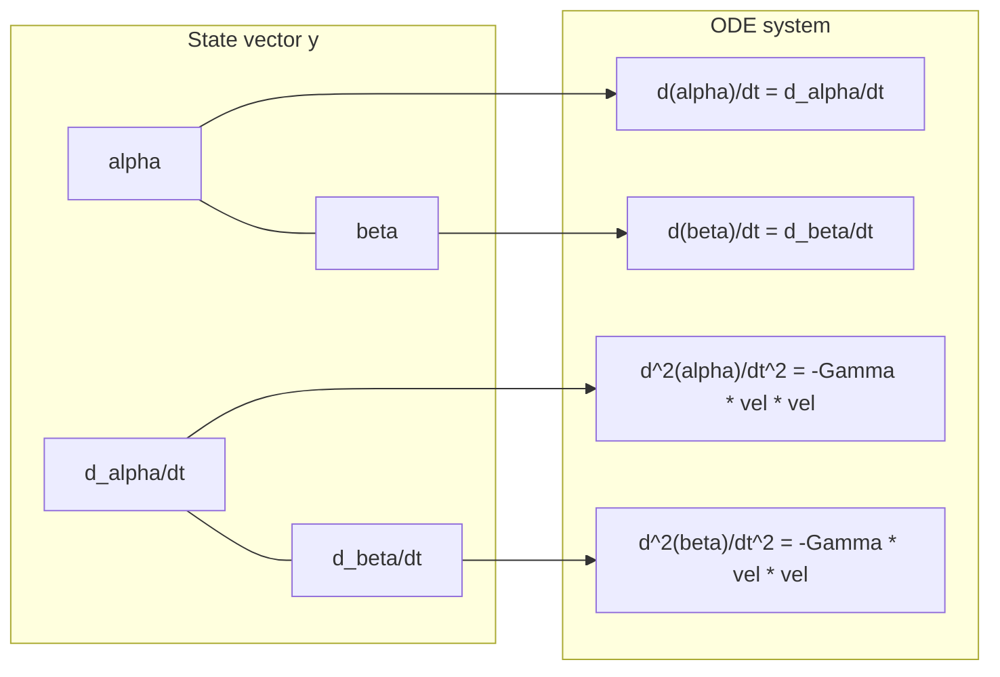

# The Shortest Path Is Curved

In Chapter 2, we computed Fisher distances by integrating along straight-line paths in `(alpha, beta)` space. That was a useful lie. The real shortest path between two beliefs on the Beta manifold is not a straight line. It curves.

Picture it this way: you're on the surface of the Earth, and you want to fly from Tokyo to Los Angeles. The shortest route on a flat map is a straight line. The actual shortest route (a great circle) curves up toward Alaska. The surface is curved, so straight lines in coordinates are not shortest paths on the surface.

Same thing here. The Beta manifold is curved. The shortest path between Beta(2, 5) and Beta(10, 3) bends. To find it, we need to solve a differential equation.

---

## The Geodesic Equation

A **geodesic** is the shortest path between two points on a curved surface. On the Beta manifold, geodesics satisfy:

$$\frac{d^2\theta^k}{dt^2} + \Gamma^k_{ij} \frac{d\theta^i}{dt} \frac{d\theta^j}{dt} = 0$$

The $\Gamma^k_{ij}$ are the **Christoffel symbols**, and they encode how the manifold curves. But let's not start with the equation. Let's start with the code.

---

## Step 1: The Fisher Metric (Recap)

We need the metric from Chapter 1, plus its derivatives.

```python
import numpy as np
from scipy.special import polygamma

def fisher_metric(alpha, beta):
    """Fisher information matrix for Beta(alpha, beta)."""
    psi1_a = polygamma(1, alpha)
    psi1_b = polygamma(1, beta)
    psi1_ab = polygamma(1, alpha + beta)
    return np.array([
        [psi1_a - psi1_ab,  -psi1_ab],
        [-psi1_ab,           psi1_b - psi1_ab]
    ])
```

---

## Step 2: Christoffel Symbols

The Christoffel symbols tell you how the coordinate grid "bends" across the manifold. They're computed from the metric and its first derivatives.

The formula: $\Gamma^k_{ij} = \frac{1}{2} G^{kl} \left(\partial_i G_{jl} + \partial_j G_{il} - \partial_l G_{ij}\right)$

where $G^{kl}$ is the inverse metric. The derivatives of our metric involve **tetragamma functions** (the third derivative of log-gamma, `polygamma(2, x)`).

```python
def metric_derivatives(alpha, beta):
    """Partial derivatives of the Fisher metric components.

    Returns dG_da[2,2] and dG_db[2,2]: derivatives with respect to alpha and beta.
    """
    # Tetragamma function: polygamma(2, x) = psi''(x)
    psi2_a  = polygamma(2, alpha)
    psi2_b  = polygamma(2, beta)
    psi2_ab = polygamma(2, alpha + beta)

    # dG/d(alpha)
    dG_da = np.array([
        [psi2_a - psi2_ab,  -psi2_ab],
        [-psi2_ab,          -psi2_ab]
    ])

    # dG/d(beta)
    dG_db = np.array([
        [-psi2_ab,          -psi2_ab],
        [-psi2_ab,           psi2_b - psi2_ab]
    ])

    return dG_da, dG_db

def christoffel_symbols(alpha, beta):
    """Compute Christoffel symbols Gamma^k_ij for the Beta manifold.

    Returns Gamma[k, i, j] as a 2x2x2 array.
    """
    G = fisher_metric(alpha, beta)
    G_inv = np.linalg.inv(G)
    dG_da, dG_db = metric_derivatives(alpha, beta)
    dG = [dG_da, dG_db]   # dG[l][i,j] = dG_ij / d(theta^l)

    Gamma = np.zeros((2, 2, 2))
    for k in range(2):
        for i in range(2):
            for j in range(2):
                s = 0.0
                for l in range(2):
                    s += G_inv[k, l] * (
                        dG[i][j, l] + dG[j][i, l] - dG[l][i, j]
                    )
                Gamma[k, i, j] = 0.5 * s
    return Gamma
```

Let's see what these look like at a couple of points:

```python
print("Christoffel symbols at Beta(2, 3):")
G1 = christoffel_symbols(2.0, 3.0)
for k in range(2):
    for i in range(2):
        for j in range(i, 2):
            if abs(G1[k, i, j]) > 1e-10:
                print(f"  Gamma^{k}_{i}{j} = {G1[k,i,j]:.6f}")

print("\nChristoffel symbols at Beta(50, 50):")
G2 = christoffel_symbols(50.0, 50.0)
for k in range(2):
    for i in range(2):
        for j in range(i, 2):
            if abs(G2[k, i, j]) > 1e-10:
                print(f"  Gamma^{k}_{i}{j} = {G2[k,i,j]:.6f}")
```

The Christoffel symbols at Beta(2, 3) are significant. At Beta(50, 50), they're smaller. The manifold is more "bent" near the origin.

!!! note "The tetragamma connection"
    The Christoffel symbols for the Beta manifold involve `polygamma(2, x)`, the tetragamma function. The metric uses trigamma (`polygamma(1, x)`). Each level of geometric structure requires one more derivative of the log-gamma function. Metric: trigamma. Christoffel symbols: tetragamma. Curvature (Chapter 4): pentagamma. The geometry gets deeper as you differentiate further.

---

## Step 3: The Geodesic ODE

The geodesic equation is second-order. To solve it numerically, we rewrite it as a first-order system. Define the state vector:

$$\mathbf{y} = [\alpha, \beta, \dot\alpha, \dot\beta]$$

where dots denote derivatives with respect to the path parameter $t$.

```python
from scipy.integrate import solve_ivp

def geodesic_ode(t, y):
    """Right-hand side of the geodesic ODE.

    y = [alpha, beta, d_alpha/dt, d_beta/dt]
    """
    alpha, beta, da, db = y
    Gamma = christoffel_symbols(alpha, beta)
    vel = np.array([da, db])

    # d^2(theta^k)/dt^2 = -Gamma^k_ij * vel^i * vel^j
    accel = np.zeros(2)
    for k in range(2):
        for i in range(2):
            for j in range(2):
                accel[k] -= Gamma[k, i, j] * vel[i] * vel[j]

    return [da, db, accel[0], accel[1]]
```



---

## Step 4: Solving an Initial Value Problem

Let's shoot a geodesic from Beta(2, 5) in a specific direction and see where it goes.

```python
# Start at Beta(2, 5), initial velocity pointing toward higher alpha
y0 = [2.0, 5.0, 1.0, -0.3]

sol = solve_ivp(
    geodesic_ode,
    t_span=(0, 5),
    y0=y0,
    method='RK45',
    max_step=0.05,
    dense_output=True,
)

t_eval = np.linspace(0, sol.t[-1], 200)
y_eval = sol.sol(t_eval)

import matplotlib.pyplot as plt

fig, ax = plt.subplots(figsize=(8, 6))
ax.plot(y_eval[0], y_eval[1], 'b-', linewidth=2, label='Geodesic')
ax.plot(y0[0], y0[1], 'go', markersize=10, label='Start')
ax.plot(y_eval[0, -1], y_eval[1, -1], 'rs', markersize=10, label='End')

# For comparison: the straight line
ax.plot([y0[0], y_eval[0, -1]], [y0[1], y_eval[1, -1]],
        'k--', alpha=0.5, label='Straight line')

ax.set_xlabel('alpha')
ax.set_ylabel('beta')
ax.set_title('Geodesic on the Beta manifold')
ax.legend()
plt.tight_layout()
plt.show()
```

The geodesic curves. It doesn't follow the straight line in `(alpha, beta)` space.

---

## Step 5: The Boundary Value Problem (Connecting Two Points)

More useful: given two endpoints, find the geodesic that connects them. This is a boundary value problem (BVP). We use a shooting method: guess the initial velocity, integrate forward, and adjust until we hit the target.

```python
from scipy.optimize import minimize

def shoot_geodesic(start, end, v0_guess, t_final=1.0, n_points=100):
    """Solve the geodesic BVP by shooting.

    start: (alpha1, beta1)
    end:   (alpha2, beta2)
    v0_guess: initial velocity (d_alpha/dt, d_beta/dt)
    """
    def miss(v0):
        y0 = [start[0], start[1], v0[0], v0[1]]
        try:
            sol = solve_ivp(geodesic_ode, (0, t_final), y0,
                            method='RK45', max_step=0.01)
            endpoint = sol.y[:2, -1]
            return np.sum((endpoint - np.array(end))**2)
        except Exception:
            return 1e10

    result = minimize(miss, v0_guess, method='Nelder-Mead',
                      options={'xatol': 1e-8, 'fatol': 1e-10, 'maxiter': 5000})

    # Solve again with the optimal velocity
    y0 = [start[0], start[1], result.x[0], result.x[1]]
    sol = solve_ivp(geodesic_ode, (0, t_final), y0,
                    method='RK45', max_step=0.01, dense_output=True)

    t = np.linspace(0, t_final, n_points)
    path = sol.sol(t)
    return path, result

# Example: geodesic from Beta(2, 5) to Beta(10, 3)
start = (2.0, 5.0)
end   = (10.0, 3.0)
v0_guess = np.array([end[0] - start[0], end[1] - start[1]])  # straight-line velocity

path, result = shoot_geodesic(start, end, v0_guess)
print(f"Optimization converged: miss = {result.fun:.2e}")
print(f"Geodesic endpoint: ({path[0, -1]:.3f}, {path[1, -1]:.3f})")
print(f"Target:            ({end[0]:.3f}, {end[1]:.3f})")
```

---

## Step 6: Geodesic vs Straight-Line Distance

Now the comparison that matters. How much shorter is the geodesic than the straight-line approximation?

```python
def path_length(path_alpha, path_beta):
    """Compute Fisher arc length along a discrete path."""
    total = 0.0
    for i in range(len(path_alpha) - 1):
        total += np.sqrt(max(0,
            np.array([path_alpha[i+1] - path_alpha[i],
                       path_beta[i+1]  - path_beta[i]]) @
            fisher_metric(path_alpha[i], path_beta[i]) @
            np.array([path_alpha[i+1] - path_alpha[i],
                       path_beta[i+1]  - path_beta[i]])
        ))
    return total

# Geodesic path length
geo_length = path_length(path[0], path[1])

# Straight-line path length
n = 100
t_lin = np.linspace(0, 1, n)
lin_alpha = start[0] + (end[0] - start[0]) * t_lin
lin_beta  = start[1] + (end[1] - start[1]) * t_lin
lin_length = path_length(lin_alpha, lin_beta)

print(f"Geodesic length:      {geo_length:.4f}")
print(f"Straight-line length: {lin_length:.4f}")
print(f"Ratio (straight/geo): {lin_length/geo_length:.3f}")
print(f"Error of approx:      {(lin_length - geo_length)/geo_length * 100:.1f}%")
```

The straight-line approximation overestimates. Always. The geodesic is the lower bound, by definition: it's the shortest path.

---

## Geodesics Curve Toward the Diagonal

Plot the geodesic alongside the straight line:

```python
fig, ax = plt.subplots(figsize=(8, 6))

# Geodesic
ax.plot(path[0], path[1], 'b-', linewidth=2.5, label='Geodesic')

# Straight line
ax.plot(lin_alpha, lin_beta, 'k--', linewidth=1.5, alpha=0.5, label='Straight line')

# Endpoints
ax.plot(*start, 'go', markersize=12, label=f'Start {start}')
ax.plot(*end, 'rs', markersize=12, label=f'End {end}')

# Diagonal reference
diag = np.linspace(0.5, 15, 100)
ax.plot(diag, diag, ':', color='gray', alpha=0.3, label='alpha = beta')

ax.set_xlabel('alpha')
ax.set_ylabel('beta')
ax.set_title('Geodesic vs straight line on the Beta manifold')
ax.legend()
plt.tight_layout()
plt.show()
```

Notice the geodesic curves *toward* the diagonal `alpha = beta`. This is a geometric property of the Beta manifold: the region near the diagonal (where the distribution is symmetric) acts as a kind of "valley" in the geometry. Paths get pulled toward it.

!!! note "Why toward the diagonal?"
    The Fisher metric is smallest near the diagonal for a given total evidence `alpha + beta`. Moving along the diagonal is "cheap" in Fisher distance. So the shortest path detours toward the diagonal to save on the expensive cross-diagonal portions. It's like a highway: go out of your way to use the fast road.

---

## Comparing Multiple Arm Pairs

Let's compute geodesic distances for several pairs and compare:

```python
import json

trajectories = {}  # load your trajectories here

# Pick some arm pairs
arm_ids = sorted(trajectories.keys())[:6]

print(f"{'Pair':<30} {'Euclid':>8} {'StraightFisher':>15} {'Geodesic':>10} {'Overshoot':>10}")
print("-" * 75)

for i in range(len(arm_ids)):
    for j in range(i + 1, len(arm_ids)):
        a_i = trajectories[arm_ids[i]][-1]
        a_j = trajectories[arm_ids[j]][-1]
        s = (a_i["alpha"], a_i["beta"])
        e = (a_j["alpha"], a_j["beta"])

        # Euclidean
        euclid = np.sqrt((s[0]-e[0])**2 + (s[1]-e[1])**2)

        # Straight-line Fisher (from Ch2)
        n = 100
        t_lin = np.linspace(0, 1, n)
        la = s[0] + (e[0]-s[0]) * t_lin
        lb = s[1] + (e[1]-s[1]) * t_lin
        sl = path_length(la, lb)

        # Geodesic Fisher
        v0 = np.array([e[0]-s[0], e[1]-s[1]])
        try:
            geo_path, res = shoot_geodesic(s, e, v0)
            gl = path_length(geo_path[0], geo_path[1])
            overshoot = f"{(sl - gl)/gl * 100:.1f}%"
        except Exception:
            gl = float('nan')
            overshoot = "failed"

        pair = f"{arm_ids[i]} vs {arm_ids[j]}"
        print(f"{pair:<30} {euclid:>8.3f} {sl:>15.4f} {gl:>10.4f} {overshoot:>10}")
```

The "Overshoot" column tells you how much the straight-line approximation from Chapter 2 was overestimating. For points close together, the error is small. For points far apart (especially if they're on opposite sides of the diagonal), the error can be significant.

---

## What Just Happened, Step by Step

Let's recap the full pipeline:

| Step | What we computed | Tools used |
|---|---|---|
| Fisher metric G | 2x2 matrix at each point | `polygamma(1, x)` (trigamma) |
| Metric derivatives dG | How G changes | `polygamma(2, x)` (tetragamma) |
| Christoffel symbols | How the coordinate grid bends | G, dG, linear algebra |
| Geodesic ODE | The differential equation for shortest paths | Christoffel symbols |
| Geodesic solution | The actual shortest path | `scipy.integrate.solve_ivp` |
| Geodesic distance | Length of the shortest path | Integration along the geodesic |

Each level required one more derivative of the log-gamma function. The geometry keeps going deeper.

---

## Exercise: Geodesic Between Two Real Arm Endpoints

??? success "Exercise: Solve the geodesic between two real arm endpoints from your bandit data"

    Pick two arms from your `bandit_state.jsonl` data. Compute the geodesic between their endpoints.

    ```python
    # Pick two arms
    arm_a = arm_ids[0]
    arm_b = arm_ids[1]

    start = (trajectories[arm_a][-1]["alpha"],
             trajectories[arm_a][-1]["beta"])
    end   = (trajectories[arm_b][-1]["alpha"],
             trajectories[arm_b][-1]["beta"])

    print(f"Geodesic from {arm_a} at {start} to {arm_b} at {end}")

    v0 = np.array([end[0] - start[0], end[1] - start[1]])
    geo_path, res = shoot_geodesic(start, end, v0)
    geo_len = path_length(geo_path[0], geo_path[1])

    # Straight-line comparison
    t_lin = np.linspace(0, 1, 100)
    la = start[0] + (end[0]-start[0]) * t_lin
    lb = start[1] + (end[1]-start[1]) * t_lin
    sl_len = path_length(la, lb)

    print(f"Geodesic distance:      {geo_len:.4f}")
    print(f"Straight-line distance: {sl_len:.4f}")
    print(f"The straight line overestimates by {(sl_len - geo_len)/geo_len * 100:.1f}%")

    # Plot
    fig, ax = plt.subplots(figsize=(8, 6))
    ax.plot(geo_path[0], geo_path[1], 'b-', lw=2.5, label='Geodesic')
    ax.plot(la, lb, 'k--', lw=1.5, alpha=0.5, label='Straight line')
    ax.plot(*start, 'go', ms=10, label=f'Start ({arm_a})')
    ax.plot(*end, 'rs', ms=10, label=f'End ({arm_b})')
    ax.set_xlabel('alpha')
    ax.set_ylabel('beta')
    ax.set_title(f'Geodesic: {arm_a} to {arm_b}')
    ax.legend()
    plt.tight_layout()
    plt.show()
    ```

    Questions to consider:

    1. Does the geodesic curve toward the diagonal?
    2. How large is the overestimate from the straight-line approximation?
    3. What happens if both arms are on the same side of the diagonal? Does the geodesic still curve?

---

## What You Learned

- The **shortest path between two beliefs is curved**, not straight, because the Beta manifold has intrinsic curvature
- **Christoffel symbols** encode how the coordinate grid bends; they're built from tetragamma functions (`polygamma(2, x)`)
- The geodesic equation is a second-order ODE, rewritten as a first-order system with state `[alpha, beta, d_alpha/dt, d_beta/dt]`
- We solve it numerically with `scipy.integrate.solve_ivp` (initial value) or a shooting method (boundary value)
- **Geodesic distance is always less than or equal to the straight-line approximation** from Chapter 2
- Geodesics on the Beta manifold tend to **curve toward the diagonal** `alpha = beta`

## Bridge to Chapter 4

We just solved a differential equation on a curved space. That equation has a name. It's the *geodesic equation*, and it shows up in exactly one other place in all of science that most people have heard of: **general relativity**. The equation of motion for a free particle in curved spacetime is the same equation we just solved. The same Christoffel symbols. The same structure.

But how curved is our manifold, exactly? And does the curvature vary, or is it constant? In the next chapter, we compute the Gaussian curvature of the Beta manifold. Spoiler: it's constant, and the value is $K = -1/2$. Everywhere. That's a deeply unusual property, and it connects the Beta manifold to hyperbolic geometry.
