# The Update Rule as a Dynamical System

The bandit updates beliefs. Each update moves a point on the manifold. Step back and look at the whole picture: you have a starting point, a rule that moves it, and a sequence of positions over time. That's a dynamical system.

And dynamical systems have structure. Fixed points (where the system stops moving). Stability (will it actually get there?). Phase portraits (the global flow pattern). Convergence rates (how fast?).

!!! warning "This chapter is a sketch"
    Chapters 1 through 4 gave you production-ready code. This chapter is different. The ideas are solid and the math is standard, but the connection between discrete bandit updates and continuous-time dynamical systems involves approximations. Treat this as a map for building intuition, not a finished implementation.

!!! note "What's already built"
    Some of the concepts in this chapter already have working implementations in the qortex observability layer: Fisher-weighted phase portraits (quiver plots where arrow length respects the metric), attractor lines showing convergence to the true success rate, basin of attraction maps in mean-concentration coordinates, and the Fisher distance to the separatrix (the "stubbornness metric" that quantifies how much evidence is needed to change the system's mind). The code in this chapter builds the same concepts from scratch so you understand them.

---

## The Update Map

Thompson Sampling updates beliefs with a simple rule. When you test an arm and observe a reward $r \in \{0, 1\}$:

$$(\alpha, \beta) \mapsto (\alpha + r, \beta + 1 - r)$$

Success ($r = 1$) increments alpha. Failure ($r = 0$) increments beta. That's the discrete map.

To treat this as a continuous dynamical system, we take the expectation. If the arm's true success rate is $p$, the expected update direction is:

$$F(\alpha, \beta) = \mathbb{E}[\Delta\alpha, \Delta\beta] = (p, 1 - p)$$

Wait. That's constant. The expected update direction doesn't depend on where you are. That seems too simple. Let's look more carefully.

```python
import numpy as np
import matplotlib.pyplot as plt

def expected_update(alpha, beta, p_true):
    """Expected update direction for an arm with true success rate p_true.

    In expected value: delta_alpha = p_true, delta_beta = 1 - p_true.
    """
    return np.array([p_true, 1 - p_true])
```

The vector field $F$ is indeed constant in the `(alpha, beta)` coordinates. Every point gets pushed in the same direction: `(p, 1-p)`. But this is the *coordinate* velocity. The *geometric* velocity (measured by the Fisher metric) changes dramatically depending on where you are.

---

## Fisher-Weighted Velocity

To see the dynamics on the manifold, we weight the update by the Fisher metric. The Fisher speed of the expected update at $(\alpha, \beta)$:

```python
from scipy.special import polygamma

def fisher_metric(alpha, beta):
    psi1_a = polygamma(1, alpha)
    psi1_b = polygamma(1, beta)
    psi1_ab = polygamma(1, alpha + beta)
    return np.array([
        [psi1_a - psi1_ab,  -psi1_ab],
        [-psi1_ab,           psi1_b - psi1_ab]
    ])

def fisher_weighted_speed(alpha, beta, p_true):
    """How fast the expected update moves in Fisher space."""
    G = fisher_metric(alpha, beta)
    F = expected_update(alpha, beta, p_true)
    return np.sqrt(max(F @ G @ F, 0))

# Compare geometric speed at two points with the same p_true
for a, b in [(1.0, 1.0), (10.0, 10.0), (50.0, 50.0)]:
    speed = fisher_weighted_speed(a, b, p_true=0.7)
    print(f"  ({a:5.0f}, {b:5.0f}): Fisher speed of expected update = {speed:.4f}")
```

Output will show the geometric speed decaying rapidly. The coordinate velocity is constant, but the *information-theoretic* velocity drops because the metric shrinks.

---

## Fixed Points: Where Does the System Stop Learning?

A fixed point of a dynamical system is where the velocity is zero. In coordinate space, $F = (p, 1-p)$ is never zero (you always add evidence). So there are no fixed points in the traditional sense.

But there's a more useful question: **where does the system stop changing its mind?** The posterior mean is $\mu = \alpha / (\alpha + \beta)$. After many updates:

$$\mu_\infty = \lim_{n \to \infty} \frac{\alpha_0 + np}{\alpha_0 + \beta_0 + n} = p$$

The posterior mean converges to the true success rate $p$. This is a *moving* fixed point in ratio space, and an attractor line in $(\alpha, \beta)$ space: the ray $\alpha / (\alpha + \beta) = p$, or equivalently $\beta = \alpha(1 - p)/p$.

```python
# The attractor line for p_true = 0.7
p = 0.7
alpha_range = np.linspace(0.5, 50, 100)
beta_attractor = alpha_range * (1 - p) / p

fig, ax = plt.subplots(figsize=(8, 6))
ax.plot(alpha_range, beta_attractor, 'r-', linewidth=2,
        label=f'Attractor line: beta = alpha * {(1-p)/p:.3f}')

# A few example trajectories
for a0, b0 in [(1, 1), (1, 5), (5, 1), (3, 3)]:
    alphas = [a0]
    betas  = [b0]
    rng = np.random.default_rng(42)
    for _ in range(200):
        r = rng.random() < p
        alphas.append(alphas[-1] + r)
        betas.append(betas[-1] + (1 - r))
    ax.plot(alphas, betas, '-', alpha=0.5, linewidth=1)
    ax.plot(a0, b0, 'go', markersize=6)

ax.set_xlabel('alpha')
ax.set_ylabel('beta')
ax.set_title(f'Trajectories converging to attractor line (p = {p})')
ax.legend()
plt.tight_layout()
plt.show()
```

All trajectories converge to the attractor line regardless of starting point. The basin of attraction is the entire parameter space.

---

## The Phase Portrait

A phase portrait shows the velocity field across the parameter space. Since the coordinate velocity is constant, we use the Fisher-weighted version: the direction stays the same, but we scale the arrow length by Fisher speed.

```python
fig, ax = plt.subplots(figsize=(10, 8))

# Grid of points
alphas = np.linspace(1, 20, 15)
betas  = np.linspace(1, 20, 15)
A, B = np.meshgrid(alphas, betas)

p_true = 0.7
U = np.zeros_like(A)
V = np.zeros_like(A)

for i in range(A.shape[0]):
    for j in range(A.shape[1]):
        a, b = A[i, j], B[i, j]
        F = expected_update(a, b, p_true)
        speed = fisher_weighted_speed(a, b, p_true)
        # Normalize direction, scale by Fisher speed (log scale for visibility)
        norm = np.sqrt(F[0]**2 + F[1]**2)
        scale = np.log1p(speed * 10)  # log scale so arrows are visible everywhere
        U[i, j] = F[0] / norm * scale
        V[i, j] = F[1] / norm * scale

# Color by Fisher speed
speeds = np.array([[fisher_weighted_speed(A[i,j], B[i,j], p_true)
                     for j in range(A.shape[1])]
                    for i in range(A.shape[0])])

ax.quiver(A, B, U, V, speeds, cmap='coolwarm', alpha=0.8)

# Attractor line
ax.plot(alphas, alphas * (1 - p_true) / p_true, 'r--', linewidth=2,
        label=f'Attractor: alpha/beta = {p_true/(1-p_true):.2f}')

ax.set_xlabel('alpha')
ax.set_ylabel('beta')
ax.set_title(f'Phase portrait (Fisher-weighted, p_true = {p_true})')
ax.legend()
plt.colorbar(ax.collections[0], ax=ax, label='Fisher speed')
plt.tight_layout()
plt.show()
```

The arrows near the origin are big and hot (high Fisher speed). Far from the origin, they're tiny and cool. The system is always moving toward the attractor line, but the information-theoretic speed of that movement drops off fast.

---

## Stability Analysis: The Jacobian

To analyze stability of a dynamical system, we linearize around the equilibrium and compute eigenvalues of the Jacobian.

For our system, the "equilibrium" is not a point but a line. Let's use a change of coordinates that's more natural: mean $\mu = \alpha/(\alpha + \beta)$ and concentration $\nu = \alpha + \beta$.

In these coordinates, the expected update is:

```python
def expected_update_mu_nu(mu, nu, p_true):
    """Expected update in (mu, nu) coordinates.

    mu = alpha / (alpha + beta), nu = alpha + beta
    After one expected update:
      new_alpha = alpha + p_true = mu*nu + p_true
      new_beta  = beta + (1-p_true) = (1-mu)*nu + (1-p_true)
      new_nu    = nu + 1
      new_mu    = (mu*nu + p_true) / (nu + 1)
    """
    new_nu = nu + 1
    new_mu = (mu * nu + p_true) / new_nu
    return new_mu - mu, new_nu - nu  # (delta_mu, delta_nu)

# At the fixed point: mu = p_true. Let's see what happens to delta_mu.
p = 0.7
for nu in [2, 10, 50, 100]:
    mu = p
    dmu, dnu = expected_update_mu_nu(mu, nu, p)
    print(f"  nu={nu:>4}: delta_mu = {dmu:.6f}, delta_nu = {dnu:.1f}")
```

The key result: $\Delta\mu$ at the fixed point is zero (the mean doesn't change if it's already at $p$). And perturbations around $\mu = p$ decay like $1/\nu$:

$$\Delta\mu \approx \frac{p - \mu}{\nu + 1}$$

This is **stable convergence**. The eigenvalue of the linearized map in the $\mu$ direction is $\nu/(\nu + 1) < 1$, so perturbations shrink at every step.



Our system is a **stable node**. No spiraling, no oscillation. The mean converges monotonically to $p$. The concentration grows linearly. Simple and robust.

---

## Lyapunov Exponents: How Fast Is Convergence?

The Lyapunov exponent measures the exponential rate of convergence (or divergence) of nearby trajectories. For our system:

```python
def lyapunov_exponent_estimate(traj, p_true):
    """Estimate the Lyapunov exponent from a trajectory.

    Measures how fast the posterior mean converges to p_true.
    """
    means = [p["alpha"] / (p["alpha"] + p["beta"]) for p in traj]
    errors = [abs(m - p_true) for m in means if abs(m - p_true) > 1e-10]

    if len(errors) < 10:
        return float('nan')

    # Fit log(error) vs step: slope is the Lyapunov exponent
    from scipy.stats import linregress
    steps = np.arange(len(errors))
    log_errors = np.log(errors)

    # Use only the tail where convergence is approximately exponential
    start = len(errors) // 4
    result = linregress(steps[start:], log_errors[start:])
    return result.slope  # negative means convergence

# Example with simulated trajectories
p_true = 0.7
rng = np.random.default_rng(42)

traj = [{"alpha": 1.0, "beta": 1.0}]
for _ in range(500):
    r = rng.random() < p_true
    traj.append({
        "alpha": traj[-1]["alpha"] + r,
        "beta": traj[-1]["beta"] + (1 - r),
    })

lam = lyapunov_exponent_estimate(traj, p_true)
print(f"Lyapunov exponent: {lam:.4f}")
print(f"(Negative means convergence; magnitude is the rate)")
```

The Lyapunov exponent should be approximately $-1$ (in discrete steps), because the error in $\mu$ decays like $1/n$, and $\log(1/n) \sim -\log(n)$, which gives a logarithmic (subexponential) decay. Strictly speaking, this is a Lyapunov exponent of zero (the decay is polynomial, not exponential). This is a hallmark of marginally stable systems.

!!! note "Polynomial, not exponential, convergence"
    The posterior mean converges to $p$ at rate $O(1/n)$, not $O(e^{-\lambda n})$. This is because the bandit adds one observation at a time, and each observation's influence shrinks like $1/n$. True exponential convergence would require the update to shrink the error by a fixed fraction at each step. Our system doesn't do that; it's slower. The Lyapunov exponent is technically zero, but the polynomial rate $1/n$ is the right convergence characterization.

---

## Arms With Different Success Rates

What happens when multiple arms have different true success rates?

```python
# Simulate three arms with different success rates
p_values = {"arm_A": 0.3, "arm_B": 0.5, "arm_C": 0.8}
rng = np.random.default_rng(42)

fig, axes = plt.subplots(1, 2, figsize=(14, 5))

# Panel 1: Trajectories in (alpha, beta) space
ax1 = axes[0]
for arm_id, p in p_values.items():
    alphas = [1.0]
    betas  = [1.0]
    for _ in range(100):
        r = rng.random() < p
        alphas.append(alphas[-1] + r)
        betas.append(betas[-1] + (1 - r))
    ax1.plot(alphas, betas, '-', label=f'{arm_id} (p={p})', alpha=0.7)

    # Attractor line
    a_range = np.linspace(0.5, max(alphas) + 5, 50)
    ax1.plot(a_range, a_range * (1 - p) / p, '--', alpha=0.3)

ax1.set_xlabel('alpha')
ax1.set_ylabel('beta')
ax1.set_title('Trajectories with different success rates')
ax1.legend()

# Panel 2: Posterior mean convergence
ax2 = axes[1]
for arm_id, p in p_values.items():
    alphas = [1.0]
    betas  = [1.0]
    for _ in range(100):
        r = rng.random() < p
        alphas.append(alphas[-1] + r)
        betas.append(betas[-1] + (1 - r))
    means = [a / (a + b) for a, b in zip(alphas, betas)]
    ax2.plot(means, '-', label=f'{arm_id} (p={p})', alpha=0.7)
    ax2.axhline(y=p, linestyle=':', alpha=0.3)

ax2.set_xlabel('Step')
ax2.set_ylabel('Posterior mean')
ax2.set_title('Mean convergence to true rate')
ax2.legend()

plt.tight_layout()
plt.show()
```

Each arm converges to its own attractor line. The attractor lines are rays through the origin with slope $(1-p)/p$. Arms with $p > 0.5$ have attractor lines below the diagonal; arms with $p < 0.5$ have attractor lines above the diagonal.

---

## The Separatrix: Geometry of Stubbornness

If two arms have different true success rates, there's a boundary in belief space: initial beliefs on one side converge toward "arm A is better," and beliefs on the other side toward "arm B is better."

This boundary is the **separatrix**. It determines how much evidence is needed to change the system's mind.

```python
# The separatrix between p=0.3 and p=0.8 in mean-concentration coordinates
# is at mu = (boundary where P(arm_A best) = P(arm_B best) = 0.5)
# For Thompson Sampling, this depends on the full posterior overlap,
# but to first approximation, it's at the midpoint of the attractor means.

p_A, p_B = 0.3, 0.8
mu_boundary = (p_A + p_B) / 2  # simplified; true separatrix is more complex

print(f"Approximate separatrix: mu = {mu_boundary:.2f}")
print(f"Arms with mean < {mu_boundary:.2f} converge toward arm_A's attractor")
print(f"Arms with mean > {mu_boundary:.2f} converge toward arm_B's attractor")
```

!!! warning "Simplified model"
    The true separatrix depends on the full posterior comparison, not just the mean. For two Beta distributions, P(arm_A > arm_B) depends on the overlap integral of the posteriors, which involves both mean and concentration. The separatrix in full (alpha, beta) space is a curved surface, not a straight line. Computing it exactly requires numerical integration over the joint posterior.

You can compute the Fisher distance from each arm to the separatrix at every step. This is the **stubbornness metric**: arms far from the separatrix (in Fisher distance, not Euclidean) are committed to their conclusion. Arms near it are persuadable. The metric quantifies conviction in a way that raw parameter counts can't.

---

## Recap: The Dynamical Systems View



| Concept | Result for Beta-Bernoulli bandit |
|---|---|
| Fixed point | Attractor line: $\beta = \alpha(1-p)/p$ |
| Stability | Stable node (monotone convergence) |
| Convergence rate | $O(1/n)$ polynomial, not exponential |
| Phase portrait | Constant direction, Fisher-speed coloring shows decay |
| Lyapunov exponent | Zero (polynomial convergence) |
| Separatrix | Boundary between basins of competing arms |

---

## Exercise: Phase Portrait for p = 0.7

??? success "Exercise: Sketch the phase portrait for a rule with 70% success rate"

    ```python
    fig, ax = plt.subplots(figsize=(10, 8))

    p_true = 0.7
    alphas = np.linspace(1, 30, 12)
    betas  = np.linspace(1, 30, 12)
    A, B = np.meshgrid(alphas, betas)

    U = np.full_like(A, p_true)
    V = np.full_like(A, 1 - p_true)

    # Scale by Fisher speed for visual clarity
    speeds = np.zeros_like(A)
    for i in range(A.shape[0]):
        for j in range(A.shape[1]):
            speeds[i, j] = fisher_weighted_speed(A[i,j], B[i,j], p_true)

    # Normalize arrows, scale by log(speed)
    norm = np.sqrt(U**2 + V**2)
    scale = np.log1p(speeds * 5)
    U_scaled = U / norm * scale
    V_scaled = V / norm * scale

    q = ax.quiver(A, B, U_scaled, V_scaled, speeds,
                  cmap='coolwarm', alpha=0.8, scale=50)

    # Attractor line
    a_range = np.linspace(0.5, 35, 100)
    ax.plot(a_range, a_range * (1-p_true)/p_true, 'r--', lw=2,
            label=f'Attractor: beta/alpha = {(1-p_true)/p_true:.2f}')

    # Simulate a few trajectories
    rng = np.random.default_rng(42)
    for a0, b0 in [(1,1), (1,10), (10,1), (5,5), (2,15)]:
        as_ = [a0]
        bs_ = [b0]
        for _ in range(80):
            r = rng.random() < p_true
            as_.append(as_[-1] + r)
            bs_.append(bs_[-1] + (1-r))
        ax.plot(as_, bs_, '-', alpha=0.4, linewidth=1)
        ax.plot(a0, b0, 'go', ms=5)

    ax.set_xlabel('alpha')
    ax.set_ylabel('beta')
    ax.set_title(f'Phase portrait: p_true = {p_true}')
    ax.legend()
    ax.set_xlim(0, 35)
    ax.set_ylim(0, 35)
    plt.colorbar(q, ax=ax, label='Fisher speed')
    plt.tight_layout()
    plt.show()
    ```

    What to look for:

    1. All trajectories approach the attractor line (red dashed)
    2. Arrows near the origin are large and hot (high Fisher speed)
    3. Arrows far from the origin are tiny and cool (low Fisher speed)
    4. The direction is the same everywhere; only the information-theoretic magnitude changes

---

## What You Learned

- The bandit update is a discrete dynamical system: $(\alpha, \beta) \mapsto (\alpha + r, \beta + 1 - r)$
- In expectation, the velocity field is constant: $F = (p, 1 - p)$
- The **attractor line** is $\beta = \alpha(1-p)/p$; all trajectories converge to it
- Stability is that of a **stable node**: monotone, no oscillation
- Convergence rate is $O(1/n)$ (polynomial), not exponential; Lyapunov exponent is zero
- The **Fisher-weighted phase portrait** reveals that the geometric velocity decays rapidly, matching the intuition from Chapters 1 and 2
- The **separatrix** between competing arms determines the "cost of changing the system's mind"

## Beyond this chapter: the global picture

Everything in this chapter is the *local* dynamical systems story: what happens near equilibrium. The *global* story is richer and still partly open:

- **Bifurcation analysis**: as a rule's reward rate shifts, the qualitative behavior of the dynamics reorganizes. At what evidence rate does "uncertain" become "committed"? Is the transition sharp or gradual?
- **Optimal control**: given the flow field, what's the best exploration/exploitation policy? Pontryagin's maximum principle gives the answer in Hamiltonian form.
- **Active inference**: the free energy principle (Friston) is a dynamical systems statement. Our entropy convergence plots are already measuring variational free energy. The connection is not imported as a framework; it emerges from the geometry.

These are roadmap Phases 6 and beyond. The tools to explore them (scipy, matplotlib, the Fisher metric) are the same ones you've been using.

## Bridge to Chapter 6

The update rule is the same at step 1 and step 1000. Same reward, same delta-alpha, regardless of when it happens. That's a symmetry: time-translation invariance.

Noether's theorem says: every continuous symmetry of a dynamical system corresponds to a conserved quantity. Time-translation invariance guarantees a conserved Hamiltonian, the "energy of learning." What is it? What happens when it breaks? And what does a violated conservation law *feel* like? That's interoception: the system's ability to sense its own internal state. It's the bridge from geometry to affect.
