# What the System Should Feel

The update rule doesn't change over time. Same reward, same delta-alpha, whether it's step 1 or step 1000. The function that maps `(state, observation)` to `new_state` is identical across all timesteps.

That's a symmetry. And symmetries have consequences.

!!! warning "This chapter is a sketch"
    Like Chapter 5, this is architecture and intuition, not production code. The ideas are grounded in real mathematics (Noether's theorem, Hamiltonian mechanics, conservation laws), but the specific application to bandit interoception requires research that hasn't been done yet. Treat this as a design document for what we want to build, with honest labels on what's buildable now versus what needs more work.

---

## Noether's Theorem: The Big Idea

Emmy Noether proved in 1918 that every continuous symmetry of a physical system corresponds to a conserved quantity. This is arguably the most important theorem in physics.

| Symmetry | Conserved quantity |
|---|---|
| Time-translation invariance | Energy |
| Spatial-translation invariance | Momentum |
| Rotational invariance | Angular momentum |

The theorem is not limited to physics. Any system with a continuous symmetry, including a learning system on a statistical manifold, has conserved quantities.

---

## The Symmetries of the Bandit Update Rule

Let's inventory the symmetries we have.

**1. Time-translation invariance.** The update rule $f(\theta, r)$ is the same at every step. It doesn't know what step number it is. If $r = 1$ at step 5, the update is $\alpha \to \alpha + 1$. If $r = 1$ at step 5000, same thing.

**2. Permutation symmetry of the prior.** Before any evidence, all arms start at `Beta(1, 1)`. The system doesn't distinguish between arms a priori. This symmetry *breaks* as evidence arrives (different arms accumulate different evidence), but the prior is perfectly symmetric.

**3. Reparameterization invariance.** The Fisher metric is the unique Riemannian metric invariant under sufficient statistics (Chentsov's theorem, Chapter 1). The geometry doesn't depend on how you parameterize the distributions. This is analogous to general covariance in general relativity: the laws of physics don't depend on your choice of coordinates.

---

## Symmetry 1: Time-Invariance and the Hamiltonian

For a system with time-translation invariance, Noether's theorem gives us a conserved *Hamiltonian*: the "energy" of the system.

For geodesic flow on the Beta manifold, the Hamiltonian is:

$$H(\alpha, \beta, p_\alpha, p_\beta) = \frac{1}{2} G^{ij} p_i p_j$$

where $G^{ij}$ is the inverse Fisher metric and $p_i$ are the conjugate momenta (cotangent vectors).

```python
import numpy as np
from scipy.special import polygamma

def fisher_metric(alpha, beta):
    psi1_a = polygamma(1, alpha)
    psi1_b = polygamma(1, beta)
    psi1_ab = polygamma(1, alpha + beta)
    return np.array([
        [psi1_a - psi1_ab,  -psi1_ab],
        [-psi1_ab,           psi1_b - psi1_ab]
    ])

def hamiltonian(alpha, beta, p_alpha, p_beta):
    """Hamiltonian for geodesic flow on the Beta manifold.

    H = (1/2) * p^T * G^{-1} * p
    """
    G = fisher_metric(alpha, beta)
    G_inv = np.linalg.inv(G)
    p = np.array([p_alpha, p_beta])
    return 0.5 * p @ G_inv @ p
```

For a true geodesic, this Hamiltonian is conserved: $H$ is constant along the path. The "energy of learning" doesn't change if the learning dynamics follow the natural geometry.

!!! note "Caveat: geodesic vs actual dynamics"
    The bandit update rule is *not* geodesic flow. It's a discrete map, not a continuous flow, and it doesn't follow shortest paths. The Hamiltonian is exactly conserved along geodesics. For the actual bandit trajectory, we'd need to define an analogous quantity. This is an open research question. The sketch here gives the direction.

---

## Symmetry 2: Permutation Symmetry and Its Breaking

Before evidence, all arms are `Beta(1, 1)`. The pairwise Fisher distance matrix is all zeros. The system is in a state of perfect symmetry.

Evidence breaks that symmetry. Some arms accumulate successes, others failures. The pairwise distance matrix fills in. The *rate* of symmetry-breaking tells you something about the learning process.

```python
def symmetry_breaking_measure(trajectories, step):
    """Frobenius norm of the pairwise Fisher distance matrix at a given step.

    At step 0, all arms are identical: measure = 0.
    As evidence arrives, the measure grows.
    """
    from itertools import combinations

    arm_ids = sorted(trajectories.keys())
    distances = []

    for a, b in combinations(arm_ids, 2):
        traj_a = trajectories[a]
        traj_b = trajectories[b]

        # Get state at this step (or last available)
        idx_a = min(step, len(traj_a) - 1)
        idx_b = min(step, len(traj_b) - 1)

        alpha_a, beta_a = traj_a[idx_a]["alpha"], traj_a[idx_a]["beta"]
        alpha_b, beta_b = traj_b[idx_b]["alpha"], traj_b[idx_b]["beta"]

        # Simple Fisher speed as distance proxy
        G = fisher_metric(alpha_a, beta_a)
        dtheta = np.array([alpha_b - alpha_a, beta_b - beta_a])
        d = np.sqrt(max(dtheta @ G @ dtheta, 0))
        distances.append(d)

    return np.sqrt(sum(d**2 for d in distances))  # Frobenius norm
```

Plot the symmetry-breaking curve over time:

```python
import matplotlib.pyplot as plt

# Assuming trajectories is loaded
max_steps = max(len(t) for t in trajectories.values())
steps = range(0, max_steps, 1)
measures = [symmetry_breaking_measure(trajectories, s) for s in steps]

fig, ax = plt.subplots(figsize=(10, 5))
ax.plot(list(steps), measures)
ax.set_xlabel('Step')
ax.set_ylabel('Symmetry-breaking measure (Frobenius norm)')
ax.set_title('Rate of permutation symmetry breaking')
plt.tight_layout()
plt.show()
```

The curve should rise rapidly at first (the manifold is highly curved near the prior), then slow as arms differentiate and settle into their respective regions.

You can take this further. **Conjugation symmetry** (swapping alpha and beta is equivalent to relabeling success/failure) is verifiable computationally. **Scaling behavior** follows ~k^-2, meaning evidence impact decays quadratically with total evidence. And the symmetry-breaking transition can be classified as **first-order** (sudden snap, like one arm pulling away decisively) or **second-order** (gradual separation, like arms slowly differentiating) by examining the derivative of the Frobenius norm curve. These measurements use straight-line Fisher distance rather than true geodesic distance, but they're real results on real data.

---

## Mapping Violations to Affect Signals

Here's where geometry meets something that looks remarkably like feelings.

The system monitors its invariants. When an invariant holds, everything is normal. When an invariant is violated, something unexpected happened, and the system needs to respond.

| Invariant | Expected behavior | Violation | Affect signal | Intuition |
|---|---|---|---|---|
| Entropy monotonicity | $\Delta H \leq 0$ | $\Delta H > 0$ | **Confusion** | "Evidence contradicts what I believe" |
| Fisher speed decay | Speed decreases over time | Speed spikes | **Surprise** | "I just learned something unexpectedly large" |
| Hamiltonian conservation | $\Delta E = 0$ | $\Delta E \neq 0$ | **Dissonance** | "The rules of the game changed" |
| Symmetry-breaking rate | Decelerating | Accelerating | **Novelty** | "The world is differentiating faster than expected" |

Each row is a conservation law (or expected trend) paired with a signal that fires when it's violated. The *intensity* of the signal is the magnitude of the violation. The *valence* (positive or negative) depends on direction.

---

## The Full Interoception Circuit



Four layers, each feeding the next:

**Layer 1: Geometric Observables.** Computable from the Fisher manifold. We already have `fisher_speed`, `posterior_entropy`, and `pairwise_distances` from the earlier chapters. Curvature is from Chapter 4. The Hamiltonian is the new addition from this chapter.

**Layer 2: Invariant Monitor.** Watches trends and conservation laws. "Is entropy decreasing?" "Is speed decaying?" "Is the Hamiltonian stable?" Each invariant has a tolerance band. Drift outside the band triggers a violation event.

**Layer 3: Affect Signals.** Maps violations to named signals with intensity and valence. Confusion is an entropy increase. Surprise is a speed spike. These are not metaphors; they're precisely defined in terms of invariant violations.

**Layer 4: Control Response.** What the system does about it. Confusion triggers exploration (widen sampling). Surprise triggers attention (log the event, increase observation rate). Dissonance triggers adaptation (down-weight stale evidence). Novelty triggers focus (attend to the changing domain).

---

## The Biological Analog

This architecture maps directly onto biological interoception (Craig 2002, Seth 2013, Barrett & Simmons 2015).

| Biological interoception | Belief manifold interoception |
|---|---|
| Body monitors homeostatic variables (temperature, pH, glucose) | System monitors geometric invariants (entropy, speed, Hamiltonian) |
| Normal range for each variable | Conservation law / expected trend for each invariant |
| Deviation from normal triggers afferent signals | Invariant violation triggers affect signal |
| Signals have intensity (how far from normal) and valence (good/bad) | Signals have magnitude (deviation size) and direction (positive/negative violation) |
| Affect: hunger, pain, thirst, anxiety | Affect: confusion, surprise, dissonance, novelty |
| Corrective action: eat, withdraw, drink, flee | Corrective action: explore, attend, adapt, focus |
| Homeostasis: the system returns to its set point | Learning converges: beliefs stabilize, invariants hold |

The key insight from Seth and Barrett: biological emotions are not reactions to external events. They are *predictions* about internal states. The brain runs a generative model of its own body and generates affect signals when predictions are violated. Interoception is prediction error about the self.

Our system does the same thing, with mathematical precision. The invariant monitor maintains predictions about the system's own dynamics (entropy should decrease, speed should decay). When those predictions are violated, affect signals fire. The system is monitoring itself.

---

## What's Buildable Now vs What Needs Research

Let's be honest about the engineering status.

| Component | Status | What's needed |
|---|---|---|
| `fisher_speed` per update | **Buildable now** | Already implemented (Chapter 1) |
| `posterior_entropy` per arm | **Buildable now** | Already implemented (Chapter 2) |
| Entropy monotonicity monitor | **Buildable now** | Sliding window, flag increases |
| Speed decay trend monitor | **Buildable now** | Linear regression on recent speeds |
| Confusion signal (entropy increase) | **Buildable now** | Threshold on $\Delta H > 0$ |
| Surprise signal (speed spike) | **Buildable now** | Threshold on speed vs moving average |
| Curvature computation | **Buildable now** | Chapter 4 code, needs extraction to module |
| Pairwise distance tracking | **Buildable now** | Chapter 2 code |
| Symmetry-breaking curve | **Buildable now** | This chapter's `symmetry_breaking_measure` |
| Hamiltonian for geodesic flow | **Needs research** | Formal: need cotangent bundle formulation |
| Hamiltonian for actual bandit dynamics | **Needs research** | Open question: what's the "right" energy function? |
| Dissonance signal (Hamiltonian shift) | **Needs research** | Requires Hamiltonian definition |
| Full control loop | **Needs research + engineering** | Requires all signals + policy design |

The honest assessment: **four of the six signals are buildable today** with code from the earlier chapters. Confusion and surprise require only `fisher_speed` and `posterior_entropy`, which we already have. The Hamiltonian-based signals (dissonance) and the full control loop require the research from Phases 1 through 5 of the Fisher manifold roadmap.

---

## Sketch: Monitoring Entropy and Speed

Here's what the simplest version of the interoception layer looks like. Just entropy and speed monitoring, with confusion and surprise detection.

```python
from dataclasses import dataclass
from typing import Optional

@dataclass
class AffectSignal:
    signal_type: str       # "confusion", "surprise", "novelty"
    intensity: float       # magnitude of the violation
    arm_id: str
    step: int
    detail: str

def monitor_arm(traj, arm_id, speed_window=5):
    """Monitor a single arm's trajectory for invariant violations."""
    signals = []

    for i in range(1, len(traj)):
        # Check entropy monotonicity
        if i >= 1:
            dH = traj[i]["entropy"] - traj[i-1]["entropy"]
            if dH > 0.01:  # entropy increased beyond noise
                signals.append(AffectSignal(
                    signal_type="confusion",
                    intensity=dH,
                    arm_id=arm_id,
                    step=i,
                    detail=f"Entropy increased by {dH:.4f}"
                ))

        # Check for speed spikes
        if i >= speed_window:
            recent_speeds = [traj[j]["fisher_speed"]
                             for j in range(i - speed_window, i)]
            avg_speed = sum(recent_speeds) / len(recent_speeds)
            current_speed = traj[i]["fisher_speed"]

            if avg_speed > 0 and current_speed > 3 * avg_speed:
                signals.append(AffectSignal(
                    signal_type="surprise",
                    intensity=current_speed / avg_speed,
                    arm_id=arm_id,
                    step=i,
                    detail=f"Speed {current_speed:.4f} is "
                           f"{current_speed/avg_speed:.1f}x the recent average"
                ))

    return signals

# Run on all arms
all_signals = []
for arm_id, traj in trajectories.items():
    signals = monitor_arm(traj, arm_id)
    all_signals.extend(signals)

# Report
all_signals.sort(key=lambda s: s.intensity, reverse=True)
print(f"Total affect signals detected: {len(all_signals)}")
print(f"  Confusion events: {sum(1 for s in all_signals if s.signal_type == 'confusion')}")
print(f"  Surprise events:  {sum(1 for s in all_signals if s.signal_type == 'surprise')}")

if all_signals:
    print(f"\nTop 5 by intensity:")
    for s in all_signals[:5]:
        print(f"  [{s.signal_type}] {s.arm_id} step {s.step}: "
              f"intensity={s.intensity:.4f} -- {s.detail}")
```

That's a working interoception layer. Minimal, but real. It monitors two invariants (entropy monotonicity, speed decay) and fires two types of affect signals (confusion, surprise). Every piece uses code from the earlier chapters.

---

## The Hamiltonian: What We Don't Have Yet

The full interoception architecture requires a Hamiltonian for the bandit dynamics. This is the most important missing piece. Here's what it would give us:

For geodesic flow on the Beta manifold:

$$H = \frac{1}{2} G^{ij}(\alpha, \beta) \, p_i \, p_j$$

This is conserved along geodesics. If we could define an analogous quantity for the actual bandit trajectory (not geodesic flow), we'd get a "learning energy" that should be approximately constant when the environment is stationary. A jump in $H$ would signal that the update rule's assumptions are violated: the environment changed.

```python
def sketch_hamiltonian_along_trajectory(traj):
    """SKETCH: compute a Hamiltonian-like quantity along a trajectory.

    This uses coordinate velocities as a proxy for conjugate momenta.
    NOT the correct Hamiltonian formulation, but gives the right intuition.
    """
    H_values = []
    for i in range(1, len(traj)):
        a = traj[i]["alpha"]
        b = traj[i]["beta"]
        da = traj[i]["alpha"] - traj[i-1]["alpha"]
        db = traj[i]["beta"]  - traj[i-1]["beta"]

        G = fisher_metric(a, b)
        vel = np.array([da, db])
        H = 0.5 * vel @ G @ vel
        H_values.append(H)

    return H_values

# Plot the pseudo-Hamiltonian along a trajectory
# for arm_id, traj in list(trajectories.items())[:3]:
#     H = sketch_hamiltonian_along_trajectory(traj)
#     plt.plot(H, label=arm_id, alpha=0.7)
# plt.xlabel('Step')
# plt.ylabel('H (pseudo-Hamiltonian)')
# plt.title('Pseudo-Hamiltonian along trajectories (sketch)')
# plt.legend()
# plt.show()
```

!!! warning "This is not the real Hamiltonian"
    The code above uses coordinate velocities as momenta, which is a shortcut. The correct formulation requires the cotangent bundle $T^*M$, with conjugate momenta defined via the Legendre transform: $p_i = G_{ij} \dot\theta^j$. The correct Hamiltonian is then $H = \frac{1}{2} G^{ij} p_i p_j$, which equals $\frac{1}{2} G_{ij} \dot\theta^i \dot\theta^j$. For the sketch above, these coincide (it's the kinetic energy), but the dynamical interpretation differs. Getting this right is Phase 5 of the roadmap.

---

## Exercise: Which Invariants Can You Monitor Today?

??? success "Exercise: Identify which invariants you could monitor with existing Phase 0 code"

    Go through the affect signal table and check off which ones are implementable with the code from Chapters 1 through 4.

    | Signal | Invariant | Can you monitor it now? | Why / why not |
    |---|---|---|---|
    | Confusion | Entropy monotonicity ($\Delta H \leq 0$) | **Yes** | `posterior_entropy` is implemented (Ch2) |
    | Surprise | Speed decay (speed should decrease) | **Yes** | `fisher_speed` is implemented (Ch1) |
    | Dissonance | Hamiltonian conservation ($\Delta E = 0$) | **No** | Requires formal Hamiltonian (Phase 5) |
    | Novelty | Symmetry-breaking rate (should decelerate) | **Yes** | `symmetry_breaking_measure` uses pairwise Fisher distances (Ch2, this chapter) |

    Three out of four are buildable today. That's not bad. The missing piece (Hamiltonian-based dissonance detection) is the most theoretically demanding signal, and it's the one that would detect environment changes (non-stationarity). Worth pursuing, but it requires the research from Phases 1 through 5 of the Fisher manifold roadmap.

    Bonus question: could you detect environment changes *without* the Hamiltonian? Yes, approximately. If the environment changes (e.g., a rule's true success rate shifts), you'd see:

    - Entropy increasing (confusion signal fires)
    - Fisher speed spiking after a period of decay (surprise signal fires)
    - Symmetry-breaking rate changing (novelty signal fires)

    The Hamiltonian would give you a single, unified detector. But the existing signals would catch most real-world non-stationarities, just less cleanly.

---

## The Full Picture

Let's step back and see the whole six-chapter arc.



Each chapter added a layer:

1. **Fisher Metric**: the correct ruler for measuring belief changes
2. **Trajectories**: applying that ruler to real learning paths
3. **Geodesics**: the shortest paths on the curved manifold
4. **Curvature**: the manifold is hyperbolic ($K = -1/2$), and the GR connection is exact
5. **Dynamical Systems**: the update rule defines a flow with fixed points and stability
6. **Interoception**: conservation laws become the sensory apparatus; violations become affect signals

The progression is from observation (what is the geometry?) to prediction (where will the system converge?) to self-monitoring (what should the system feel when its predictions are violated?).

---

## What You Learned

- **Noether's theorem**: continuous symmetries guarantee conserved quantities. Time-invariance of the update rule implies a conserved Hamiltonian.
- **Three symmetries** of the bandit update: time-invariance, permutation symmetry of the prior, reparameterization invariance (Chentsov)
- **Symmetry breaking** is learning: the prior is perfectly symmetric, evidence breaks that symmetry, and the rate of breaking is measurable
- **Invariant violations map to affect signals**: entropy increase is confusion, speed spike is surprise, Hamiltonian shift is dissonance, symmetry acceleration is novelty
- **The biological analog is exact**: biological interoception monitors homeostatic invariants and generates affect signals when they're violated; our system does the same thing on the belief manifold
- **Four of six signals are buildable today** with code from Chapters 1 through 4; the Hamiltonian requires Phase 5 research

## The Horizon: Symmetry and Group Theory

The symmetry story goes deeper than conservation laws. Here's the frontier:

The three symmetries we identified (time-invariance, permutation, reparameterization) are the obvious ones. Are there others? Scaling symmetry (doubling all evidence doesn't change the mean)? The full set of symmetries determines the full set of conserved quantities, which determines everything interoception should monitor. Missing a symmetry means the system has a blind spot.

**Representation theory** decomposes the symmetry group's action on the space of belief states into irreducible pieces. Each piece is a "mode" of the system: some modes are observable (the system can detect them), others are hidden. The observable modes are what the system can possibly learn. The hidden modes are structural blind spots. Mapping these tells you the fundamental limits of the learning architecture.

This connects to Lie algebra, gauge theory, and category theory. It's the most mathematically demanding part of the roadmap (Phase 7). But the questions are precisely stated, and that precision is itself valuable.

## What Comes Next

This tutorial series gave you the geometry of a single bandit's learning process: one manifold, one family of distributions, one update rule. The next frontier is multi-agent geometry (what happens when multiple bandits interact?), the formal Hamiltonian (Phase 5 of the roadmap), and the closed control loop (where affect signals actually modify the system's behavior).

Where the causal module (the companion series) meets this geometry is at `CreditAssigner.to_posterior_updates()`: the causal DAG chooses *which* concepts to credit; the Fisher manifold determines *how much that credit matters*. The stubbornness metric tells you which beliefs are load-bearing. The symmetry-breaking curves tell you when the system has made up its mind. For the full picture of where both domains bind together and where they're headed, see [The Road Ahead](../the-road-ahead.md).

The conservation laws are the sensory apparatus. A violated invariant is the mathematical analog of pain. Build the interoception layer.
