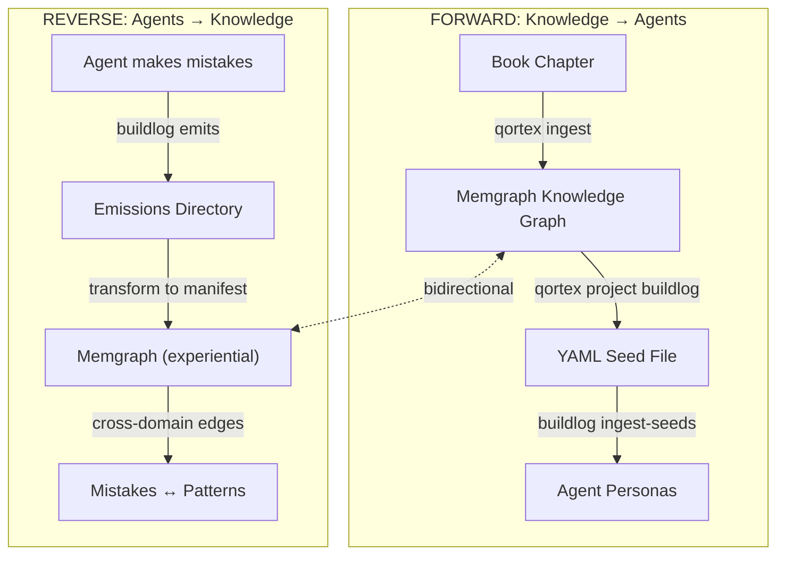

# Full Loop: The Buildlog Case Study

*In which knowledge flows both ways*

---

!!! note "This is not a tutorial"
    The preceding chapters teach you *how* qortex works. This case study shows you *why* we built it. It's a real exploration, warts and all, demonstrating the bidirectional knowledge flow between a knowledge graph and an AI agent system called buildlog.

---

## The Setup

It's late. You've been debugging for three hours. The AI assistant just made the same mistake it made yesterday. And the day before.

You fix it. Again. Move on. Again.

That mistake *could* have been prevented. Somewhere in a design patterns book you read last year, there's a principle that would have caught this. The assistant doesn't know about that principle. And even if it did, it wouldn't know that *this specific type of error* is the one it keeps making.

What if the assistant could learn from books? What if it could learn from its own mistakes? What if those two knowledge sources could *talk to each other*?

That's what we built.

---

## The Architecture



The architecture has two flows sharing one graph. Let's walk through both.

---

## Part 1: Forward Flow

### Connecting to the Graph

First, we need a graph. Memgraph Lab at `localhost:3000` shows us what we're working with.


After authenticating (the credentials are `memgraph`/`memgraph` if you're using the default docker-compose), we connect and see our starting state:


**988 nodes. 549 edges.** Five domains of design pattern knowledge, extracted from book chapters we'd previously ingested.

### The Concept Network

What does this knowledge actually look like? Let's query it:

```cypher
MATCH (n)-[r]->(m) RETURN n, r, m LIMIT 50
```


Each red dot is a concept. Each line is a relationship. The clusters you see aren't random - they're domains of related knowledge.


The edges have types, and that matters.

### Edge Types Are Everything

Early on, we made a mistake. We stored edge types as properties instead of labels:

```cypher
-- WRONG: All edges look the same to graph algorithms
CREATE (a)-[:REL {type: "requires"}]->(b)

-- RIGHT: Edge type IS the relationship
CREATE (a)-[:REQUIRES]->(b)
```

The difference isn't academic. Graph algorithms like PageRank operate on *relationship types*. If everything is `:REL`, your analytics are useless.

Let's see what we actually have:

```cypher
MATCH ()-[r]->()
RETURN DISTINCT type(r) AS edge_type, count(*) AS count
ORDER BY count DESC
```


Ten semantic relationship types:

| Edge Type | Count | What It Means |
|-----------|-------|---------------|
| SUPPORTS | 141 | A reinforces B |
| USES | 117 | A employs B |
| IMPLEMENTS | 112 | A realizes B |
| PART_OF | 53 | A is a component of B |
| REQUIRES | 40 | A depends on B |
| CHALLENGES | 33 | A conflicts with B |
| REFINES | 25 | A specializes B |
| SIMILAR_TO | 15 | A and B are analogous |
| ALTERNATIVE_TO | 9 | A and B are interchangeable |
| CONTRADICTS | 4 | A and B are mutually exclusive |

This isn't just metadata. This is *reasoning structure*. When we later ask "what challenges test coverage?", we can traverse `CHALLENGES` edges to find answers no keyword search would surface.

### Adding New Knowledge

Let's ingest Chapter 12: The Observer Pattern.

```bash
uv run qortex ingest file \
  "data/books/ch12_12_The_Observer_Design_Pattern.txt" \
  --domain observer_pattern \
  --backend anthropic \
  --save-manifest data/manifests/ch12_manifest.json
```

The extraction finds:

- **265 concepts** (publisher-subscriber, loose coupling, event objects...)
- **139 edges** (Observer IMPLEMENTS Loose Coupling, Publisher USES Event...)
- **6 explicit rules** directly from the text
- **2 code examples**

After loading:


**1,132 nodes. 827 edges.** The Observer Pattern knowledge is now part of the graph.

### Domain Distribution

Where does all this knowledge live?

```cypher
MATCH (n:Concept)
RETURN n.domain AS domain, count(*) AS concepts
ORDER BY concepts DESC
```


| Domain | Concepts |
|--------|----------|
| `iterator_visitor_patterns` | 249 |
| `implementation_hiding` | 237 |
| `template_strategy_patterns` | 170 |
| `factory_patterns` | 158 |
| `observer_pattern` | 137 |
| `adapter_facade_patterns` | 137 |

Six domains. Over a thousand concepts. But which concepts *matter most*?

### Finding the Hubs

PageRank tells us which nodes are most central - the concepts that connect to everything else:

```cypher
CALL pagerank.get()
YIELD node, rank
RETURN node.name AS concept, node.domain AS domain, rank
ORDER BY rank DESC LIMIT 15
```


The top concepts:

1. **Interface Compatibility** (`adapter_facade_patterns`) - 0.0071
2. **Visitor Design Pattern** (`iterator_visitor_patterns`) - 0.0068
3. **Tree Node Processing** (`iterator_visitor_patterns`) - 0.0067
4. **Architecture Problem** (`iterator_visitor_patterns`) - 0.0063
5. **Algorithm Encapsulation** (`iterator_visitor_patterns`) - 0.0059

These are the hub concepts, the ideas that bridge multiple patterns. If an agent needs to understand design patterns, these are the concepts to prioritize.

We've ingested knowledge. We've analyzed its structure. Now comes the payoff: turning that knowledge into something an agent can use.

### Projecting to Buildlog

Knowledge in a graph is useful for analysis, but agents need *rules*. The projection creates a YAML seed file that buildlog can ingest:

```bash
uv run qortex project buildlog \
  --domain observer_pattern \
  -p qortex_observer \
  -o /tmp/qortex_observer.yaml
```

**135 rules** projected. The seed file looks like this:

```yaml
persona: qortex_observer
version: 1
rules:
  - rule: "Publishers should not know how subscribers process data"
    category: observer_pattern
    provenance:
      id: "observer_pattern:rule:0"
      domain: observer_pattern
      derivation: explicit
      confidence: 0.9
```

Copy it to the interop directory and ingest:

```bash
cp /tmp/qortex_observer.yaml ~/.qortex/seeds/pending/
buildlog ingest-seeds
```

```
[qortex] 1 ingested
  ✓ qortex_observer.yaml (qortex_observer, 135 rules)
```

The Observer Pattern is now influencing agent behavior during code reviews.

**Recap**: We took a book chapter, extracted a knowledge graph, ran analytics to find the most important concepts, and projected rules to an AI agent system. The forward flow is complete.

---

## Part 2: Reverse Flow

So far we've moved knowledge in one direction: books to graph to agents. Useful, but incomplete.

The agents aren't just consumers of knowledge. They're also *producers*. Every time an agent catches itself making a mistake, that's information. Every time it learns a new pattern from reviewing code, that's data. What if we could feed that experience back into the graph?

### The Emissions

Buildlog emits data about what happens during agent work:

```
~/.buildlog/emissions/pending/
├── learned_rules_*.json    (338 files)
├── mistake_manifest_*.json (192 files)
└── reward_signal_*.json    (28 files)
```

Let's look at a mistake manifest:

```json
{
  "source_id": "buildlog:004be4c1743d",
  "domain": "experiential",
  "concepts": [{
    "name": "mistake:mistake-typo-20260206-203932",
    "properties": {
      "error_class": "typo",
      "description": "Variable name typo",
      "was_repeat": false,
      "session_id": "session-20260206-203932"
    }
  }]
}
```

The agent made a typo, and caught it. That's *experience*.

Hundreds of these files accumulate over time. Each one is a data point. Together, they form a picture of what the agent struggles with.

### Loading Mistakes into the Graph

Those 192 mistake manifests are sitting in a directory. What if we could query them the same way we query design patterns? What if we could find connections between the mistakes agents make and the knowledge that might prevent them?

We transform the emissions into a qortex manifest and load them:

```bash
uv run qortex ingest load /tmp/buildlog_mistakes_manifest.json
```

```
Loaded manifest: experiential
  Concepts: 100
  Edges: 0
  Rules: 0
```

100 mistake concepts, now queryable. Let's see what they tell us:

```cypher
MATCH (n:Concept {domain: 'experiential'})
RETURN n.properties AS props, count(*) AS cnt
ORDER BY cnt DESC
```


### The Repeat Rate Problem

The data reveals a pattern:

| Error Class | Total | Repeats | Rate |
|-------------|-------|---------|------|
| test | 99 | 61 | **61.6%** |
| missing_test | 53 | 26 | **49.1%** |
| security | 13 | 0 | 0.0% |
| validation | 13 | 0 | 0.0% |
| typo | 13 | 0 | 0.0% |

**61.6% of test errors are repeats.** The agent keeps making the same testing mistakes. Security errors? Zero repeats. They get fixed and stay fixed.

The signal? Test-related patterns need reinforcement. Security patterns consolidate more swiftly.

But knowing *that* the agent struggles with tests isn't enough. We need to know *what knowledge* would help.

### Cross-Domain Edges

The graph now contains both design pattern knowledge and experiential data. We can link mistakes to the design patterns that might prevent them:

```cypher
MATCH (e:Concept {domain: 'experiential'})-[r]->(p:Concept)
WHERE p.domain <> 'experiential'
RETURN e.name, type(r), p.name, p.domain
```


| Mistake Type | Relation | Pattern Concept | Domain |
|--------------|----------|-----------------|--------|
| Test Errors (Aggregate) | `CHALLENGES` | Algorithm Encapsulation | `iterator_visitor_patterns` |
| Test Errors (Aggregate) | `CHALLENGES` | Object Creation | `factory_patterns` |
| Missing Test Errors (Aggregate) | `CHALLENGES` | Algorithm Steps | `template_strategy_patterns` |
| Security Errors (Aggregate) | `SUPPORTS` | Private Methods | `implementation_hiding` |
| Validation Errors (Aggregate) | `CHALLENGES` | External Code Integration | `adapter_facade_patterns` |

The 61.6% repeat rate on test errors? It `CHALLENGES` Algorithm Encapsulation and Object Creation. The fix isn't "try harder" - it's "learn Iterator and Factory patterns better."

---

## The Insight

We've walked both directions. Books flowed into rules. Mistakes flowed back into the graph. Now we have something neither source could provide alone.

The graph holds **1,238 nodes** and **833 edges** across **7 domains**:

- Six domains of design pattern knowledge (from books)
- One domain of experiential knowledge (from agent mistakes)
- Cross-domain edges connecting them

When the `test_terrorist` persona reviews code, it should prioritize rules from `iterator_visitor_patterns` and `factory_patterns`. Those are the patterns that address the mistakes it keeps making.

That's not a heuristic we invented. That's what the graph told us.

---

## What We Built

Step back and look at what just happened.

We read a book chapter. The Observer Pattern, 50 pages of design wisdom written by humans for humans. We fed it to qortex, which extracted 265 concepts, 139 relationships, and 6 explicit rules. We projected those rules to buildlog, where they now guide an AI agent during code reviews.

Books teach agents.

Then we looked at what the agent actually does. 192 mistake manifests, each one a moment where the agent caught itself doing something wrong. We loaded those into the same graph. We ran analytics. We found that 61.6% of test-related errors are repeats. We created cross-domain edges linking those persistent mistakes to the design patterns that might prevent them.

Agents teach the graph.

The two flows meet in the middle. The graph now contains design patterns from books alongside experiential data from agent mistakes, connected by cross-domain edges that link test errors to the patterns (like Algorithm Encapsulation) that might prevent them.

This changes everything about how we think about AI assistants.

The agent that keeps making the same testing mistakes? Don't just scold it. Don't write more rules by hand. Instead: find the design patterns that address the gap. Ingest the relevant chapters. Project the rules. Let the graph tell you what knowledge is missing, then fill the gap systematically.

The 61.6% repeat rate on test errors isn't a bug. It's a diagnostic. It points directly at `iterator_visitor_patterns` and `factory_patterns` as the knowledge domains that need reinforcement. The graph tells you where the gaps are.

The graph now holds 1,238 nodes and 833 edges across 7 domains, with two knowledge sources connected by cross-domain edges.

That's the loop.
