# The Feast of Graphs

*A tutorial series on knowledge graph analytics with Memgraph*

---

You've ingested your data into a graph. Now it's time to actually use it.

This series takes you from "what is this?" to "I can derive new knowledge from structure alone."

---

## What You'll Learn

This six-part series takes you from "what is this?" to "I can derive new knowledge from structure alone." By the end, you'll be able to:

- Navigate a knowledge graph with confidence
- Write Cypher queries that find what you need
- Trace multi-hop paths through connected concepts
- Measure importance with centrality algorithms
- Discover hidden communities in your data
- Forge new rules from graph structure

## The Data

All examples use real data from a software design textbook:

- **~400 concepts** extracted from Chapter 5 on implementation hiding
- **~25 relationships** showing how concepts connect (REQUIRES, SUPPORTS, etc.)
- **7 explicit rules** about encapsulation, properties, and information hiding

## Prerequisites

Before starting, ensure you have:

1. **Memgraph running**: `qortex infra up`
2. **Data ingested**: `qortex ingest your-chapter.txt --domain your_domain`
3. **Memgraph Lab open**: [http://localhost:3000](http://localhost:3000)

## The Journey

| Part | Title | What You'll Master |
|------|-------|-------------------|
| 1 | [Welcome to the Hall](part1-welcome.md) | Orientation, first queries, seeing the shape |
| 2 | [The Tongue of Queries](part2-cypher.md) | Cypher patterns, filtering, aggregation |
| 3 | [Following the Thread](part3-multi-hop.md) | Variable-length paths, shortest paths |
| 4 | [Measuring Worth](part4-centrality.md) | Degree centrality, PageRank |
| 5 | [The Tribes Within](part5-communities.md) | Community detection, clustering |
| 6 | [Forging New Rules](part6-forging-rules.md) | Rule derivation from structure |

---

*Ready? [Let's begin](part1-welcome.md).*
