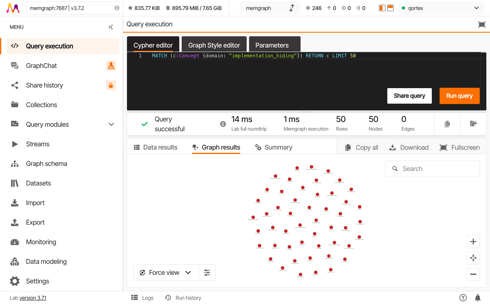
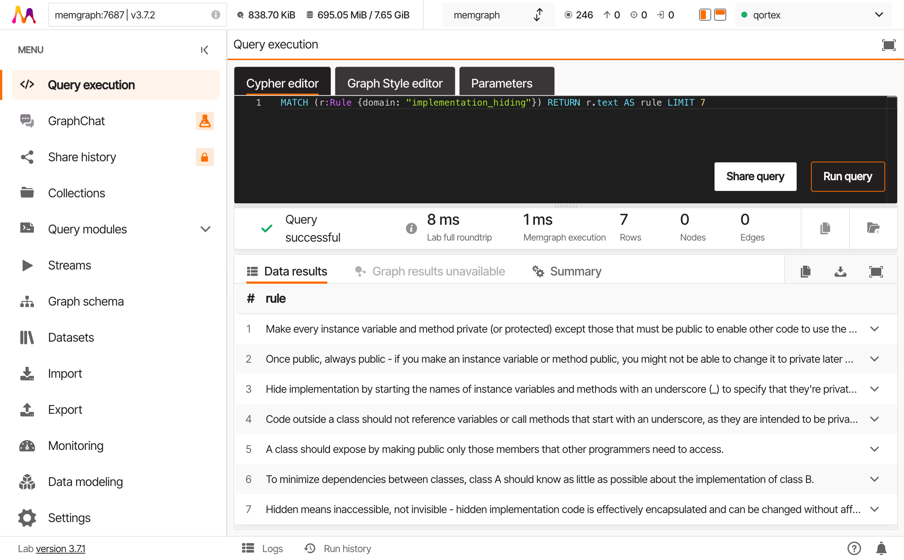

# Welcome to the Hall

*In which you learn to see*

---

Pull up a chair. You've got data in a graph, but you're probably staring at it like a cat watching a fish tank. Let's fix that.

This tutorial teaches three things:
1. **What** a graph actually is (not tables in disguise)
2. **Why** it's useful (connections ARE the data)
3. **How** to see patterns no table could show you

---

## What Is This Thing?

You've ingested text into something called a "knowledge graph." Let's be concrete about what that means.



**A table** stores things in rows. Each row is isolated - you need JOINs to connect them.

**A graph** stores things as nodes, connected by edges. The connections ARE the data.

### The Elements

| Element | What It Is | Example |
|---------|-----------|---------|
| **Node** | A thing | `Encapsulation`, `Properties`, `Law of Demeter` |
| **Edge** | A relationship | `REQUIRES`, `SUPPORTS`, `IMPLEMENTS` |
| **Property** | Data on a node/edge | `name: "Encapsulation"`, `confidence: 0.95` |
| **Label** | A category | `:Concept`, `:Rule`, `:Domain` |

Your ingested data created:

- **Concept nodes** - the ideas extracted from your text
- **Rule nodes** - explicit guidelines found in the text
- **REL edges** - how concepts relate to each other

---

## Connect to the Hall

Open Memgraph Lab at [http://localhost:3000](http://localhost:3000).

Click **Quick Connect** - if you used the default docker-compose, it's already configured.


### Why Lab?

Lab is your window into the graph. You could use the raw Bolt protocol, but Lab gives you:

- A query editor with syntax highlighting
- Visual graph rendering
- Data export
- Query history

It's not magic - it's sending Cypher queries and rendering results. But it makes learning much faster.

---

## Your First Query

In the query editor, type:

```cypher
MATCH (n) RETURN labels(n), count(n);
```

Hit **Run** (or Ctrl+Enter).

### What Just Happened?

| Part | Meaning |
|------|---------|
| `MATCH (n)` | Find all nodes, call each one `n` |
| `RETURN` | Give back... |
| `labels(n)` | ...the labels (categories) of each node |
| `count(n)` | ...and how many of each |

You should see something like:

| labels(n) | count(n) |
|-----------|----------|
| ["Concept"] | 405 |
| ["Rule"] | 7 |
| ["Domain"] | 1 |

### The Shape of Knowledge

Those numbers tell a story. ~400 concepts means your chapter was rich with ideas. 7 rules means it had explicit guidelines. 1 domain means everything belongs to a single knowledge area.

But numbers are just the start. Let's see the shape.

---

## See the Graph

Run this query:

```cypher
MATCH (c:Concept {domain: "implementation_hiding"})
RETURN c
LIMIT 50;
```

Switch to the **Graph** view (not Table).



### What You're Seeing

Each circle is a concept. The layout algorithm tries to position connected nodes near each other. Nodes with no connections float to the edges.

Try clicking a node. You'll see its properties in the sidebar:

- `id` - unique identifier
- `name` - human-readable name
- `description` - what the concept means
- `domain` - which knowledge area it belongs to
- `confidence` - how certain the extraction was

---

## See the Connections

Now let's see the relationships:

```cypher
MATCH (a:Concept)-[r:REL]->(b:Concept)
WHERE a.domain = "implementation_hiding"
RETURN a, r, b
LIMIT 50;
```


### Reading the Visualization

- **Nodes** are circles (concepts)
- **Edges** are lines with arrows (relationships)
- **Direction** matters - `a -> b` means "a relates to b"
- **Clusters** form naturally around highly-connected concepts

### Why This Matters

In a table, you'd need:

```sql
SELECT a.name, r.type, b.name
FROM concepts a
JOIN relations r ON a.id = r.source_id
JOIN concepts b ON b.id = r.target_id
WHERE a.domain = 'implementation_hiding'
LIMIT 50;
```

Three tables. Two joins. And you still can't visualize it without external tools.

In a graph, the relationship IS the query. You draw what you want to find.

---

## Inspect the Rules

Rules are explicit guidelines extracted from your text:

```cypher
MATCH (r:Rule {domain: "implementation_hiding"})
RETURN r.text AS rule, r.category
LIMIT 10;
```



These are the "shoulds" and "musts" from your source material - statements like "Make every instance variable private" or "Use properties instead of direct access."

---

## What You've Learned

You came here knowing nothing of graphs. Now you know:

1. **Graphs store relationships as first-class citizens** - not afterthoughts requiring joins
2. **Cypher reads like ASCII art** - `(a)-[r]->(b)` is literally a picture of what you want
3. **Visualization reveals structure** - clusters, hubs, and outliers become visible
4. **Your data is richer than rows** - concepts RELATE to each other, they don't just exist in isolation

---

## Try This

Before moving on, experiment:

1. Find all concepts whose name contains "Private":
   ```cypher
   MATCH (c:Concept)
   WHERE c.name CONTAINS "Private"
   RETURN c.name, c.description;
   ```

2. Count how many relationships exist:
   ```cypher
   MATCH ()-[r:REL]->()
   RETURN count(r);
   ```

3. Find the concept with the longest description:
   ```cypher
   MATCH (c:Concept {domain: "implementation_hiding"})
   RETURN c.name, size(c.description) AS desc_length
   ORDER BY desc_length DESC
   LIMIT 1;
   ```

---

## What's Next

You can see the graph now. Next up: learning to speak its language.

---

*[Continue to The Tongue of Queries](part2-cypher.md)*
