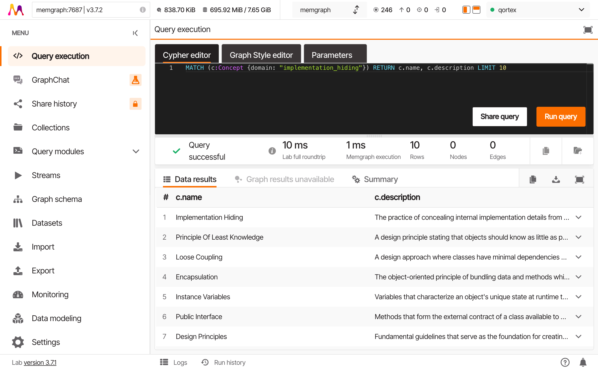
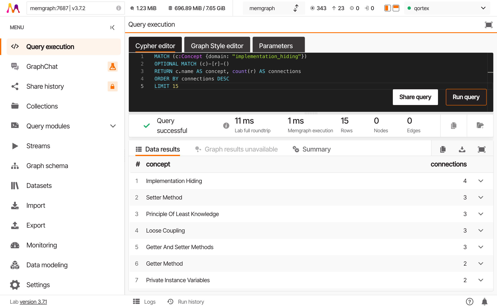

# The Tongue of Queries

*In which you learn to speak*

---

Cypher looks like ASCII art had a baby with SQL. That's because it is.

The patterns you write ARE the query. You're not describing what you want - you're drawing it.

---

## Patterns Are Visual

Before we write queries, understand this: Cypher patterns are literal pictures.

```
(a)-[r]->(b)
```

That's not an abstraction. That's literally a picture:
- `(a)` is a node
- `-[r]->` is a directed edge
- `(b)` is another node

You bind symbols together to express what you seek:



---

## MATCH: Drawing What You Seek

Every query starts with `MATCH`. You're saying "find me things that look like this."

### Find All Concepts

```cypher
MATCH (c:Concept)
RETURN c.name, c.description
LIMIT 10;
```

| Part | Meaning |
|------|---------|
| `(c:Concept)` | A node with label `Concept`, call it `c` |
| `RETURN c.name, c.description` | Give back these properties |
| `LIMIT 10` | Stop after 10 results |

### Find Relationships

```cypher
MATCH (a:Concept)-[r:REL]->(b:Concept)
RETURN a.name, type(r), b.name
LIMIT 10;
```

| Part | Meaning |
|------|---------|
| `(a:Concept)` | Source node |
| `-[r:REL]->` | Edge of type REL, call it `r` |
| `(b:Concept)` | Target node |
| `type(r)` | The relationship type |



---

## WHERE: The Gatekeeper

`WHERE` filters results. It's the bouncer at the door of your query.

### Filter by Property

```cypher
MATCH (c:Concept)
WHERE c.name CONTAINS "Encapsulation"
RETURN c.name, c.description;
```

### Filter by Domain

```cypher
MATCH (c:Concept)
WHERE c.domain = "implementation_hiding"
RETURN c.name
LIMIT 20;
```

### Combine Conditions

```cypher
MATCH (c:Concept)
WHERE c.domain = "implementation_hiding"
  AND c.confidence > 0.8
RETURN c.name, c.confidence
ORDER BY c.confidence DESC;
```

### Inline vs WHERE

These two queries are equivalent:

```cypher
-- Inline filter
MATCH (c:Concept {domain: "implementation_hiding"})
RETURN c.name;

-- WHERE filter
MATCH (c:Concept)
WHERE c.domain = "implementation_hiding"
RETURN c.name;
```

Use inline `{property: value}` for simple equality. Use `WHERE` for complex conditions, ranges, or string operations.

---

## Patterns: The Real Power

Here's where graph thinking diverges from SQL thinking.

### SQL Mindset (find, then join)

"Find Encapsulation. Then find what it connects to."

```cypher
-- Step 1: Find Encapsulation
MATCH (enc:Concept {name: "Encapsulation"})
RETURN enc;

-- Step 2: Separately find connections
MATCH (enc:Concept {name: "Encapsulation"})-[r]-(other)
RETURN other.name;
```

### Graph Mindset (draw the shape)

"Find Encapsulation and its connections in one pattern."

```cypher
MATCH (enc:Concept {name: "Encapsulation"})-[r]-(other:Concept)
RETURN enc.name, type(r), other.name;
```

The pattern `(enc)-[r]-(other)` is the query. You drew what you wanted.

### Direction Matters

```cypher
-- Outgoing edges only
MATCH (a)-[r]->(b) ...

-- Incoming edges only
MATCH (a)<-[r]-(b) ...

-- Either direction
MATCH (a)-[r]-(b) ...
```

The arrow shows direction. No arrow means "I don't care about direction."

---

## Aggregation: Counting and Grouping

### Count Connections Per Concept

```cypher
MATCH (c:Concept {domain: "implementation_hiding"})
OPTIONAL MATCH (c)-[r]-()
RETURN c.name, count(r) AS connections
ORDER BY connections DESC
LIMIT 10;
```



| Part | Meaning |
|------|---------|
| `OPTIONAL MATCH` | Like LEFT JOIN - return c even if no edges |
| `count(r)` | Count matching edges |
| `AS connections` | Name the result column |
| `ORDER BY ... DESC` | Sort high to low |

### Why OPTIONAL?

Without `OPTIONAL`, concepts with zero connections disappear from results. With `OPTIONAL`, they appear with `count(r) = 0`.

Always use `OPTIONAL MATCH` when counting or aggregating relationships - otherwise you lose the lonely nodes.

---

## WITH: Chaining Queries

`WITH` passes results from one part of a query to the next. It's like piping in Unix.

### Find Highly-Connected Concepts, Then Get Their Edges

```cypher
-- Step 1: Find concepts with 3+ connections
MATCH (c:Concept {domain: "implementation_hiding"})
OPTIONAL MATCH (c)-[r]-()
WITH c, count(r) AS degree
WHERE degree >= 3

-- Step 2: Get their actual connections
MATCH (c)-[r2]-(neighbor:Concept)
RETURN c.name, degree, type(r2), neighbor.name
ORDER BY degree DESC;
```

### Collect Into Lists

```cypher
MATCH (c:Concept {domain: "implementation_hiding"})-[r]-(neighbor:Concept)
RETURN c.name, collect(neighbor.name) AS connected_to
LIMIT 10;
```

`collect()` gathers values into a list - useful for seeing all connections at once.

---

## Common Patterns

### Find Concepts That REQUIRE Something

```cypher
MATCH (a:Concept)-[r:REL]->(b:Concept)
WHERE r.type = "requires"
RETURN a.name AS concept, b.name AS requires
LIMIT 20;
```

### Find Concepts Required By Multiple Others

```cypher
MATCH (a:Concept)-[r:REL]->(foundation:Concept)
WHERE r.type = "requires"
WITH foundation, count(a) AS dependent_count
WHERE dependent_count > 1
RETURN foundation.name, dependent_count
ORDER BY dependent_count DESC;
```

### Find Isolated Concepts (No Edges)

```cypher
MATCH (c:Concept {domain: "implementation_hiding"})
WHERE NOT (c)-[]-()
RETURN c.name, c.description;
```

---

## The Shape of Questions

Notice how each query is a shape:

```
(c)                     -- A single node
(a)-[r]->(b)            -- Two nodes, one edge
(a)-[r1]->(b)-[r2]->(c) -- A chain
(a)-[r]-(b)             -- Undirected connection
```

You're not writing instructions. You're drawing what you seek. The database finds things that match your drawing.

This is why graphs excel at relationship queries. In SQL, you describe steps: "join this, then filter that, then aggregate." In Cypher, you describe the shape: "find things that look like this."

---

## Try This

1. Find all concepts whose description mentions "private":
   ```cypher
   MATCH (c:Concept)
   WHERE c.description CONTAINS "private"
   RETURN c.name, c.description;
   ```

2. Count concepts per rule (via their concept_ids):
   ```cypher
   MATCH (r:Rule {domain: "implementation_hiding"})
   RETURN r.text, size(r.concept_ids) AS concept_count
   ORDER BY concept_count DESC;
   ```

3. Find the most common relationship type:
   ```cypher
   MATCH ()-[r:REL]->()
   RETURN r.type, count(*) AS frequency
   ORDER BY frequency DESC;
   ```

---

## What's Next

You can speak the tongue now. Next: tracing paths - two hops, three hops, until you find what you didn't know you were looking for.

---

*[Continue to Following the Thread](part3-multi-hop.md)*
