# Following the Thread

*In which you learn to walk the paths*

---

A single hop is for tourists. Real knowledge seekers follow the thread - two hops, three hops, until you find what you didn't know you were looking for.

This is where graphs earn their keep.

---

## Why Multi-Hop Matters

In a table, everything is one step away. Row 5 is just... row 5.

In a graph, distance matters:



- **Encapsulation** directly requires **Properties** (1 hop)
- **Encapsulation** is indirectly connected to **Law of Demeter** (2 hops)
- **Encapsulation** reaches **Loose Coupling** through a chain (3 hops)

This is where graphs earn their keep. Finding "everything within 3 hops of X" would require recursive CTEs in SQL that make DBAs weep.

---

## Direct Neighbors (1 Hop)

Start simple. Find everything directly connected to a concept:

```cypher
MATCH (c:Concept {name: "Encapsulation"})-[r]-(neighbor:Concept)
RETURN c.name, type(r), neighbor.name;
```

This finds immediate connections in either direction.

### Directed vs Undirected

```cypher
-- Only outgoing edges (what Encapsulation points TO)
MATCH (c:Concept {name: "Encapsulation"})-[r]->(neighbor)
RETURN neighbor.name;

-- Only incoming edges (what points TO Encapsulation)
MATCH (c:Concept {name: "Encapsulation"})<-[r]-(neighbor)
RETURN neighbor.name;

-- Both directions
MATCH (c:Concept {name: "Encapsulation"})-[r]-(neighbor)
RETURN neighbor.name;
```

Direction often matters for meaning. "A requires B" is different from "B requires A."

---

## Variable-Length Paths

The magic syntax: `[*min..max]`

### Two Hops Out

```cypher
MATCH path = (c:Concept {name: "Encapsulation"})-[*1..2]-(distant:Concept)
WHERE c <> distant
RETURN DISTINCT distant.name, length(path) AS hops
ORDER BY hops;
```

| Part | Meaning |
|------|---------|
| `[*1..2]` | 1 to 2 hops (variable length) |
| `WHERE c <> distant` | Don't return the start node |
| `length(path)` | How many hops to reach it |
| `DISTINCT` | No duplicates (might reach same node multiple ways) |

### Three Hops Out

```cypher
MATCH path = (c:Concept {name: "Encapsulation"})-[*1..3]-(distant:Concept)
WHERE c <> distant
RETURN DISTINCT distant.name, length(path) AS hops
ORDER BY hops;
```

### The Expanding Frontier

Each hop multiplies possibilities. If a node has 5 connections:
- 1 hop: up to 5 nodes
- 2 hops: up to 25 nodes
- 3 hops: up to 125 nodes

This is exponential growth. Always use `LIMIT` or specific filters when exploring multi-hop paths.

---

## Finding All Paths Between Two Concepts

Sometimes you know the start and end - you want to see HOW they connect.

```cypher
MATCH path = (a:Concept)-[*1..4]-(b:Concept)
WHERE a.name = "Encapsulation"
  AND b.name CONTAINS "Demeter"
RETURN
  [n IN nodes(path) | n.name] AS concept_chain,
  [r IN relationships(path) | type(r)] AS relationship_chain
LIMIT 10;
```

### Reading the Result

| concept_chain | relationship_chain |
|---------------|-------------------|
| ["Encapsulation", "Properties", "Law of Demeter"] | ["REL", "REL"] |
| ["Encapsulation", "Information Hiding", "Law of Demeter"] | ["REL", "REL"] |

Each row is a different path. You're seeing the actual routes through your knowledge graph.

### List Comprehensions

```cypher
[n IN nodes(path) | n.name]
```

This is Cypher's list comprehension:
- `nodes(path)` gives all nodes in the path
- `| n.name` extracts the name property from each

Same pattern works for relationships:
```cypher
[r IN relationships(path) | type(r)]
```

---

## Shortest Path

When multiple paths exist, find the most direct one:

```cypher
MATCH path = shortestPath(
  (a:Concept {name: "Encapsulation"})-[*]-(b:Concept {name: "Loose Coupling"})
)
RETURN [n IN nodes(path) | n.name] AS path;
```

### All Shortest Paths

If multiple paths have the same (shortest) length:

```cypher
MATCH path = allShortestPaths(
  (a:Concept {name: "Encapsulation"})-[*]-(b:Concept)
)
WHERE b.name CONTAINS "Principle"
RETURN [n IN nodes(path) | n.name] AS path
LIMIT 10;
```

---

## Visualizing Paths

Run a path query in Lab, then switch to Graph view:

```cypher
MATCH path = (a:Concept {name: "Encapsulation"})-[*1..2]-(b:Concept)
WHERE a.domain = "implementation_hiding"
RETURN path
LIMIT 30;
```

The visualization highlights the actual paths - you'll see the "neighborhood" around your starting concept.



---

## Path Filtering

### Only REQUIRES Relationships

```cypher
MATCH path = (a:Concept)-[r:REL*1..3]->(b:Concept)
WHERE a.name = "Encapsulation"
  AND ALL(rel IN relationships(path) WHERE rel.type = "requires")
RETURN [n IN nodes(path) | n.name] AS dependency_chain
LIMIT 10;
```

The `ALL()` function checks that every relationship in the path matches a condition.

### Exclude Certain Nodes

```cypher
MATCH path = (a:Concept)-[*1..3]-(b:Concept)
WHERE a.name = "Encapsulation"
  AND NONE(n IN nodes(path) WHERE n.name = "Setters")
RETURN [n IN nodes(path) | n.name] AS path
LIMIT 10;
```

`NONE()` ensures no node in the path matches the condition.

---

## When Paths Matter

Multi-hop queries answer questions like:

1. **Dependency chains**: "What does X ultimately depend on?"
2. **Impact analysis**: "If I change X, what's affected within 2 hops?"
3. **Knowledge gaps**: "What connects these two seemingly unrelated concepts?"
4. **Learning paths**: "What's the shortest route from fundamentals to advanced?"

In SQL, these require recursive CTEs:

```sql
WITH RECURSIVE path AS (
  SELECT source_id, target_id, 1 AS depth
  FROM relations WHERE source_id = 'encapsulation'
  UNION ALL
  SELECT r.source_id, r.target_id, p.depth + 1
  FROM relations r JOIN path p ON r.source_id = p.target_id
  WHERE p.depth < 3
)
SELECT DISTINCT target_id FROM path;
```

In Cypher:

```cypher
MATCH (a {name: "Encapsulation"})-[*1..3]->(b)
RETURN DISTINCT b.name;
```

The graph makes path queries natural.

---

## Try This

1. Find everything within 2 hops of "Properties":
   ```cypher
   MATCH path = (p:Concept {name: "Properties"})-[*1..2]-(c:Concept)
   WHERE p <> c
   RETURN DISTINCT c.name, length(path) AS distance
   ORDER BY distance;
   ```

2. Find the longest shortest path in the graph:
   ```cypher
   MATCH (a:Concept), (b:Concept)
   WHERE a <> b AND a.domain = "implementation_hiding"
   MATCH path = shortestPath((a)-[*]-(b))
   RETURN a.name, b.name, length(path) AS distance
   ORDER BY distance DESC
   LIMIT 5;
   ```

3. Find "bridge" concepts (appear in many paths):
   ```cypher
   MATCH path = (a:Concept)-[*2]-(b:Concept)
   WHERE a <> b AND a.domain = "implementation_hiding"
   UNWIND nodes(path)[1..-1] AS middle
   RETURN middle.name, count(*) AS appearances
   ORDER BY appearances DESC
   LIMIT 10;
   ```

---

## What's Next

You can walk the paths now. Next: measuring which nodes matter most - not just by count, but by influence.

---

*[Continue to Measuring Worth](part4-centrality.md)*
