# Measuring Worth

*In which you learn to judge*

---

Not all nodes are equal. Some concepts are foundational - everything depends on them. Others are bridges - remove them and the graph splits in two.

Let's find out who's who.

---

## The Question of Importance

Which is more important: the concept with the most connections, or the concept connected to the most important concepts?

Answer: they're measuring different things.

- **Degree centrality**: How many connections does it have?
- **PageRank**: How important are its connections?

A concept connected to 3 foundational ideas might outrank one connected to 10 trivial ones.

---

## Degree Centrality: The Simple Metric

Count the connections. It's crude, but it works.

```cypher
MATCH (c:Concept {domain: "implementation_hiding"})
OPTIONAL MATCH (c)-[r]-()
RETURN c.name, count(r) AS degree
ORDER BY degree DESC
LIMIT 10;
```

### Understanding the Results

| name | degree |
|------|--------|
| Implementation Hiding | 4 |
| Encapsulation | 3 |
| Properties | 3 |
| Information Hiding | 2 |
| ... | ... |

The concept with the highest degree is the most connected. It's a hub.

### In vs Out Degree

```cypher
-- Outgoing edges only (what this concept points to)
MATCH (c:Concept {domain: "implementation_hiding"})
OPTIONAL MATCH (c)-[r]->()
RETURN c.name, count(r) AS out_degree
ORDER BY out_degree DESC
LIMIT 10;

-- Incoming edges only (what points to this concept)
MATCH (c:Concept {domain: "implementation_hiding"})
OPTIONAL MATCH (c)<-[r]-()
RETURN c.name, count(r) AS in_degree
ORDER BY in_degree DESC
LIMIT 10;
```

High **out-degree** means "depends on many things" - it's complex.
High **in-degree** means "many things depend on it" - it's foundational.

---

## Visualizing Degree

In Memgraph Lab, you can size nodes by a property. Run this to add degree as a property:

```cypher
MATCH (c:Concept {domain: "implementation_hiding"})
OPTIONAL MATCH (c)-[r]-()
WITH c, count(r) AS degree
SET c.degree = degree
RETURN c.name, c.degree
ORDER BY c.degree DESC;
```

Then visualize all concepts and set node size to the `degree` property. Hubs become visually obvious.



---

## PageRank: The Famous Algorithm

Google's original insight: a page is important if important pages link to it.

The same applies to concepts: a concept is important if important concepts relate to it.

### Run PageRank

Memgraph has MAGE (Memgraph Advanced Graph Extensions) built in:

```cypher
CALL pagerank.get()
YIELD node, rank
WHERE node:Concept AND node.domain = "implementation_hiding"
RETURN node.name, round(rank * 1000) / 1000 AS influence
ORDER BY influence DESC
LIMIT 10;
```

### Why PageRank Differs from Degree

Consider this graph:



- **B** has degree 1 (just A points to it)
- **F** has degree 5 (E, G, H, I, J point to it)

By degree, F wins. But if A is the most important node in the graph (high PageRank), then B inherits that importance. F's connections might all be nobodies.

PageRank propagates importance through the graph.

---

## Compare Them Side by Side

```cypher
MATCH (c:Concept {domain: "implementation_hiding"})
OPTIONAL MATCH (c)-[r]-()
WITH c, count(r) AS degree
CALL pagerank.get()
YIELD node, rank
WHERE node = c
RETURN c.name, degree, round(rank * 1000) / 1000 AS pagerank
ORDER BY pagerank DESC
LIMIT 15;
```

### What to Look For

| Pattern | Meaning |
|---------|---------|
| High degree, high PageRank | True hub - connected AND important |
| High degree, low PageRank | Busy but not influential |
| Low degree, high PageRank | Connected to VIPs - strategic position |
| Low degree, low PageRank | Peripheral concept |

---

## Betweenness Centrality: The Bridges

A different question: which nodes are bridges?

If you remove node X, how many shortest paths break?

```cypher
CALL betweenness_centrality.get()
YIELD node, betweenness_centrality
WHERE node:Concept AND node.domain = "implementation_hiding"
RETURN node.name, round(betweenness_centrality * 100) / 100 AS bridge_score
ORDER BY bridge_score DESC
LIMIT 10;
```

High betweenness = critical bridge. Remove it and the graph fragments.

### When Bridges Matter

In a knowledge graph:
- **High betweenness concepts** connect different sub-domains
- Removing them breaks understanding chains
- They're often good candidates for "core curriculum"

Example: if "Encapsulation" bridges OOP concepts and design principles, it's essential for any learning path.

---

## Choosing the Right Metric

The answer depends on your goal:

| Goal | Use | Why |
|------|-----|-----|
| Find hubs | Degree | Raw connectivity |
| Find influence | PageRank | Weighted by neighbor importance |
| Find bridges | Betweenness | Critical for graph connectivity |
| Find authorities | In-degree | What everything points to |
| Find dependencies | Out-degree | What points to everything |

All are valid. All answer different questions.

---

## Matplotlib Visualization

For presentations or reports, you might want a static chart. Here's a Python snippet:

```python
import matplotlib.pyplot as plt
from neo4j import GraphDatabase

driver = GraphDatabase.driver("bolt://localhost:7687", auth=("qortex", "qortex"))

with driver.session() as session:
    result = session.run("""
        MATCH (c:Concept {domain: "implementation_hiding"})
        OPTIONAL MATCH (c)-[r]-()
        WITH c, count(r) AS degree
        RETURN c.name, degree
        ORDER BY degree DESC
        LIMIT 10
    """)
    data = [(r["c.name"], r["degree"]) for r in result]

names, degrees = zip(*data)

plt.figure(figsize=(10, 6))
plt.barh(names, degrees, color='#3498db')
plt.xlabel('Degree (connections)')
plt.title('Top 10 Concepts by Connectivity')
plt.gca().invert_yaxis()
plt.tight_layout()
plt.savefig('degree-centrality-chart.png', dpi=150)
```

---

## Try This

1. Find concepts with high in-degree (foundations):
   ```cypher
   MATCH (c:Concept {domain: "implementation_hiding"})
   OPTIONAL MATCH (c)<-[r]-()
   RETURN c.name, count(r) AS in_degree
   ORDER BY in_degree DESC
   LIMIT 10;
   ```

2. Find the "bridge" between two concepts:
   ```cypher
   MATCH path = shortestPath(
     (a:Concept {name: "Encapsulation"})-[*]-(b:Concept {name: "Loose Coupling"})
   )
   UNWIND nodes(path) AS n
   RETURN n.name, n.description;
   ```

3. Combine metrics for a holistic view:
   ```cypher
   MATCH (c:Concept {domain: "implementation_hiding"})
   OPTIONAL MATCH (c)-[r]-()
   WITH c, count(r) AS degree
   OPTIONAL MATCH (c)<-[r2]-()
   WITH c, degree, count(r2) AS in_degree
   CALL pagerank.get() YIELD node, rank
   WHERE node = c
   RETURN c.name, degree, in_degree, round(rank * 1000) / 1000 AS pagerank
   ORDER BY pagerank DESC
   LIMIT 15;
   ```

---

## What's Next

You can measure worth now. Next: discovering that your concepts naturally cluster into groups.

---

*[Continue to The Tribes Within](part5-communities.md)*
