# The Tribes Within

*In which you discover hidden structure*

---

Your concepts cluster into groups. They form tribes - clusters of closely related ideas that hang together. Finding these tribes reveals the hidden structure of your knowledge.

---

## What Is Community Detection?

Imagine you have 400 concepts. Reading them one by one would take forever. But what if they naturally grouped into 10-15 clusters?



Community detection algorithms find these clusters automatically by looking at connection density: nodes that connect more to each other than to outsiders form a community.

---

## The Louvain Algorithm

The most popular community detection algorithm. It works by:

1. Start with each node as its own community
2. Merge communities that improve "modularity" (internal density vs external connections)
3. Repeat until stable

```cypher
CALL community_detection.louvain()
YIELD node, community_id
WHERE node:Concept AND node.domain = "implementation_hiding"
RETURN community_id, collect(node.name) AS tribe_members
ORDER BY size(tribe_members) DESC;
```

### Understanding the Results

| community_id | tribe_members |
|-------------|---------------|
| 0 | ["Encapsulation", "Properties", "Private Methods", "Getters", "Setters"] |
| 1 | ["Law of Demeter", "Principle of Least Knowledge", "Loose Coupling"] |
| 2 | ["Immutability", "Value Objects", "Side Effects"] |
| 3 | ["State Management", "Dangerous Setters", "Mutable State"] |

Each row is a tribe - concepts that cluster together based on their connections.

---

## Visualize Communities

Add community labels to nodes, then use Lab's coloring:

```cypher
CALL community_detection.louvain()
YIELD node, community_id
WHERE node:Concept AND node.domain = "implementation_hiding"
SET node.community = community_id
RETURN node.name, community_id;
```

Now visualize all concepts and color by the `community` property. Each tribe gets its own color.

### Why Communities Matter

Finding communities answers questions like:

| Question | What Communities Tell You |
|----------|---------------------------|
| "What are the main topics?" | Each community is a topic cluster |
| "What should I learn first?" | Foundational communities have more dependencies |
| "Are there isolated areas?" | Small communities might be peripheral |
| "What connects different topics?" | Nodes linking communities are bridges |

---

## Analyzing Community Structure

### Size Distribution

```cypher
CALL community_detection.louvain()
YIELD node, community_id
WHERE node:Concept AND node.domain = "implementation_hiding"
WITH community_id, count(*) AS size
RETURN community_id, size
ORDER BY size DESC;
```

A few large communities + many small ones is typical. The large ones are your core topics.

### Inter-Community Edges

Find concepts that bridge communities:

```cypher
CALL community_detection.louvain()
YIELD node, community_id
WHERE node:Concept AND node.domain = "implementation_hiding"
WITH node, community_id
MATCH (node)-[r]-(neighbor:Concept)
WHERE neighbor.community <> node.community
RETURN node.name, node.community, collect(DISTINCT neighbor.community) AS bridges_to
ORDER BY size(bridges_to) DESC
LIMIT 10;
```

Concepts that bridge multiple communities are valuable - they connect different areas of knowledge.

---

## Interpreting Your Tribes

Expected tribes in a software design domain:

| Tribe Theme | Expected Members |
|------------|------------------|
| **Core OOP** | Encapsulation, Classes, Objects, Methods |
| **Access Control** | Properties, Getters, Setters, Private/Public |
| **Design Principles** | Law of Demeter, SOLID principles |
| **State Management** | Immutability, Mutability, Side Effects |
| **Patterns** | Factory, Singleton, Strategy |

If your communities don't match expected themes, investigate:
- Maybe the extraction missed some relationships
- Maybe the domain naturally clusters differently
- Maybe you discovered unexpected structure

---

## Alternative: Label Propagation

Faster but less stable than Louvain:

```cypher
CALL community_detection.label_propagation()
YIELD node, community_id
WHERE node:Concept AND node.domain = "implementation_hiding"
RETURN community_id, collect(node.name) AS members
ORDER BY size(members) DESC;
```

Label propagation is non-deterministic - run it multiple times and you might get different results. Louvain is more consistent.

---

## The Deeper Pattern

Communities reveal structure that no reading of individual nodes would show.

Consider: you extracted 400 concepts from a book chapter. Too many to comprehend at once. But if they form 8 communities, you now have 8 "super-concepts" to think about.



This is **hierarchical thinking**:
- Zoom out: see the tribes
- Zoom in: explore individuals within a tribe
- Navigate: follow bridges between tribes

The graph enables this naturally. Tables don't.

---

## Matplotlib Visualization

For a publication-ready community chart:

```python
import matplotlib.pyplot as plt
from neo4j import GraphDatabase

driver = GraphDatabase.driver("bolt://localhost:7687", auth=("qortex", "qortex"))

with driver.session() as session:
    result = session.run("""
        CALL community_detection.louvain()
        YIELD node, community_id
        WHERE node:Concept AND node.domain = "implementation_hiding"
        WITH community_id, count(*) AS size
        RETURN community_id, size
        ORDER BY size DESC
    """)
    data = [(r["community_id"], r["size"]) for r in result]

communities, sizes = zip(*data)

plt.figure(figsize=(10, 6))
colors = plt.cm.Set3(range(len(communities)))
plt.bar([f"Tribe {c}" for c in communities], sizes, color=colors)
plt.xlabel('Community')
plt.ylabel('Number of Concepts')
plt.title('Concept Distribution Across Communities')
plt.xticks(rotation=45)
plt.tight_layout()
plt.savefig('community-distribution.png', dpi=150)
```

---

## Try This

1. Find the largest community and list its members:
   ```cypher
   CALL community_detection.louvain()
   YIELD node, community_id
   WHERE node:Concept AND node.domain = "implementation_hiding"
   WITH community_id, collect(node) AS members
   ORDER BY size(members) DESC
   LIMIT 1
   UNWIND members AS m
   RETURN community_id, m.name, m.description;
   ```

2. Find "bridge" nodes connecting multiple communities:
   ```cypher
   CALL community_detection.louvain()
   YIELD node, community_id
   WHERE node:Concept AND node.domain = "implementation_hiding"
   WITH node, community_id
   MATCH (node)-[]-(neighbor:Concept)
   WITH node, community_id, collect(DISTINCT neighbor.community) AS neighbor_communities
   WHERE size(neighbor_communities) > 1
   RETURN node.name, community_id, neighbor_communities
   ORDER BY size(neighbor_communities) DESC;
   ```

3. Calculate community "purity" (internal vs external edges):
   ```cypher
   CALL community_detection.louvain()
   YIELD node, community_id
   WHERE node:Concept
   WITH node, community_id
   MATCH (node)-[r]-(neighbor:Concept)
   WITH node, community_id,
        sum(CASE WHEN neighbor.community = community_id THEN 1 ELSE 0 END) AS internal,
        sum(CASE WHEN neighbor.community <> community_id THEN 1 ELSE 0 END) AS external
   RETURN community_id,
          sum(internal) AS internal_edges,
          sum(external) AS external_edges,
          round(100.0 * sum(internal) / (sum(internal) + sum(external))) AS purity_pct
   ORDER BY purity_pct DESC;
   ```

---

## What's Next

You can see the tribes now. Next: the ultimate power - deriving NEW knowledge from pure structure.

---

*[Continue to Forging New Rules](part6-forging-rules.md)*
