# Forging New Rules

*In which you create from structure*

---

You've learned to see the graph, query it, measure it, and cluster it. Now for the real power: forging NEW knowledge from pure structure.

This is where graphs transcend databases.

---

## The Power of Derivation

Your graph contains:
- **Explicit knowledge**: concepts and rules extracted from text
- **Implicit knowledge**: relationships between concepts

But there's a third kind:
- **Derived knowledge**: rules that logically follow from structure



No one wrote these derived rules. They emerge from the graph's shape.

---

## Deriving from REQUIRES Relationships

If `A REQUIRES B`, there's an implicit rule:

> "Before implementing A, ensure you understand B."

```cypher
MATCH (a:Concept)-[r:REL {type: "requires"}]->(b:Concept)
WHERE a.domain = "implementation_hiding"
RETURN
  a.name AS concept,
  b.name AS prerequisite,
  "Before implementing " + a.name + ", ensure you understand " + b.name AS derived_rule
LIMIT 10;
```

### Results

| concept | prerequisite | derived_rule |
|---------|-------------|--------------|
| Encapsulation | Information Hiding | Before implementing Encapsulation, ensure you understand Information Hiding |
| Properties | Getters | Before implementing Properties, ensure you understand Getters |

These rules weren't in your source text. They follow from structure.

---

## Deriving from CONTRADICTS Relationships

If `A CONTRADICTS B`, there's a warning:

> "Warning: A and B conflict. Choose one approach."

```cypher
MATCH (a:Concept)-[r:REL {type: "contradicts"}]->(b:Concept)
WHERE a.domain = "implementation_hiding"
RETURN
  a.name,
  b.name,
  "Warning: " + a.name + " conflicts with " + b.name + ". Choose one approach." AS derived_rule;
```

---

## Deriving from Centrality

Highly-connected concepts deserve attention:

```cypher
CALL pagerank.get()
YIELD node, rank
WHERE node:Concept AND node.domain = "implementation_hiding" AND rank > 0.05
RETURN
  node.name AS key_concept,
  round(rank * 1000) / 1000 AS importance,
  "Prioritize understanding " + node.name + " - it's foundational to this domain." AS derived_rule
ORDER BY rank DESC
LIMIT 5;
```

### Why This Matters

You didn't write "Prioritize Encapsulation." The graph's structure implies it.

This is knowledge **emergence** - the whole reveals truths invisible in the parts.

---

## Comparing Explicit vs Derived Rules

### Explicit Rules (from text)

```cypher
MATCH (r:Rule {domain: "implementation_hiding"})
RETURN r.text AS explicit_rule, r.category
LIMIT 5;
```

These were literally stated in your source material.

### Derived Rules (from structure)

```cypher
// Dependency rules from REQUIRES edges
MATCH (a:Concept)-[r:REL]->(b:Concept)
WHERE a.domain = "implementation_hiding" AND r.type = "requires"
RETURN
  "dependency" AS rule_type,
  "Before implementing " + a.name + ", understand " + b.name AS derived_rule

UNION

// Priority rules from centrality
CALL pagerank.get()
YIELD node, rank
WHERE node:Concept AND node.domain = "implementation_hiding" AND rank > 0.08
RETURN
  "priority" AS rule_type,
  "Focus on " + node.name + " - it's highly connected" AS derived_rule

LIMIT 15;
```

---

## The Rule Templates

Qortex uses templates to systematically derive rules from edge types:

| Edge Type | Template | Derived Rule |
|-----------|----------|--------------|
| REQUIRES | Dependency | "A depends on B" |
| SUPPORTS | Enhancement | "B enhances A" |
| CONTRADICTS | Warning | "A and B conflict" |
| IMPLEMENTS | Realization | "A is one way to achieve B" |
| CHALLENGES | Tension | "A introduces problems for B" |

Each relationship type implies specific guidance.

---

## Deriving Learning Paths

Combine centrality and dependencies:

```cypher
// Find foundational concepts (high in-degree, many things depend on them)
MATCH (foundation:Concept {domain: "implementation_hiding"})
WHERE (foundation)<-[:REL]-()
WITH foundation, size((foundation)<-[:REL]-()) AS dependents
WHERE dependents >= 2
ORDER BY dependents DESC

// Build learning path: foundations first
RETURN
  "learning_order" AS path_type,
  foundation.name AS concept,
  dependents AS dependent_count,
  "Learn " + foundation.name + " early - " + toString(dependents) + " concepts build on it" AS guidance;
```

This query identifies what to learn first based purely on graph structure.

---

## The Deeper Pattern

Explicit rules are **what the author said**.
Derived rules are **what the structure implies**.

Both are valid knowledge:


An author can't write every implication. The graph captures relationships, and from relationships, rules follow.

This is why knowledge graphs matter: they enable reasoning beyond what was explicitly stated.

---

## The Qortex Projection Pipeline

This derivation isn't manual - Qortex automates it:

```bash
qortex project buildlog --domain implementation_hiding --output rules.yaml
```

This runs the full pipeline:
1. Load concepts and edges from the graph
2. Apply rule templates to each edge type
3. Enrich rules with context and rationale
4. Export in a format other systems can consume

The templates in `qortex.core.templates` codify the derivation logic you've been doing manually.

---

## Try This

1. Derive "bridge" rules for concepts connecting communities:
   ```cypher
   MATCH (bridge:Concept {domain: "implementation_hiding"})-[]-(n1:Concept), (bridge)-[]-(n2:Concept)
   WHERE n1.community <> n2.community AND n1.community <> bridge.community
   WITH DISTINCT bridge
   RETURN
     bridge.name,
     "Key integration point: " + bridge.name + " connects multiple concept clusters" AS derived_rule;
   ```

2. Find concepts that SUPPORT others but aren't well understood (low description length):
   ```cypher
   MATCH (a:Concept)-[r:REL {type: "supports"}]->(b:Concept)
   WHERE a.domain = "implementation_hiding" AND size(a.description) < 50
   RETURN
     a.name,
     size(a.description) AS desc_length,
     "Deepen understanding of " + a.name + " - it supports " + b.name + " but has sparse documentation" AS derived_rule;
   ```

3. Create a full rule derivation report:
   ```cypher
   // Combine all derivation types
   MATCH (a:Concept)-[r:REL]->(b:Concept)
   WHERE a.domain = "implementation_hiding"
   WITH a.name AS source, r.type AS rel_type, b.name AS target
   RETURN
     rel_type,
     source,
     target,
     CASE rel_type
       WHEN "requires" THEN source + " depends on " + target
       WHEN "supports" THEN target + " is enhanced by " + source
       WHEN "contradicts" THEN source + " conflicts with " + target
       WHEN "implements" THEN source + " realizes " + target
       ELSE source + " relates to " + target
     END AS derived_rule
   ORDER BY rel_type, source;
   ```

---

## What You've Learned

You came here knowing nothing of graphs. Now you can:

| Skill | What It Does |
|-------|--------------|
| **Orientation** | See nodes, edges, structure |
| **Cypher** | Query with patterns |
| **Path Walking** | Trace multi-hop connections |
| **Centrality** | Measure importance |
| **Communities** | Find hidden clusters |
| **Rule Forging** | Derive new knowledge |

The graph reveals what the text conceals.

---

## Where to Go Next

- **More Memgraph**: [Memgraph Documentation](https://memgraph.com/docs)
- **MAGE Algorithms**: [Graph Algorithms Reference](https://memgraph.com/docs/mage)
- **Qortex Projection**: `qortex project --help` for automated rule derivation
- **Build Your Own**: Ingest new content, see what emerges

---

*May your graphs be dense and your queries fast.*

[Return to Index](index.md)
