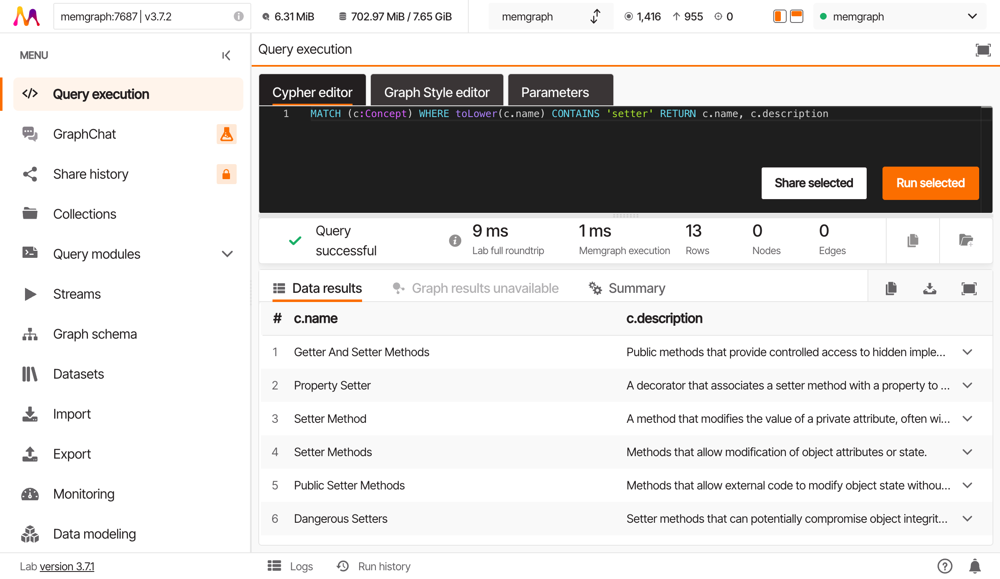
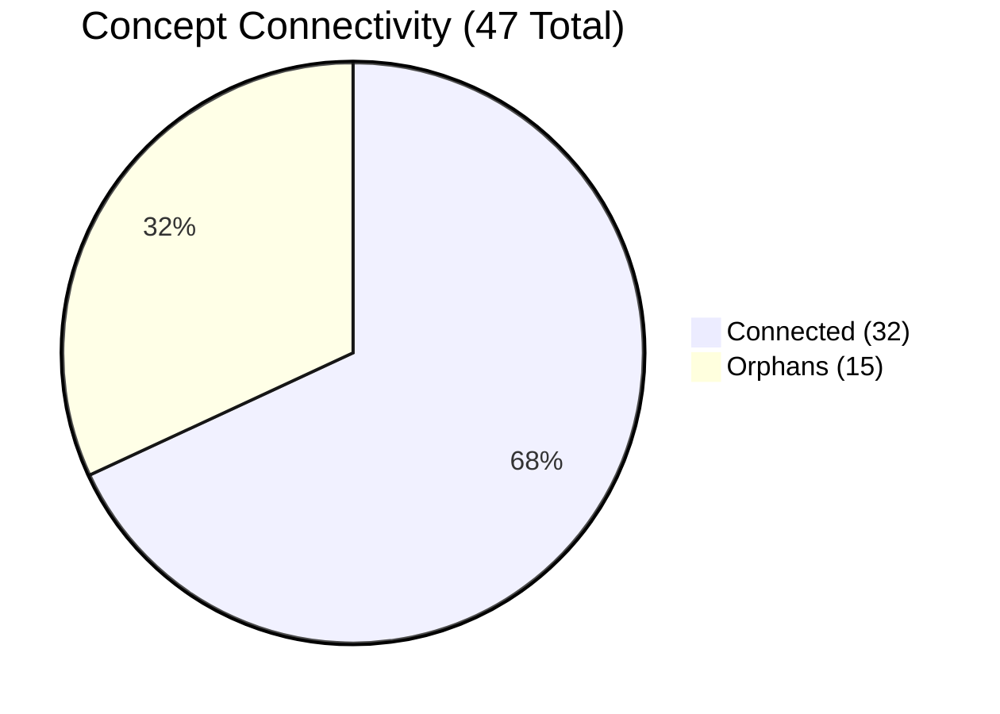

# What Do I Actually Have?

**Part 3: Exploring Your Knowledge Graph | Chapter 1 of 6**

:octicons-clock-16: ~20 minutes
:octicons-checklist-16: Prerequisites: Parts 1-2 (you've ingested at least one chapter and have a running Memgraph instance with data)

---

## The Problem With Your First Instinct

You just ingested Chapter 5 of *Software Design for Python Programmers*. The CLI printed a nice little summary:

```
Ingested: ch05_5_Hide_class_implementations
  47 concepts, 83 edges, 7 rules
```

Cool. You remember that chapter spending a LOT of time on setters: dangerous setters, property setters, the whole setter antipattern. So you pop open Memgraph Lab, type this, and hit run:

```cypher
MATCH (c:Concept) WHERE c.name CONTAINS 'setter' RETURN c
```

And you get back:

| c.name |
|--------|
| Setter Method |
| Dangerous Setters |
| Property Setters |

Three nodes.

That's it?

But you KNOW that chapter had 15 pages on dangerous setters, why they break things, how property decorators fix them, the whole setter antipattern. Where did everything go?

Nowhere. It's all in the graph. You just asked the wrong question.

Let's fix that.

---

## Asking Questions: The Two-Word Skeleton

Every question you ask this graph has the same shape. Two words: **ask**, then **show**.

Here's the simplest possible question: "show me everything."

```cypher
MATCH (c:Concept)
RETURN c
LIMIT 5
```

| c.name | c.description | c.domain |
|--------|--------------|----------|
| Encapsulation | Bundling data and methods that operate on that data within a single unit | software_design |
| Properties | Controlled access to object attributes via @property decorators | software_design |
| Dangerous Setters | Setter methods that can put an object into an invalid state | software_design |
| Immutability | Objects that cannot be modified after construction | software_design |
| Class Invariant | A condition that must be true for all objects before and after method calls | software_design |

Two things to notice.

First: `MATCH (c:Concept)` is the "ask" part. You're saying "find me all nodes labeled Concept, and let me call each one `c`." The parentheses are literal: a node in a graph looks like a circle, and `(c)` is your ASCII circle.

Second: `RETURN c` is the "show" part. Without it, the database finds the nodes but never shows them to you. Like asking someone a question and then walking away before they answer.

The `LIMIT 5` is self-defense. You have 47 concepts. You don't need all of them dumped on your screen right now.

!!! info "The query skeleton"
    Every question in this tutorial follows the same two-part shape:

    1. `MATCH` : describe what you're looking for
    2. `RETURN` : say what you want back

    That's it. Everything else (filtering, sorting, counting) hangs off this skeleton.

---

## Picking What To Show

When you wrote `RETURN c`, you got the whole node back: name, description, domain, source_id, every property the thing has. That's noisy. Most of the time, you want specific pieces.

Each node stores properties, and you grab them with a dot:

```cypher
MATCH (c:Concept)
RETURN c.name, c.description
LIMIT 5
```

| c.name | c.description |
|--------|--------------|
| Encapsulation | Bundling data and methods that operate on that data within a single unit |
| Properties | Controlled access to object attributes via @property decorators |
| Dangerous Setters | Setter methods that can put an object into an invalid state |
| Immutability | Objects that cannot be modified after construction |
| Class Invariant | A condition that must be true for all objects before and after method calls |

Cleaner. You're reading a table instead of decoding JSON blobs.

The properties available depend on what your extraction pipeline stored. For the concepts in this graph, you'll typically see:

| Property | What it holds | Example |
|----------|--------------|---------|
| `c.name` | The concept's name | "Dangerous Setters" |
| `c.description` | A short explanation | "Setter methods that can put an object into an invalid state" |
| `c.domain` | Which knowledge domain it belongs to | "software_design" |
| `c.source_id` | Where it was extracted from | "ch5" |

Now you know how to pick specific fields. Let's go back to the setter problem.

---

## Why Your First Search Was Too Narrow

Here's what you ran:

```cypher
MATCH (c:Concept) WHERE c.name CONTAINS 'setter' RETURN c
```

Three results. But the chapter covered WAY more than three setter-related ideas. So what went wrong?

Two things. And you're going to discover them one at a time.

### Problem 1: You Only Searched The Name

Your query said: "find concepts where the **name** contains the word 'setter'." That's like searching your email by subject line only. A huge email thread titled "Q3 Planning" that mentions setters twenty times in the body? Invisible to your query.

Try this instead: search the description too.

```cypher
MATCH (c:Concept)
WHERE c.name CONTAINS 'setter'
   OR c.description CONTAINS 'setter'
RETURN c.name, c.description
```

| c.name | c.description |
|--------|--------------|
| Setter Method | A method that modifies an object's attribute, sometimes called a mutator |
| Dangerous Setters | Setter methods that can put an object into an invalid state |
| Property Setters | Using @property decorator to create controlled setter methods |
| Invalid State | An object state that violates one or more class invariants, often caused by uncontrolled setter access |
| Encapsulation | Bundling data and methods that operate on that data within a single unit, preventing direct setter access to internal state |
| Access Control | Mechanisms that restrict how attributes are modified, replacing raw setters with controlled interfaces |
| State Validation | Checking that object state remains valid after modification, typically in setter or property methods |

Seven results. More than double. And look at those descriptions: "Invalid State" mentions setters. "Encapsulation" mentions setters. "Access Control" mentions setters. They were there the whole time. You just weren't looking in the right place.

!!! tip "Search broadly, not narrowly"
    The concept name is a label. The description is where the real content lives. When you're exploring, search both.

### Recap So Far

You can ask the graph questions with `MATCH` and `RETURN`. You can pick specific properties with the dot (`c.name`, `c.description`). And searching just the name misses concepts that mention your term in the description.

But you're not done. You went from 3 results to 7. The chapter had MUCH more to say about setters. There's a second problem.

---

### Problem 2: Case Sensitivity Is Biting You

Look at this query again:

```cypher
WHERE c.name CONTAINS 'setter'
```

That's looking for lowercase "setter" exactly. What if some concepts store the name as "Setter" with a capital S? Or "SETTER" in all caps? String matching is case-sensitive by default.

The fix: force everything to lowercase before comparing.

```cypher
MATCH (c:Concept)
WHERE toLower(c.name) CONTAINS 'setter'
   OR toLower(c.description) CONTAINS 'setter'
RETURN c.name, c.description
```

`toLower()` converts "Setter Method" to "setter method" before the comparison happens, so now "Setter", "setter", and "SETTER" all match.

Here's the full result set:

| c.name | c.description |
|--------|--------------|
| Setter Method | A method that modifies an object's attribute, sometimes called a mutator |
| Dangerous Setters | Setter methods that can put an object into an invalid state |
| Property Setters | Using @property decorator to create controlled setter methods |
| Invalid State | An object state that violates one or more class invariants, often caused by uncontrolled Setter access |
| Encapsulation | Bundling data and methods that operate on that data within a single unit, preventing direct Setter access to internal state |
| Access Control | Mechanisms that restrict how attributes are modified, replacing raw Setters with controlled interfaces |
| State Validation | Checking that object state remains valid after modification, typically in Setter or property methods |
| Mutator Pattern | A design pattern involving Setter methods that change object state in a controlled manner |
| Data Hiding | Restricting direct access to object internals, forcing use of Setter/getter interfaces |
| Attribute Protection | Mechanisms including naming conventions and property Setters to control attribute access |
| Write Access | The ability to modify an attribute, typically gated through Setter methods or properties |
| Object Protocol | The set of methods (including Setters) that define how external code interacts with an object |

**Twelve results.**



You went from 3 to 12. Your first query was missing **75%** of the setter-related concepts. Three-quarters of the relevant data, invisible because you searched one field with case-sensitive matching.

!!! warning "The falsifiable claim"
    Searching the name field alone misses more than 50% of relevant concepts. You just proved it: 3 out of 12 is 25% coverage. The claim holds.

---

## Stepping Back: How Many Concepts Do You Actually Have?

You've been searching for specific things. Let's zoom out. How big is this graph?

```cypher
MATCH (c:Concept)
RETURN count(c)
```

```
47
```

47 concepts. The CLI told you that, but now you've confirmed it yourself. Good habit: never trust the summary. Verify.

And here's a question that might not have occurred to you yet: how many of those 47 concepts actually connect to anything?

A concept sitting in the graph with no connections is like a word in a dictionary that nobody uses. It exists, technically. But it's not doing any work.

To check, you need to look for concepts that have at least one line connecting them to something else. Those lines (the arrows between nodes) are called **relationships** or **edges**. Same thing, two names. Here's how you find concepts that have them:

```cypher
MATCH (c:Concept)-[r]-()
RETURN count(DISTINCT c)
```

```
32
```

Let's unpack that syntax. `(c:Concept)-[r]-()` says: "find a Concept node `c` that has some relationship `r` connecting it to any other node." The square brackets hold the relationship, just like parentheses hold the node. The empty `()` at the end means "I don't care what's on the other side."

`DISTINCT` matters here because one concept might have multiple relationships, so it would show up multiple times without it.

32 out of 47. That means **15 concepts have zero connections**. They're orphans.



!!! note "Why orphans exist"
    Orphan concepts aren't necessarily errors. Sometimes the extraction pipeline captures a concept that's mentioned in passing but never related to other concepts in that specific chapter. Sometimes the LLM missed a connection. Either way, you now know they're there, and that's information you can act on.

---

## Not Drowning in Output: ORDER BY and LIMIT

You've got 47 concepts. When you start listing them all, you need two tools to keep the output manageable.

`LIMIT` you've already seen: it caps the number of results.

`ORDER BY` lets you sort, so the most interesting stuff floats to the top.

```cypher
MATCH (c:Concept)
RETURN c.name, c.description
ORDER BY c.name
LIMIT 10
```

Alphabetical. Useful for scanning. But you can sort by anything, including computed values:

```cypher
MATCH (c:Concept)
RETURN c.name, size(c.description) AS desc_length
ORDER BY desc_length DESC
LIMIT 5
```

| c.name | desc_length |
|--------|------------|
| Programming by Contract | 142 |
| Encapsulation | 118 |
| Dangerous Setters | 105 |
| Class Invariant | 98 |
| Properties | 87 |

`DESC` means descending (biggest first). Without it, you get ascending (smallest first). `size()` on a string gives you its length.

The concepts with the longest descriptions tend to be the most important ones. That's not a rule, just a pattern you'll notice: the extraction pipeline writes more when there's more to say.

### Recap

Here's where you stand. You can:

- Ask questions with `MATCH` and get answers with `RETURN`
- Pick specific properties: `c.name`, `c.description`, `c.domain`
- Search text with `CONTAINS` (and make it case-insensitive with `toLower()`)
- Search multiple fields with `OR`
- Count things with `count()`
- Sort with `ORDER BY` and cap output with `LIMIT`
- Find connected concepts using relationship patterns: `(c)-[r]-()`

And you know something important about your data: 47 concepts, but only 32 have connections. 15 orphans sitting in the dark.

---

## Exercises

Time to get your hands dirty. Each exercise has a hint if you're stuck and a solution you can expand.

### Exercise 1: Find All Concepts Related to "Validation"

Search both the name and description fields (case-insensitive) for any concept that mentions "validation." Return the concept name and description.

!!! hint
    The pattern is the same one you used for "setter": `toLower()` on both fields, `CONTAINS` with `OR`.

??? success "Solution"
    ```cypher
    MATCH (c:Concept)
    WHERE toLower(c.name) CONTAINS 'validation'
       OR toLower(c.description) CONTAINS 'validation'
    RETURN c.name, c.description
    ```

    **Expected output**: You should see concepts like "State Validation", "Input Validation", "Precondition" (whose description mentions validation), and possibly others. The exact count depends on your extraction, but expect 4-6 results.

---

### Exercise 2: Find Concepts With Long Descriptions

Some concepts got a one-liner. Others got a paragraph. Find all concepts whose description is longer than 100 characters. Return the name and the length of the description, sorted longest first.

!!! hint
    Use `size(c.description)` to get the string length, and filter with `WHERE`.

??? success "Solution"
    ```cypher
    MATCH (c:Concept)
    WHERE size(c.description) > 100
    RETURN c.name, size(c.description) AS desc_length
    ORDER BY desc_length DESC
    ```

    **Expected output**: Somewhere between 5-10 concepts, depending on how verbose your extraction pipeline was. The top entries will likely be foundational concepts like "Encapsulation" or "Programming by Contract" that needed more words to describe.

---

### Exercise 3: List All Unique Domain Values

Your concepts have a `domain` property. But how many different domains are there? List every unique domain value and how many concepts belong to each.

!!! hint
    `RETURN c.domain` gives you the domain. If you return a non-aggregated field alongside `count()`, Cypher groups by that field automatically.

??? success "Solution"
    ```cypher
    MATCH (c:Concept)
    RETURN c.domain, count(c) AS concept_count
    ORDER BY concept_count DESC
    ```

    **Expected output**: If you ingested a single chapter, you'll likely see one domain ("software_design") with all 47 concepts. If you ingested multiple chapters from different domains, you'll see the breakdown. Either way, now you know how your data is organized.

---

## What You Learned

- **The query skeleton**: `MATCH` asks, `RETURN` shows. Everything else hangs off those two.
- **Property access**: Grab specific fields with `c.name`, `c.description`, `c.domain`.
- **Text search**: `CONTAINS` finds substrings. `toLower()` makes it case-insensitive. Always search multiple fields.
- **Counting**: `count()` tells you how many. `DISTINCT` avoids double-counting.
- **Relationships (edges)**: The lines between nodes, written as `(a)-[r]-(b)`. You used them to find which concepts have connections.
- **Output control**: `ORDER BY` sorts. `LIMIT` caps. Use both or drown.
- **The big number**: 47 concepts, 32 connected, 15 orphans.

---

## Next Up

47 concepts. 32 with connections. 15 orphans.

But you still don't know what KINDS of connections exist. Is the graph mostly "this requires that"? Or "this contradicts that"? Is there a dominant relationship type, or is it evenly spread?

Next chapter: [Counting and Grouping](3.2-counting-and-grouping.md). We count the edges and find out what this graph is really made of.
