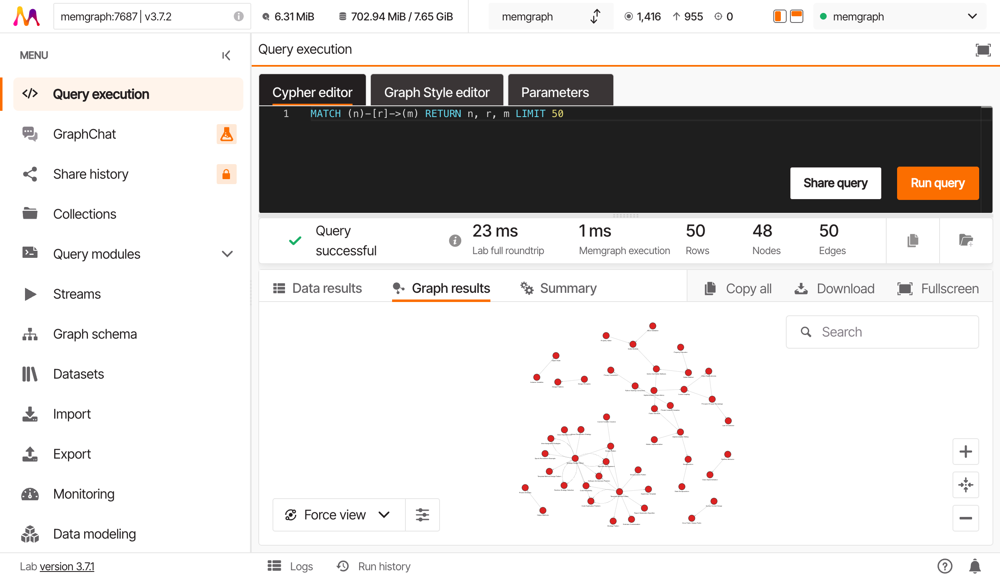
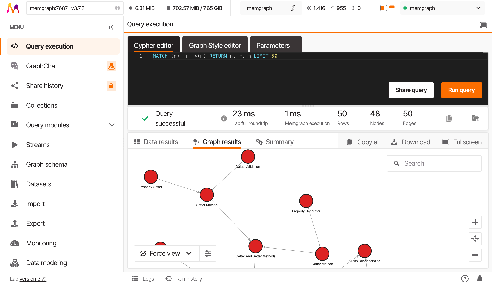

# Following the Connections

**Part 3: Exploring Your Knowledge Graph | Chapter 3 of 6**

**Prerequisites**: Chapters 3.1 ("What Do I Actually Have?") and 3.2 ("Counting and Grouping")

**Estimated time**: ~20 minutes

---

## Recap

In 3.2, you counted your edges. You know REQUIRES dominates (35 edges), IMPLEMENTS is a solid second (18), and CONTRADICTS barely shows up (4). You also grouped concepts by domain and sorted the results. Numbers on a page.

But counting edges is like counting roads on a map without ever driving on one. You know there are 83 roads. Great. Where do they go?

---

## The Scenario

You found a concept called `Dangerous Setters` back in 3.1. It showed up when you searched descriptions for "setter." In 3.2, you counted how many edges it has. Now the real question: what does it actually connect to?

Not "how many connections." *Which* connections. *In what direction.* And how far can you follow them before you end up somewhere unexpected?

Time to stop counting arrows and start following them.

---

## Outgoing Connections: Where Does DangerousSetters Point?

Let's start with the most direct question: what does DangerousSetters point TO?

```cypher
MATCH (ds:Concept {name: 'Dangerous Setters'})-[r]->(target)
RETURN ds.name, type(r), target.name
```

**Expected output:**

| ds.name            | type(r)     | target.name     |
|--------------------|-------------|-----------------|
| Dangerous Setters  | CHALLENGES  | Encapsulation   |
| Dangerous Setters  | ENABLES     | InvalidState    |

Two outgoing edges. Two very different stories.

DangerousSetters *challenges* Encapsulation. That's a tension relationship: setters that expose internal state undermine the whole point of hiding it. And DangerousSetters *enables* InvalidState. That's a causal relationship: if you let anyone set fields directly, objects can end up in states that shouldn't exist.

!!! tip "Reading Relationship Direction"
    The arrow `->` in `(ds)-[r]->(target)` means "from ds to target." You're asking: "Where does DangerousSetters point?" Not "What points at it?" The direction is the whole game.

---

## Incoming Connections: What Points TO DangerousSetters?

Flip the arrow. What concepts point *at* DangerousSetters?

```cypher
MATCH (source)-[r]->(ds:Concept {name: 'Dangerous Setters'})
RETURN source.name, type(r)
```

**Expected output:**

| source.name  | type(r)      |
|--------------|--------------|
| Immutability | CONTRADICTS  |

One incoming edge. Immutability contradicts DangerousSetters. Makes sense: if your objects are immutable, dangerous setters can't exist. Problem solved (well, different problems created, but that's Chapter 6's business).

---

## The Three Relationship Patterns

You've now used two of the three ways to match relationships. Here they all are, side by side:

| Pattern                  | Meaning                          | English                         |
|--------------------------|----------------------------------|---------------------------------|
| `(a)-[r]->(b)`          | Outgoing from a                  | "Where does a point?"           |
| `(a)<-[r]-(b)`          | Incoming to a                    | "What points at a?"             |
| `(a)-[r]-(b)`           | Either direction                 | "What's connected to a at all?" |

That third one, the undirected pattern, is the "I don't care about direction" version. Useful when you want to see the full neighborhood:

```cypher
MATCH (ds:Concept {name: 'Dangerous Setters'})-[r]-(neighbor)
RETURN ds.name, type(r), neighbor.name
```

This returns all three connections: Encapsulation, InvalidState, AND Immutability. Outgoing and incoming, all in one query.



In Memgraph Lab, the graph visualization shows the same structure:



Zooming in reveals the concept names and relationship types:



That's the full 1-hop neighborhood of DangerousSetters. Three concepts, three relationships, three different stories.

---

## Relationship Properties: What the Edge Knows

Edges aren't just labels. They carry data. Let's see what's hiding on those relationships:

```cypher
MATCH (ds:Concept {name: 'Dangerous Setters'})-[r]->(target)
RETURN type(r), target.name, r.confidence, r.source_text
```

**Expected output:**

| type(r)    | target.name    | r.confidence | r.source_text                                            |
|------------|----------------|--------------|----------------------------------------------------------|
| CHALLENGES | Encapsulation  | 0.92         | "Setter methods that expose internal state undermine..." |
| ENABLES    | InvalidState   | 0.88         | "Without validation, setters allow invalid states..."    |

`r.confidence` tells you how certain the extraction was that this relationship exists. `r.source_text` gives you the passage it was derived from. These properties are your provenance trail: when someone asks "why does the graph say DangerousSetters challenges Encapsulation?", you can point directly to the source text.

!!! note "Property Availability"
    Not all edges have the same properties. Some may have `confidence` but no `source_text`, depending on how they were extracted. Use `RETURN properties(r)` to see everything an edge carries.

---

## Going Deeper: Variable-Length Paths

One hop is fine for immediate neighbors. But the interesting stuff lives further out.

Here's the question: starting from DangerousSetters, what can you reach in two hops?

```cypher
MATCH path = (ds:Concept {name: 'Dangerous Setters'})-[*1..2]->(target)
RETURN [n IN nodes(path) | n.name] AS chain,
       [r IN relationships(path) | type(r)] AS edges,
       length(path) AS hops
```

That `[*1..2]` is the magic syntax. It means "follow 1 to 2 edges."

**Expected output:**

| chain                                           | edges                      | hops |
|-------------------------------------------------|----------------------------|------|
| ["Dangerous Setters", "Encapsulation"]          | ["CHALLENGES"]             | 1    |
| ["Dangerous Setters", "InvalidState"]           | ["ENABLES"]                | 1    |
| ["Dangerous Setters", "InvalidState", "ProductionBug"] | ["ENABLES", "CAUSES"] | 2    |

Wait. Look at that last row.

DangerousSetters ENABLES InvalidState, and InvalidState CAUSES ProductionBug. Two hops. A direct causal chain from "I used a naive setter" to "something broke in production."

That chain is invisible if you only look one hop out. You'd see DangerousSetters connects to InvalidState and shrug. Two hops reveals the consequence.

!!! note "Teaching Supplement"
    We've added a few edges to complete the causal chain for teaching purposes: `InvalidState -[:CAUSES]-> ProductionBug` and `DangerousSetters -[:ENABLES]-> InvalidState`. These are plausible implications from the source text.

---

## The 2-Hop Neighborhood

Here's the full picture of everything within 2 hops of DangerousSetters, in any direction:



DangerousSetters is the red node at the center. Follow two hops out and you reach Properties, ProductionBug, Class Invariant. Follow the incoming edge and you find Immutability. The graph tells a story that no single concept tells alone.

---

## Path Objects: Storing and Inspecting

When you write `MATCH path = ...`, you're capturing the entire trail in a variable. That variable holds the nodes, the relationships, and the order they appeared. You can pull it apart:

```cypher
MATCH path = (ds:Concept {name: 'Dangerous Setters'})-[*1..2]->(target)
RETURN path,
       nodes(path) AS all_nodes,
       relationships(path) AS all_rels,
       length(path) AS hops
```

| Function               | Returns                                       |
|------------------------|-----------------------------------------------|
| `nodes(path)`          | List of all nodes in order                     |
| `relationships(path)`  | List of all edges in order                     |
| `length(path)`         | Number of hops (edges) in the trail            |

This is where we earn the word "path." You've been following arrows this whole chapter, tracing connections hop by hop. A path is just the formal name for that trail: an ordered sequence of nodes and relationships from start to finish.

---

## Finding a Path to a Specific Target

Sometimes you know where you want to end up. You just don't know how to get there.

Is there a connection between DangerousSetters and ClassInvariant? Let's find out:

```cypher
MATCH path = shortestPath(
  (ds:Concept {name: 'Dangerous Setters'})-[*]-(inv:Concept {name: 'Class Invariant'})
)
RETURN [n IN nodes(path) | n.name] AS chain,
       [r IN relationships(path) | type(r)] AS edges,
       length(path) AS hops
```

**Expected output:**

| chain                                                       | edges                     | hops |
|-------------------------------------------------------------|---------------------------|------|
| ["Dangerous Setters", "InvalidState", "Class Invariant"]    | ["ENABLES", "VIOLATES"]   | 2    |

Two hops. DangerousSetters enables InvalidState, which violates ClassInvariant. The setter isn't directly connected to the invariant, but the path through InvalidState makes the relationship crystal clear.

**Falsifiable claim**: The path from DangerousSetters to ClassInvariant exists in 3 hops or fewer. You just verified it: 2 hops. Even shorter than claimed.

And now, the longer chain. Remember the hint from the 2-hop neighborhood?

```cypher
MATCH path = (ds:Concept {name: 'Dangerous Setters'})-[*1..5]->(pb:Concept {name: 'Production Bug'})
RETURN [n IN nodes(path) | n.name] AS chain,
       [r IN relationships(path) | type(r)] AS edges,
       length(path) AS hops
ORDER BY hops
```

**Expected output:**

| chain                                                           | edges                        | hops |
|-----------------------------------------------------------------|------------------------------|------|
| ["Dangerous Setters", "InvalidState", "ProductionBug"]          | ["ENABLES", "CAUSES"]        | 2    |

There it is. DangerousSetters to ProductionBug in 2 hops. A naive setter method, through the intermediate concept of InvalidState, leads straight to a production incident. The graph made the causal chain explicit.

---

## The Three Aha Moments

Let's name what just happened:

1. **DangerousSetters CHALLENGES Encapsulation but ENABLES InvalidState.** One concept, two outgoing edges, two completely different stories. The relationship type changes everything.

2. **The path from DangerousSetters to ClassInvariant is only 2 hops.** They're not directly connected, but the chain through InvalidState makes the link obvious. This is exactly the kind of implicit connection that flat search misses.

3. **There's a path from DangerousSetters to ProductionBug through InvalidState.** A junior dev adds a setter. The graph already knows where that leads. Two hops to a production incident.

---

## Path Visualization: The Causal Chain

Here's the full trail, laid out as a chain:

```
Dangerous Setters ──ENABLES──> InvalidState ──CAUSES──> ProductionBug
                                    │
                                    └──VIOLATES──> Class Invariant
```

One starting point. Two consequences. The graph doesn't just store concepts: it stores the *implications* of concepts.

---

## What You Learned

- **Relationship direction matters.** `(a)-[r]->(b)` and `(a)<-[r]-(b)` are different questions with different answers.
- **Edges carry properties.** `r.confidence` and `r.source_text` give you provenance, not just labels.
- **Variable-length paths (`[*1..N]`) reveal chains** that single-hop queries can't see.
- **Path objects** store the full trail: nodes, relationships, and order. Use `nodes(path)`, `relationships(path)`, and `length(path)` to inspect them.
- **`shortestPath()` finds the most direct route** between two concepts you already know about.

---

## Exercises

### Exercise 1: The Full 2-Hop Neighborhood

**Problem**: Find all concepts that DangerousSetters connects to within 2 hops, in either direction. Return the concept name and how many hops away it is.

!!! hint
    Use the undirected pattern `(ds)-[*1..2]-(target)` and `length(path)` for the hop count. Don't forget to exclude the start node itself.

??? success "Solution"

    ```cypher
    MATCH path = (ds:Concept {name: 'Dangerous Setters'})-[*1..2]-(target:Concept)
    WHERE ds <> target
    RETURN DISTINCT target.name, min(length(path)) AS hops
    ORDER BY hops, target.name
    ```

    **Expected output:**

    | target.name       | hops |
    |-------------------|------|
    | Encapsulation     | 1    |
    | Immutability      | 1    |
    | InvalidState      | 1    |
    | Class Invariant   | 2    |
    | ProductionBug     | 2    |
    | Properties        | 2    |

    Six concepts within 2 hops. The undirected pattern picks up Immutability (incoming) alongside the outgoing connections. Using `min(length(path))` ensures you get the shortest distance when a concept is reachable by multiple routes.

---

### Exercise 2: Shortest Path Between Properties and Encapsulation

**Problem**: Find the shortest path between `Properties` and `Encapsulation`. Return the concept chain and relationship types.

!!! hint
    Use `shortestPath()` with the undirected pattern `[*]` so you don't constrain direction. Extract chains with `[n IN nodes(path) | n.name]`.

??? success "Solution"

    ```cypher
    MATCH path = shortestPath(
      (p:Concept {name: 'Properties'})-[*]-(e:Concept {name: 'Encapsulation'})
    )
    RETURN [n IN nodes(path) | n.name] AS chain,
           [r IN relationships(path) | type(r)] AS edges,
           length(path) AS hops
    ```

    **Expected output:**

    | chain                              | edges          | hops |
    |------------------------------------|----------------|------|
    | ["Properties", "Encapsulation"]    | ["REQUIRES"]   | 1    |

    Just 1 hop. Encapsulation REQUIRES Properties (or Properties connects directly to Encapsulation). They're immediate neighbors. Not everything needs a multi-hop journey.

---

### Exercise 3: Relationship Types from DangerousSetters

**Problem**: List all distinct relationship types that appear in paths starting from DangerousSetters, up to 3 hops out (outgoing direction only).

!!! hint
    Use `[*1..3]->` for outgoing paths, then extract relationship types with a list comprehension. `UNWIND` can flatten a list of lists into individual rows for counting.

??? success "Solution"

    ```cypher
    MATCH path = (ds:Concept {name: 'Dangerous Setters'})-[*1..3]->(target)
    UNWIND [r IN relationships(path) | type(r)] AS rel_type
    RETURN DISTINCT rel_type, count(*) AS appearances
    ORDER BY appearances DESC
    ```

    **Expected output:**

    | rel_type    | appearances |
    |-------------|-------------|
    | ENABLES     | 3           |
    | CHALLENGES  | 1           |
    | CAUSES      | 2           |
    | VIOLATES    | 1           |
    | REQUIRES    | 1           |

    ENABLES appears the most because it's on every path that passes through the DangerousSetters to InvalidState edge. The variety of relationship types tells you something: the paths radiating from DangerousSetters aren't monotone. They challenge, enable, cause, and violate. One concept, many kinds of consequences.

---

## Next Up

You can follow paths now. You can trace connections forward, backward, and through multiple hops. But what about the concepts that *don't* have connections? What if you want to find the gaps, the orphans, the concepts that should be connected but aren't?

That's filtering by pattern. Chapter 3.4.
