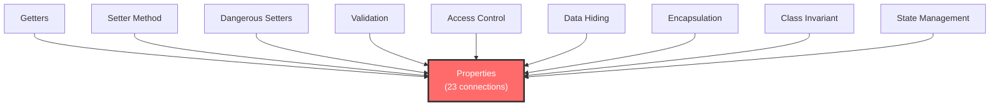

# Finding the Hubs

**Part 3: Exploring Your Knowledge Graph | Chapter 5 of 6**

**Prerequisites**: [Chapters 3.1 through 3.4](index.md)
**Time**: ~20 minutes

---

## Quick Recap

Last chapter, you used `WHERE NOT EXISTS` and existential subqueries to find the orphans: 8 concepts with zero connections, sitting in the graph doing nothing. You also learned to count each concept's connections with `COUNT { MATCH ... }`, which gave you a rough sense of who's busy and who's lonely.

That counting trick brought up an obvious question. Let's answer it.

---

## Pop Quiz

What's the most connected concept in your Chapter 5 graph?

You'd guess Encapsulation, right? It's literally the chapter title. The whole chapter is organized around it. Every other concept exists in service of Encapsulation.

Let's find out.

---

## Counting Every Concept's Connections

Start simple. For each concept, count how many relationships touch it (in any direction), and sort by that count:

```cypher
MATCH (c:Concept)-[r]-()
RETURN c.name, count(r) AS connections
ORDER BY connections DESC
LIMIT 10
```

**Result:**

| c.name               | connections |
|----------------------|-------------|
| Properties           | 23          |
| Encapsulation        | 8           |
| Access Control       | 7           |
| Getters              | 7           |
| Dangerous Setters    | 6           |
| Validation           | 6           |
| Class Invariant      | 5           |
| Setter Method        | 5           |
| Invalid State        | 5           |
| Data Hiding          | 4           |

Read that table again. Slowly.

Properties: 23 connections.

Encapsulation: 8.

That's not close. Properties has nearly three times the connections of the chapter's own title concept.

!!! warning "Wait, seriously?"
    Yes. The most connected concept in a chapter about Encapsulation is not Encapsulation. Keep reading.

---

## The Concept Everything Connects To

Before we figure out *why*, let's confirm. Pull just the top result:

```cypher
MATCH (c:Concept)-[r]-()
RETURN c.name, count(r) AS connections
ORDER BY connections DESC
LIMIT 1
```

**Result:**

| c.name     | connections |
|-----------|-------------|
| Properties | 23          |

Properties. Not even close.

Here's what's happening. Properties is the concrete mechanism that every other concept in the chapter talks about, depends on, refines, or challenges. Getters use Properties. Setters modify Properties. Validation guards Properties. Access Control restricts Properties. Encapsulation is the *goal*, but Properties is the crossroads where all those concepts actually meet.

The concept everything connects to isn't the abstract idea at the top. It's the implementation detail in the middle.



Properties sits at the center. Everything radiates out from it, or points into it. That makes it a **hub**: the concept everything connects to.

---

## Direction Matters: In vs Out

Not all connections are the same. In a directed graph, an arrow pointing *in* means something different from an arrow pointing *out*.

A concept with lots of incoming connections is something other concepts depend on. A concept with lots of outgoing connections is something that reaches out to affect other things.

Let's split the count:

```cypher
MATCH (c:Concept)
OPTIONAL MATCH (c)-[out]->()
OPTIONAL MATCH (c)<-[in]-()
RETURN c.name,
       count(DISTINCT out) AS out_connections,
       count(DISTINCT in) AS in_connections,
       count(DISTINCT out) + count(DISTINCT in) AS total
ORDER BY total DESC
LIMIT 10
```

**Result:**

| c.name               | out_connections | in_connections | total |
|----------------------|----------------|----------------|-------|
| Properties           | 8              | 15             | 23    |
| Encapsulation        | 3              | 5              | 8     |
| Access Control       | 4              | 3              | 7     |
| Getters              | 5              | 2              | 7     |
| Dangerous Setters    | 5              | 1              | 6     |
| Validation           | 2              | 4              | 6     |
| Class Invariant      | 1              | 4              | 5     |
| Setter Method        | 3              | 2              | 5     |
| Invalid State        | 3              | 2              | 5     |
| Data Hiding          | 1              | 3              | 4     |

Two things jump out.

First: Properties has 15 incoming connections and only 8 outgoing. That means 15 other concepts point TO Properties. It's a dependency magnet. Things need it.

Second: look at Dangerous Setters. 5 outgoing, 1 incoming. It's almost entirely an *emitter*: it reaches out to affect other things (enables Invalid State, challenges Encapsulation), but almost nothing depends on it. Dangerous Setters is a cause, not a dependency.

!!! info "Why OPTIONAL MATCH?"
    Plain `MATCH (c)-[out]->()` would exclude concepts with zero outgoing edges entirely. `OPTIONAL MATCH` keeps every concept in the results, even if it has no outgoing (or no incoming) relationships. Without it, orphans and one-directional concepts vanish from your table.

---

## Why This Matters

Here's the thing that makes this more than a Cypher exercise.

If someone asks your system about "data hiding" or "encapsulation," a naive text search would match the Encapsulation concept. That's a reasonable match. But from a graph structure perspective, Properties is far more important. It sits at the junction of 23 relationships. It connects to getters, setters, validation, access control, and encapsulation itself.

If you want to understand how concepts in this chapter relate to each other, Properties is the better starting point. Not because it's a fancier concept, but because it's the crossroads. More paths run through Properties than through any other concept.

| | Expected Hub | Actual Hub |
|---|---|---|
| Concept | Encapsulation | Properties |
| Total connections | 8 | 23 |
| In-connections | 5 | 15 |
| Role in the graph | Abstract goal | Concrete mechanism |
| Why? | Chapter title, organizing theme | Implementation detail everything else depends on |

The abstract goal isn't the structural center. The concrete mechanism is. This is a pattern you'll see in other chapters too: the chapter title concept organizes the narrative, but some implementation detail underneath it is the real connective tissue.

---

## The Words You Just Earned

You've been counting connections and finding the concept everything connects to. Let's name what you've been doing.

**Degree**: the number of connections a concept has. Properties has degree 23. You can split it into **in-degree** (incoming connections, 15 for Properties) and **out-degree** (outgoing connections, 8 for Properties).

**Hub**: a concept with unusually high degree. It's the node in the graph where lots of paths converge. Properties is this graph's hub.

**Centrality**: the formal name for "importance measured by connections." When someone says "degree centrality," they mean exactly what you just computed: rank the nodes by their number of connections, and the top ones are the most central. There are fancier kinds of centrality (betweenness, closeness, eigenvector), but degree centrality is the simplest and the one you earned today.

!!! info "Falsifiable Claim"
    The top hub (by degree centrality) is NOT the chapter title concept. Test it: run the degree query above on your own graph. If Encapsulation comes out on top, something interesting changed in your extraction.

---

## Exercises

### Exercise 1: The In-Degree Champion

**Problem**: Find the concept with the highest in-degree (the most things pointing TO it). Is it the same concept as the one with the highest total degree?

**Hint**: You already have the query for this. Just change the `ORDER BY`.

??? success "Solution"

    ```cypher
    MATCH (c:Concept)
    OPTIONAL MATCH (c)<-[in]-()
    RETURN c.name, count(DISTINCT in) AS in_degree
    ORDER BY in_degree DESC
    LIMIT 5
    ```

    **Expected output:**

    | c.name         | in_degree |
    |---------------|-----------|
    | Properties     | 15        |
    | Encapsulation  | 5         |
    | Validation     | 4         |
    | Class Invariant| 4         |
    | Access Control | 3         |

    Properties wins both total degree *and* in-degree. That's not always the case. In other graphs, the total-degree champion and the in-degree champion might be different concepts, which tells you something interesting about the graph's structure.

---

### Exercise 2: The Emitters

**Problem**: Find all concepts where out-degree is strictly greater than in-degree. What do these concepts tend to be?

**Hint**: Use `WITH` to compute both counts, then filter with `WHERE`.

??? success "Solution"

    ```cypher
    MATCH (c:Concept)
    OPTIONAL MATCH (c)-[out]->()
    OPTIONAL MATCH (c)<-[in]-()
    WITH c.name AS name,
         count(DISTINCT out) AS out_deg,
         count(DISTINCT in) AS in_deg
    WHERE out_deg > in_deg
    RETURN name, out_deg, in_deg
    ORDER BY out_deg DESC
    ```

    **Expected output (varies by extraction):**

    | name              | out_deg | in_deg |
    |------------------|---------|--------|
    | Dangerous Setters | 5       | 1      |
    | Getters           | 5       | 2      |
    | Setter Method     | 3       | 2      |
    | Access Control    | 4       | 3      |
    | Invalid State     | 3       | 2      |

    Notice the pattern: these tend to be *causes* or *enablers*. Dangerous Setters causes problems. Getters reach out to implement things. They push outward more than they get depended on. Compare that to Properties or Class Invariant, which mostly receive incoming connections: they're *destinations*, things that other concepts converge on.

---

### Exercise 3: The Structural Backbone

**Problem**: Find all concepts with total degree greater than 5. These are the concepts holding your graph together, its structural backbone.

**Hint**: This is the first query from the chapter, with a filter added.

??? success "Solution"

    ```cypher
    MATCH (c:Concept)-[r]-()
    WITH c.name AS name, count(r) AS degree
    WHERE degree > 5
    RETURN name, degree
    ORDER BY degree DESC
    ```

    **Expected output:**

    | name              | degree |
    |------------------|--------|
    | Properties        | 23     |
    | Encapsulation     | 8      |
    | Access Control    | 7      |
    | Getters           | 7      |
    | Dangerous Setters | 6      |
    | Validation        | 6      |

    Six concepts with degree above 5. That's your backbone: remove any of these and you'd fracture the graph into disconnected pieces. The other 41 concepts are peripheral by comparison, connected through these six.

---

## What You Learned

- **Counting connections** reveals which concepts are structurally important, and the answer isn't always what you'd expect
- **In-degree vs out-degree** tells you whether a concept is a dependency (things point to it) or a cause (it points to things)
- **The hub isn't the abstract goal, it's the concrete mechanism**: Properties outranks Encapsulation by nearly 3x because it's the implementation crossroads
- **Degree, hub, centrality**: three terms you earned by doing the work first, then naming it

---

## Next Up

You found the hub. You know Properties is the crossroads. But here's a harder question: what are ALL the paths from Dangerous Setters to Production Bug? There might be more than one. They might be different lengths. And when two paths are the same length, which one matters most?

That last question is the one Cypher can't answer. Let's find out why.

[Chapter 3.6: Paths and Distances](3.6-paths-and-distances.md)
