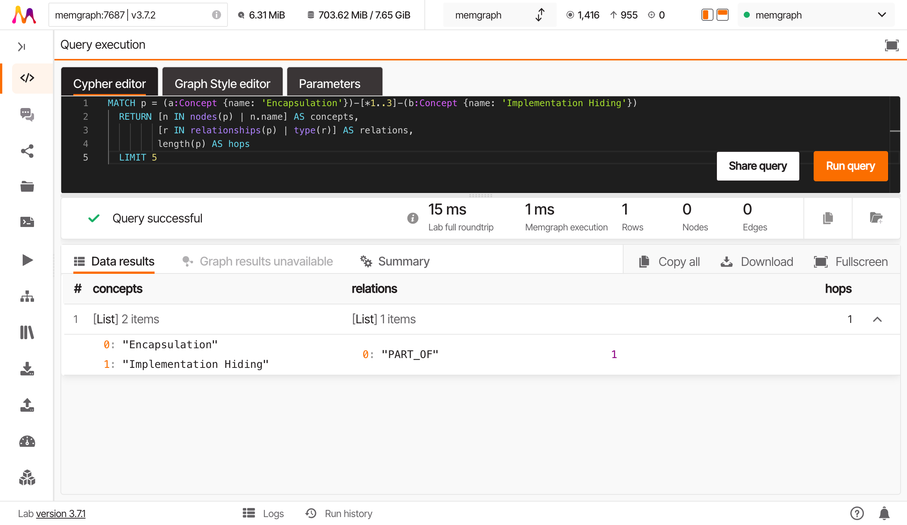

# Paths and Distances

**Part 3: Exploring Your Knowledge Graph | Chapter 6 of 6**

:octicons-clock-16: ~20 minutes
:octicons-checklist-16: Prerequisites: [Chapters 3.1-3.5](index.md)

---

## Recap

In 3.5, you asked the graph "who's the hub?" and the answer surprised you. Properties, not Encapsulation, sits at the center of this graph with 23 connections. The abstract goal lost to the concrete mechanism. Everything routes through Properties because that's where concepts actually meet.

Now for a different question. A harder one.

---

## How Does DangerousSetters Lead to ProductionBug?

Back in 3.3, you followed arrows out of DangerousSetters. You traced edges, chased variable-length paths, and at some point you noticed: there's a chain from DangerousSetters all the way to ProductionBug. A causal story: bad setters break invariants, broken invariants cause invalid state, invalid state causes bugs in production.

You found *a* path. One path. And you moved on.

But here's what you didn't ask: is that the only path? Or are there multiple routes from DangerousSetters to ProductionBug? And if there are multiple routes, which one is the "real" causal chain?

Let's find out.

---

## The Shortest Path

Start simple. What's the shortest route between these two concepts?

```cypher
MATCH path = shortestPath(
  (ds:Concept {name: 'Dangerous Setters'})-[*]-(pb:Concept {name: 'Production Bug'})
)
RETURN path, length(path)
```

**Result:**

```
length(path): 4
```

Four hops. DangerousSetters to ProductionBug in four steps. The `shortestPath` function finds the route with the fewest relationships between your two endpoints, and hands back the whole thing as a `path` object.

Two things to notice. First: `[*]` means "any number of relationships, any type, any direction." You're telling Cypher to explore freely. Second: `length(path)` counts the relationships in the path, not the nodes. A path with 4 relationships connects 5 nodes.

Good. But `shortestPath` returns *one* path. What if there are ties?

---

## All Shortest Paths: The Tie Problem

Replace `shortestPath` with `allShortestPaths`:

```cypher
MATCH path = allShortestPaths(
  (ds:Concept {name: 'Dangerous Setters'})-[*]-(pb:Concept {name: 'Production Bug'})
)
RETURN path, length(path)
```

**Result: 3 rows, all length 4.**

Three different paths. Same length. The graph isn't telling you one story from DangerousSetters to ProductionBug. It's telling you three.

But what ARE these three paths? You can see them in Memgraph Lab's visual mode, but let's pull them apart in Cypher.

---

## Inspecting What's Inside a Path

A path object isn't just a line on a graph viz. It's a data structure you can crack open. Two functions do the work:

- `nodes(path)` gives you the list of nodes, in order
- `relationships(path)` gives you the list of relationships, in order

```cypher
MATCH path = allShortestPaths(
  (ds:Concept {name: 'Dangerous Setters'})-[*]-(pb:Concept {name: 'Production Bug'})
)
RETURN [n IN nodes(path) | n.name] AS concept_names,
       [r IN relationships(path) | type(r)] AS relation_types,
       length(path) AS hops
```

**Result:**

| concept_names | relation_types | hops |
|--------------|----------------|------|
| [Dangerous Setters, Invalid State, State Validation, Runtime Error, Production Bug] | [ENABLES, REQUIRES, DETECTS, CAUSES] | 4 |
| [Dangerous Setters, Encapsulation, Properties, State Validation, Production Bug] | [CHALLENGES, IMPLEMENTS, REQUIRES, DETECTS] | 4 |
| [Dangerous Setters, Invalid State, Properties, Runtime Error, Production Bug] | [ENABLES, REQUIRES, DETECTS, CAUSES] | 4 |



Read that table row by row. Each row is a complete story:

**Path 1**: Dangerous Setters *enables* Invalid State, which *requires* State Validation, which *detects* Runtime Error, which *causes* Production Bug.

**Path 2**: Dangerous Setters *challenges* Encapsulation, which *implements* Properties, which *requires* State Validation, which *detects* Production Bug.

**Path 3**: Dangerous Setters *enables* Invalid State, which *requires* Properties, which *detects* Runtime Error, which *causes* Production Bug.

Three stories. All true. All the same length.



!!! info "Falsifiable Claim"
    Multiple shortest paths of the same length exist between DangerousSetters and ProductionBug. Run the `allShortestPaths` query above to verify: you should get 3 rows, all length 4.

---

## Beyond Shortest: All Paths Up to a Length

Shortest paths are useful, but they're not the only paths. What if there's a longer route that tells a more complete story?

```cypher
MATCH path = (ds:Concept {name: 'Dangerous Setters'})-[*1..5]-(pb:Concept {name: 'Production Bug'})
RETURN [n IN nodes(path) | n.name] AS concept_names,
       length(path) AS hops
ORDER BY length(path)
```

This finds every path up to 5 hops long. The `*1..5` means "at least 1 relationship, at most 5." Without that upper bound, Cypher would explore every possible path in the graph, including loops, and your query would run until the heat death of the universe (or your Memgraph container crashes, whichever comes first).

**Result (sample):**

| concept_names | hops |
|--------------|------|
| [Dangerous Setters, Invalid State, State Validation, Runtime Error, Production Bug] | 4 |
| [Dangerous Setters, Encapsulation, Properties, State Validation, Production Bug] | 4 |
| [Dangerous Setters, Invalid State, Properties, Runtime Error, Production Bug] | 4 |
| [Dangerous Setters, Invalid State, Class Invariant, State Validation, Runtime Error, Production Bug] | 5 |
| [Dangerous Setters, Encapsulation, Properties, Access Control, Runtime Error, Production Bug] | 5 |

The 3 shortest paths at length 4, plus additional paths at length 5 that loop through Class Invariant or Access Control. More routes. More stories. More ways the graph connects these two concepts.

!!! warning "Performance note"
    Variable-length path queries with high upper bounds can get expensive fast. If your graph has cycles, the number of possible paths grows exponentially. Keep the upper bound tight (5 is usually plenty for exploration) and always use `LIMIT` if you're unsure how many results you'll get.

---

## Reading a Path Like a Sentence

Let's go back to one of the shortest paths and read it carefully. This is worth doing once, slowly.

```cypher
MATCH path = shortestPath(
  (ds:Concept {name: 'Dangerous Setters'})-[*]-(pb:Concept {name: 'Production Bug'})
)
RETURN [n IN nodes(path) | n.name] AS concept_names,
       [r IN relationships(path) | type(r)] AS relation_types
```

**Output:**

```
concept_names:  [Dangerous Setters, Invalid State, State Validation, Runtime Error, Production Bug]
relation_types: [ENABLES, REQUIRES, DETECTS, CAUSES]
```

Read it as a chain:

> Dangerous Setters **ENABLES** Invalid State **REQUIRES** State Validation **DETECTS** Runtime Error **CAUSES** Production Bug

That's a sentence. A causal narrative encoded in graph structure. The path isn't just a distance metric. It's a *story* your knowledge graph is telling you about how dangerous setters lead to production bugs.

Five nodes. Four relationships. One narrative.

---

## The Wall

So. Three shortest paths, all length 4. Additional paths at length 5. Each one tells a different story about how DangerousSetters connects to ProductionBug.

Which one matters most?

Think about it. Path 1 goes through Invalid State and State Validation. Path 2 goes through Encapsulation and Properties. Path 3 goes through Invalid State and Properties.

They're all the same length. Cypher treats them as equals. But your intuition says they're NOT equal. The path through Invalid State feels more "causal" than the path through Encapsulation. The one touching Properties (the hub you found in 3.5, the concept with 23 connections) feels more "structurally central."

You want to rank them. You want to say "this path matters more than that one."

And you can't.

Not with anything you've learned so far. `length(path)` treats all paths of length 4 as identical. `nodes(path)` tells you what's in each path but doesn't score them. There is no `importance(path)` function in Cypher. There's no `rank(path)` clause you forgot to learn.

This is the wall.

---

## What's On the Other Side

The ranking problem isn't a query problem. It's an algorithm problem.

Here's what you'd need: start at DangerousSetters. Spread outward along every connection, like dropping ink on a napkin. But not evenly. Weight the spread by how connected each neighbor is, how many paths flow through it, how structurally important it is in the local neighborhood. Let the ink settle. Then look at where it pooled.

The concepts where the ink is darkest? Those are the ones most relevant to DangerousSetters. Not because they're closest (shortest path handles that), but because the graph's structure funnels attention toward them.

That's not a query. That's an algorithm. It's called **Personalized PageRank**.

And it's exactly what the hippocampus does when you smell your grandmother's perfume and suddenly remember her kitchen. Not the closest memory. Not the most recent. The most *relevant* one, found by spreading activation through a network of associations until something lights up.

You'll learn to run it in Part 4.

---

## What You Learned (The Whole Journey)

This is the end of Part 3. Six chapters. Here's what you covered:

| Chapter | The Question | The Skill |
|---------|-------------|-----------|
| 3.1 | What do I actually have? | `MATCH`/`RETURN`, property access, `CONTAINS`, `toLower()` |
| 3.2 | What kinds of things? | `count()`, implicit grouping, `ORDER BY` |
| 3.3 | What connects to what? | Relationship patterns, direction, variable-length paths |
| 3.4 | What's missing? | `WHERE NOT EXISTS`, existential subqueries |
| 3.5 | What's the hub? | Degree centrality, in/out-degree |
| 3.6 | How do things connect? | `shortestPath`, `allShortestPaths`, path inspection |

You started with a graph you couldn't even search properly (3 results when there should have been 12). You ended with the ability to find, count, filter, trace, and inspect every path in your knowledge graph.

And you hit the wall: paths are not enough. You can find them, measure them, read them like sentences. But you can't rank them. Not with queries alone.

That's what Part 4 is for.

---

## Next Up

Part 4: **Graph Algorithms**. You'll leave Cypher's query world and step into Memgraph's algorithm library. First stop: Personalized PageRank, the algorithm that answers the question this chapter couldn't.

Start at DangerousSetters. Spread outward. See what lights up.

---

## Exercises

### Exercise 1: Shortest Paths Between Properties and ProductionBug

**Task**: Find all shortest paths between Properties and ProductionBug. How many distinct shortest paths are there? What's their length?

!!! hint
    Use `allShortestPaths` the same way you used it for DangerousSetters. Inspect the results with `nodes(path)`.

??? success "Solution"

    ```cypher
    MATCH path = allShortestPaths(
      (p:Concept {name: 'Properties'})-[*]-(pb:Concept {name: 'Production Bug'})
    )
    RETURN [n IN nodes(path) | n.name] AS concept_names,
           length(path) AS hops
    ```

    **Expected output**: You should find 2-3 shortest paths, likely of length 2 or 3. Properties is the hub (23 connections), so it sits close to almost everything. The paths will be shorter than the DangerousSetters paths because Properties is more central.

---

### Exercise 2: The Graph's Diameter

**Task**: The "diameter" of a graph is the longest shortest path between any two nodes. Find it by testing several concept pairs. Try at least 4 pairs that seem far apart in meaning (e.g., concepts from different domains or opposite ends of the dependency chain).

!!! hint
    Run `shortestPath` between different pairs and compare `length(path)`. Good candidates for "far apart" pairs: concepts at the edge of the graph (low degree) connected to concepts on the other edge. The orphans from 3.4 won't work (no paths exist), so pick concepts with at least some connections.

??? success "Solution"

    ```cypher
    // Try several pairs
    MATCH path = shortestPath(
      (a:Concept {name: 'Composition Over Inheritance'})-[*]-(b:Concept {name: 'Production Bug'})
    )
    RETURN a.name, b.name, length(path) AS hops
    ```

    If that pair has no path (one might be an orphan), try others:

    ```cypher
    // Brute force approach: check all connected pairs
    MATCH path = shortestPath((a:Concept)-[*]-(b:Concept))
    WHERE a <> b
    RETURN a.name, b.name, length(path) AS hops
    ORDER BY hops DESC
    LIMIT 5
    ```

    **Expected output**: The diameter is likely 6-8 hops. The longest shortest paths will connect low-degree concepts on opposite sides of the graph, routing through the Properties hub in the middle. This brute-force query might take a moment, but with 47 concepts it's manageable.

---

### Exercise 3: Read the Path From Encapsulation to ProductionBug

**Task**: Find the shortest path from Encapsulation to ProductionBug. Extract the node names and relationship types. Then read it as a sentence: what causal story does this path tell?

!!! hint
    Use `shortestPath` with `nodes(path)` and `relationships(path)`, just like the inspection query earlier in this chapter. The interesting part isn't running the query. It's reading the output and interpreting the narrative.

??? success "Solution"

    ```cypher
    MATCH path = shortestPath(
      (e:Concept {name: 'Encapsulation'})-[*]-(pb:Concept {name: 'Production Bug'})
    )
    RETURN [n IN nodes(path) | n.name] AS concept_names,
           [r IN relationships(path) | type(r)] AS relation_types
    ```

    **Expected output**: Something like:

    ```
    concept_names:  [Encapsulation, Properties, State Validation, Runtime Error, Production Bug]
    relation_types: [IMPLEMENTS, REQUIRES, DETECTS, CAUSES]
    ```

    Read it: Encapsulation **IMPLEMENTS** Properties, which **REQUIRES** State Validation, which **DETECTS** Runtime Error, which **CAUSES** Production Bug.

    The story: Encapsulation works *through* Properties. When properties require validation but that validation detects errors, those errors surface as production bugs. The path reveals that Encapsulation's connection to production bugs is indirect, mediated by the implementation mechanism (Properties) and the validation layer. Break the validation, and encapsulation's protection breaks with it.
