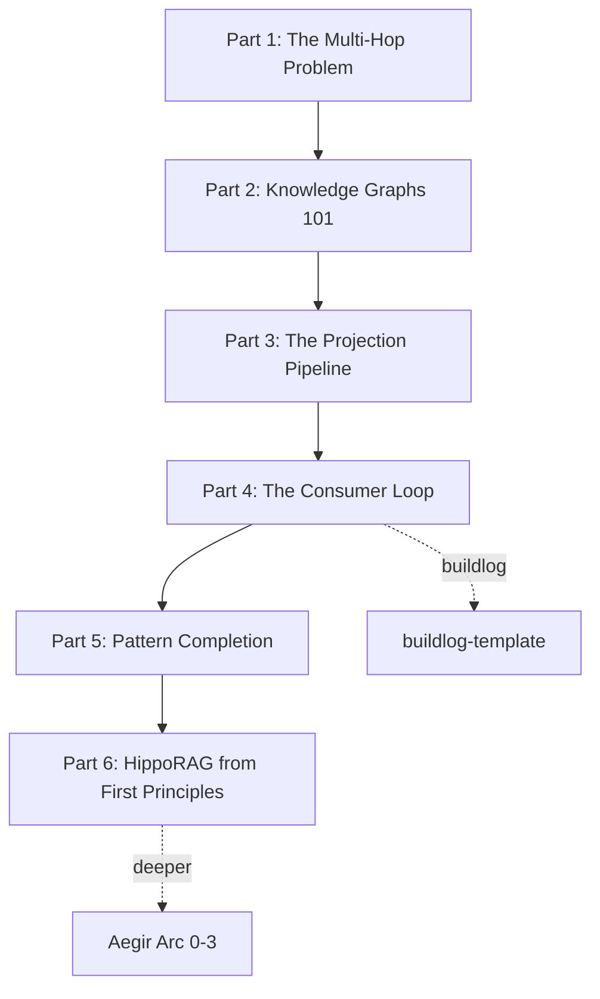
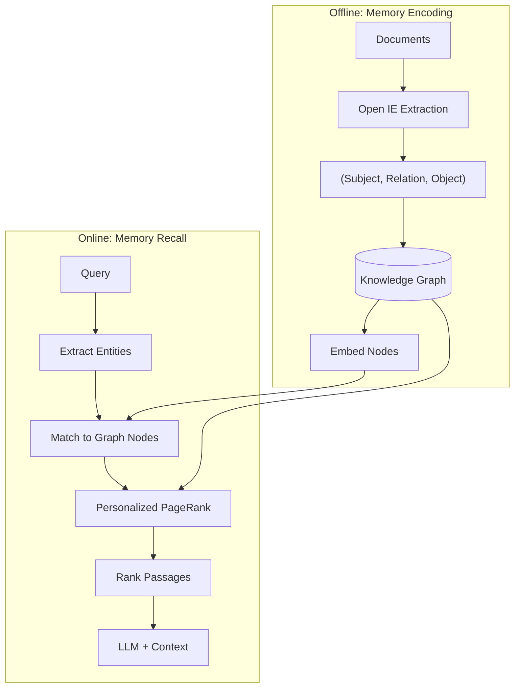

# Tutorial Series: From RAG to HippoRAG

**A 6-Part Journey from "The Fuck Is This?" to First Principles Understanding**

> This series is a teaser for the full [Aegir curriculum](https://github.com/Peleke/aegir) — a mathematically-rigorous path from probability foundations through information geometry. These tutorials give you working intuition and code. Aegir gives you the theory to extend it.

---

## The Map



**Parts 1-3**: What qortex does TODAY (KG ingestion, rule projection)
**Parts 4-6**: Where it's going (consumer loop, HippoRAG retrieval)

---

## Part 1: The Multi-Hop Problem

### War Story

You're building an AI coding assistant. It has access to your company's engineering handbook — 500 pages of best practices, patterns, and hard-won lessons. You RAG the whole thing into a vector database. Life is good.

Then a junior dev asks: "What's the recommended error handling strategy for the auth service?"

Your RAG system confidently returns... a section about logging formats. The actual answer requires connecting:
- "Auth service" → "uses Circuit Breaker pattern" (page 34)
- "Circuit Breaker" → "requires timeout configuration" (page 89)
- "Timeout configuration" → "follow error handling matrix" (page 156)

No single chunk contains the answer. The information is spread across passage boundaries, connected only through concepts your vector search never saw.

**The Turn**: Your RAG system doesn't understand *relationships*. It understands *similarity*. And similarity isn't enough.

### What You'll Learn

- Why vector similarity search fails for multi-hop questions
- The difference between "documents that look like my query" and "concepts connected to my query"
- A taxonomy of RAG failures (and which ones qortex solves)

### The Bridge

You need to store *relationships*, not just *embeddings*. That's a knowledge graph. Part 2.

---

## Part 2: Knowledge Graphs 101

### War Story

Back to that engineering handbook. You realize you need structure. So you start annotating:

- "Circuit Breaker" is a *concept*
- "Timeout" is a *concept*
- Circuit Breaker *REQUIRES* Timeout
- Retry *CONTRADICTS* Fail-Fast

Suddenly you can answer: "What does Circuit Breaker need?" by *traversing edges*, not searching embeddings.

But now you have a new problem: you have 500 pages. Annotating by hand will take months. Can you automate this?

**The Turn**: Manual annotation doesn't scale. You need a pipeline.

### What You'll Learn

- Concepts, edges, and semantic relation types
- The 10 relation types in qortex (REQUIRES, CONTRADICTS, REFINES, etc.)
- Why rich typing enables automated rule derivation
- Domains as isolated subgraphs (like database schemas)

### Code You'll Write

```python
from qortex.core.models import ConceptNode, ConceptEdge, RelationType

# Your first knowledge graph
node_a = ConceptNode(
    id="circuit_breaker",
    name="Circuit Breaker",
    description="Pattern that prevents cascading failures",
    domain="error_handling",
    source_id="handbook",
)

edge = ConceptEdge(
    source_id="circuit_breaker",
    target_id="timeout",
    relation_type=RelationType.REQUIRES,
)
```

### The Bridge

You have a graph. Now what? You need to *extract actionable rules* from it. That's projection. Part 3.

---

## Part 3: The Projection Pipeline

### War Story

Your knowledge graph has 200 concepts and 450 edges. Great. But your AI assistant doesn't speak "graph" — it speaks "rules." You need to transform:

```
(Circuit Breaker) --REQUIRES--> (Timeout)
```

Into:

```
"When implementing Circuit Breaker, ensure Timeout is configured"
```

And you need to do it systematically, for every edge, in every style (imperative, conditional, warning).

**The Turn**: You realize the graph is the *primary representation*. Rules are just one *projection* of it. Different consumers need different projections.

### What You'll Learn

- The Source → Enricher → Target architecture
- 30 edge rule templates (3 variants × 10 relation types)
- Why buildlog isn't special — it's just one ProjectionTarget
- Enrichment: adding context, antipatterns, rationale

### Code You'll Write

```python
from qortex.projectors.projection import Projection
from qortex.projectors.sources.flat import FlatRuleSource
from qortex.projectors.enrichers.template import TemplateEnricher
from qortex.projectors.targets.buildlog_seed import BuildlogSeedTarget

projection = Projection(
    source=FlatRuleSource(backend=backend),
    enricher=TemplateEnricher(domain="error_handling"),
    target=BuildlogSeedTarget(persona_name="handbook_rules"),
)

# One line to go from graph to actionable rules
result = projection.project(domains=["error_handling"])
```

### The Bridge

You're generating rules. But who *consumes* them? And how do you know if they *work*? Part 4.

---

## Part 4: The Consumer Loop

### War Story

You've projected 150 rules from your handbook. They land in a YAML file. Now what?

Enter **buildlog** — a system that:
1. Ingests your rules as "seeds"
2. Surfaces them to AI agents as instructions
3. Tracks whether they actually reduce mistakes
4. Learns which rules work via Thompson Sampling

The loop closes: qortex generates rules → buildlog tests them → feedback improves confidence → better rules surface.

**The Turn**: Rules aren't static. They're *hypotheses*. The consumer loop is how you test them.

### What You'll Learn

- buildlog as the first intended consumer (but not the only one)
- The interop protocol: pending directory + signal log
- Universal schema: flat `persona`, integer `version`, `provenance` block
- Why full decoupling matters (qortex doesn't know about buildlog internals)

### Code You'll Write

```python
from qortex.interop import write_seed_to_pending, get_interop_config

# Publish rules for any consumer
path = write_seed_to_pending(
    seed_data=result,
    persona="handbook_rules",
    domain="error_handling",
    emit_signal=True,  # Notify watchers
)

# buildlog picks it up automatically
# buildlog_gauntlet_rules() now includes your rules
```

### The Feedback Loop

```
qortex projects rules
    ↓
buildlog ingests seeds
    ↓
Agent uses rules
    ↓
User logs mistakes/rewards
    ↓
Thompson Sampling updates posteriors
    ↓
High-confidence rules surface more
    ↓
Repeated Mistake Rate (RMR) measured
```

### The Bridge

You have a working pipeline. But retrieval is still keyword-based. What if you could retrieve rules by *spreading activation through the graph*? Part 5.

---

## Part 5: Pattern Completion

### War Story

A developer asks: "How should I handle timeouts in the payment service?"

Your system needs to:
1. Match "payment service" to concepts in the graph
2. Find "timeout" concepts
3. Discover that "payment service" connects to "Circuit Breaker" which connects to "Timeout"
4. Return rules about *all* these connected concepts

This isn't keyword search. It's *pattern completion* — starting from partial cues and filling in the rest.

**The Turn**: Your brain does this constantly. Smell grandma's perfume → her kitchen → her voice → her face. Partial cue → complete memory. What if your retrieval system worked the same way?

### What You'll Learn

- The hippocampal indexing theory (neuroscience)
- Pattern separation vs pattern completion
- Why Personalized PageRank is algorithmic pattern completion
- The random walk intuition: start at query nodes, spread through edges

### The Algorithm (Intuition)

```
1. User asks about "payment timeout handling"

2. Match to graph nodes:
   - "payment" → Payment Service node
   - "timeout" → Timeout node

3. Start random walks from these seeds
   - Payment Service → connects to → Circuit Breaker
   - Circuit Breaker → REQUIRES → Timeout
   - Timeout reinforced (was already a seed!)

4. After many walks, nodes accumulate "activation"
   - Highly connected nodes score high
   - Circuit Breaker scores high (connects both seeds!)

5. Retrieve rules from high-scoring nodes
   - Rules about Circuit Breaker, Timeout, Payment Service
```

### Code You'll Write

```python
# Simplified PPR intuition
def personalized_pagerank(graph, seeds, damping=0.85, iterations=100):
    scores = {n: 1/len(seeds) if n in seeds else 0 for n in graph.nodes}

    for _ in range(iterations):
        new_scores = {}
        for node in graph.nodes:
            # Score from random walk
            walk = sum(
                damping * scores[neighbor] / graph.out_degree(neighbor)
                for neighbor in graph.predecessors(node)
            )
            # Score from teleporting back to seeds
            teleport = (1 - damping) * (1/len(seeds) if node in seeds else 0)
            new_scores[node] = walk + teleport
        scores = new_scores

    return scores
```

### The Bridge

You understand pattern completion intuitively. Part 6 puts it all together with the full HippoRAG algorithm.

---

## Part 6: HippoRAG from First Principles

### The Full Picture



### The Brain Analogy

| Brain Component | HippoRAG Analog | Function |
|-----------------|-----------------|----------|
| **Neocortex** | LLM + Documents | Stores actual content |
| **Hippocampal Index** | Knowledge Graph | Network of associations |
| **Pattern Separation** | OpenIE Extraction | Creates discrete representations |
| **Pattern Completion** | Personalized PageRank | Spreads activation from partial cues |

### Why It Works

**Standard RAG asks**: "What documents look like this query?"
**HippoRAG asks**: "What concepts connect to this query's concepts?"

The difference is **association** vs **similarity**.

When you ask about "the director of Saving Private Ryan's eye color":
- Standard RAG finds no single document with the answer
- HippoRAG connects "Saving Private Ryan" → "Steven Spielberg" → "blue eyes"

### The Full Algorithm

**Phase 1: Indexing (Offline)**

```python
def index_corpus(documents):
    kg = KnowledgeGraph()

    for doc in documents:
        # 1. Extract triples via LLM
        triples = llm.extract_triples(doc)  # OpenIE

        for (subject, relation, object) in triples:
            # 2. Add to graph
            kg.add_node(subject)
            kg.add_node(object)
            kg.add_edge(subject, object, relation)

            # 3. Link to source passage
            kg.link_to_passage(subject, doc)
            kg.link_to_passage(object, doc)

    # 4. Embed all nodes for retrieval
    for node in kg.nodes:
        node.embedding = embed(node.name)

    return kg
```

**Phase 2: Retrieval (Online)**

```python
def retrieve(query, kg, top_k=10):
    # 1. Extract query entities
    query_entities = llm.extract_entities(query)

    # 2. Match to graph nodes (embedding similarity)
    seed_nodes = []
    for entity in query_entities:
        matches = kg.find_similar_nodes(entity, top_n=5)
        seed_nodes.extend(matches)

    # 3. Pattern completion via PPR
    scores = personalized_pagerank(kg, seed_nodes)

    # 4. Rank passages by node scores
    passage_scores = defaultdict(float)
    for node, score in scores.items():
        for passage in kg.get_passages(node):
            passage_scores[passage] += score

    # 5. Return top passages
    return sorted(passage_scores.items(), key=lambda x: -x[1])[:top_k]
```

### What qortex Provides

qortex is the **indexing layer** — it builds the knowledge graph that HippoRAG retrieves from:

1. **Ingest** → Documents become IngestionManifests
2. **Store** → Concepts, edges, rules in GraphBackend
3. **Project** → Rules for consumers (buildlog tests them)
4. **Retrieve** (future) → PPR-based pattern completion

The scaffolding exists in `src/qortex/hippocampus/`. The full implementation is Phase 2.

### The Aegir Connection

This tutorial gave you intuition. Aegir gives you the math:

| Concept | Tutorial Level | Aegir Arc |
|---------|----------------|-----------|
| Probability basics | Intuition | Arc 0: Modules 0.2-0.4 |
| Thompson Sampling | Working code | Arc 0: Module 0.7 |
| Bayesian updating | Conceptual | Arc 0: Module 0.4, Arc 2 |
| Graph algorithms | PPR intuition | Arc 1: Linear algebra |
| Information geometry | Not covered | Arc 3: Why embeddings have the structure they do |

**The bridge**: These tutorials show you *what* works. Aegir shows you *why* it works, with enough rigor to extend it.

---

## Series Summary

| Part | Title | You'll Learn | You'll Build |
|------|-------|--------------|--------------|
| 1 | The Multi-Hop Problem | Why RAG fails | Mental model |
| 2 | Knowledge Graphs 101 | Concepts, edges, types | Your first KG |
| 3 | The Projection Pipeline | Source → Enricher → Target | Rule projector |
| 4 | The Consumer Loop | buildlog, interop, feedback | End-to-end pipeline |
| 5 | Pattern Completion | PPR, hippocampus analogy | Intuitive retriever |
| 6 | HippoRAG First Principles | Full algorithm | Complete understanding |

---

## Prerequisites

- Python basics (functions, classes, dicts)
- Comfort with `pip install` and running scripts
- No ML/AI background required — we'll build intuition from scratch

## What You Won't Learn Here

- How to train embeddings (use sentence-transformers)
- How to fine-tune LLMs (use Anthropic/OpenAI APIs)
- The mathematical foundations (that's Aegir)

## Next Steps

After completing this series:

1. **Use qortex** — Ingest your own content, project rules, feed buildlog
2. **Start Aegir Arc 0** — Probability foundations, Thompson Sampling from first principles
3. **Contribute** — Phase 2 (HippoRAG implementation) needs builders

---

*Generated for the qortex project. Part of the Aegir curriculum ecosystem.*
