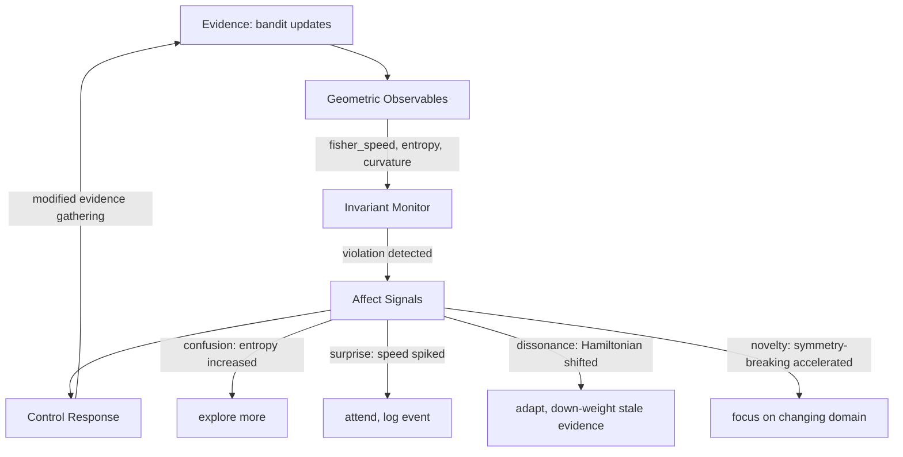

# The Road Ahead

*In which we stand at the perimeter and look out*

---

You've made it through two tutorial series. One about structure (the causal DAG), one about measurement (the Fisher metric). Both are operational: you can build a DAG from a real knowledge graph, test independence with d-separation, propagate credit, and measure how much the system is actually learning per observation.

But both series end with open questions. Credit decays at a constant rate. The Fisher metric tells you where you are, but not where you're going. The curvature map shows where evidence is amplified, but doesn't predict when the system will converge.

This page sketches what comes next. Not as tutorials (those are coming), but as a map of the territory. Some of it is already built. Some of it needs months of research. The line between the two is visible, and we'll draw it clearly.

---

## Two problems, one surface

The causal DAG and the Fisher manifold look like separate concerns. One is about graph structure. The other is about probability distributions. But they share a surface, and that surface is where the interesting problems live.

Here's the connection: when `CreditAssigner.to_posterior_updates()` converts a reward into `{alpha_delta, beta_delta}`, those deltas are a direction on the Fisher manifold. The causal DAG chose *which* concepts to credit. The manifold determines *how much that credit matters* at the current point in belief space.

A credit of +0.5 to alpha means something completely different at Beta(1,1) than at Beta(100,100). The causal layer doesn't know this. It applies a constant decay factor regardless of where each concept sits on the manifold. That's the first problem to solve: geometry-aware credit propagation.

The second problem is harder: can the system predict its own future?

---

## The update rule as a dynamical system

Thompson Sampling updates beliefs by a simple rule:

```
(alpha, beta) -> (alpha + reward, beta + 1 - reward)
```

This is the same rule at step 1 and step 10,000. Same reward, same delta. That makes it a dynamical system: a rule that moves points around a space, applied repeatedly.

Dynamical systems have vocabulary. **Fixed points** are states where the rule stops moving you. If a rule succeeds 70% of the time, the posterior eventually converges to an (alpha, beta) ratio that reflects 70%. You can find that fixed point before getting there, by analyzing the vector field.

**Stability** tells you the shape of convergence. The Jacobian at a fixed point has eigenvalues. Negative real parts mean stable convergence (the system spirals in). Positive means instability (perturbations grow). Complex parts mean oscillation. You can classify the convergence of every arm in your bandit before it finishes converging.

**Lyapunov exponents** measure the rate. Two arms might both converge, but one gets there in 50 observations and the other in 500. The exponent quantifies this. It's the exponential rate of convergence or divergence for nearby trajectories.

**Phase portraits** are the visual: a vector field over the (alpha, beta) plane showing where the update rule pushes beliefs, with flow lines tracing the paths. Fixed points sit at the centers. Basins of attraction show which starting beliefs lead to the same conclusion.

All of this happens *on* the Fisher manifold. The curvature of the manifold modifies the dynamics. Near (1,1), where curvature is enormous, small updates have outsized effects on the flow. Near (100,100), where the manifold is nearly flat, the dynamics are well-approximated by their linearization. The geometry and the dynamics are coupled.

Some of this is already working. We have Fisher-weighted phase portraits (quiver plots where arrow length respects the metric), attractor lines showing where the mean converges to the true success rate, and basin of attraction maps in mean-concentration coordinates. One result worth highlighting: the **Fisher distance to the separatrix**, which measures how much evidence it takes to change the system's mind. We're calling it the "stubbornness metric." Arms far from the separatrix (in Fisher distance, not Euclidean) are committed. Arms near it are persuadable. The geometry quantifies conviction in a way raw parameter counts can't.

The full treatment (Jacobian eigenvalues, Lyapunov exponents, bifurcation analysis) requires the geodesic solver from Phase 1. But the preliminary results already show the shape of things.

---

## Beyond fixed points: the global picture

Fixed points are the local story. The global story is richer.

**Bifurcation analysis** asks: as the reward rate of a rule shifts (say, from 0.3 to 0.7), the qualitative behavior of the dynamics changes. There's a critical threshold where the fixed point structure reorganizes. That's a bifurcation. At what evidence rate does "uncertain" become "committed"? Is it sharp or gradual? (For Beta posteriors: it's sharp near the diagonal, gradual far from it. The curvature predicts this.)

**Basin boundaries** are the separatrices between competing conclusions. Given two arms, there's a curve in belief space: initial beliefs on one side converge to "arm A is better," the other side to "arm B is better." Mapping these boundaries tells you how much evidence is needed to change the system's mind. This is the geometry of stubbornness, and preliminary implementations already visualize it (see [Chapter 5](fisher-information/part5-dynamical-systems.md)).

**Optimal control** uses the flow field to ask: what's the best exploration/exploitation policy? Pontryagin's maximum principle gives the answer in Hamiltonian form. The optimal policy follows geodesics of a value-weighted Fisher metric. This connects to information-directed sampling (Russo & Van Roy 2014).

**Active inference** is the punchline. The free energy principle (Friston) is a dynamical systems statement: the system minimizes variational free energy, which is an upper bound on surprise. Our entropy convergence plots are already measuring this. The Hamiltonian from Phase 5 IS the free energy (up to sign conventions). Active inference drops out of the formalism we're already building. We don't need to import it as a framework; it emerges from the geometry.

---

## Noether's theorem, or: what should be conserved?

Here's the fact that makes interoception possible.

The update rule is time-invariant. It doesn't change between step 1 and step 10,000. In physics, time-invariance guarantees a conserved quantity called energy. This isn't a metaphor. It's a theorem.

**Noether's theorem** (1918): every continuous symmetry of a dynamical system corresponds to a conserved quantity. Time-translation invariance gives conservation of energy. Rotational symmetry gives conservation of angular momentum. The theorem is the *only* general method for finding quantities that don't change as a system evolves.

The bandit update rule has at least three symmetries:

1. **Time-invariance**: the rule is the same at every step. This guarantees a conserved Hamiltonian: the "energy of learning." You can define it as H(alpha, beta, p_alpha, p_beta) on the cotangent bundle, where p are conjugate momenta. Along geodesic flow, H should be constant.

2. **Prior permutation symmetry**: before any evidence, all arms start at Beta(1,1). The prior doesn't distinguish them. This symmetry breaks as evidence arrives (that's what learning *is*), but the rate of symmetry-breaking should follow predictable dynamics.

3. **Reparameterization invariance**: the Fisher metric is the *unique* Riemannian metric invariant under sufficient statistics (Cencov's theorem). The geometry doesn't depend on how you parameterize the distributions. This is analogous to general covariance in GR.

Some of this is now testable. Conjugation symmetry (swapping alpha and beta is equivalent to relabeling success/failure) has been verified computationally. Scaling behavior follows ~k^-2, meaning evidence impact decays quadratically with total evidence. Symmetry-breaking curves using the Frobenius norm of the pairwise distance matrix over time show the transition from "all arms are equal" to "arm A is clearly best," and that transition can be classified as first-order (sudden snap) or second-order (gradual). See [Chapter 6](fisher-information/part6-interoception.md) for the details.

When a conserved quantity changes, something in the environment changed. Not "a metric crossed a threshold." A conservation law was violated. That's a qualitatively different kind of signal.

---

## Symmetry as skeleton

The symmetry story goes deeper than conservation laws. Here's the speculative part, stated precisely so we know what to aim for.

**The full symmetry group.** Time-translation, permutation, and reparameterization are the obvious symmetries. Are there others? Scaling symmetry (doubling all evidence doesn't change the mean)? Conjugation (already verified computationally)? The full set of symmetries determines the full set of conserved quantities, which determines everything interoception should monitor. Missing a symmetry means the system has a blind spot.

**Phase transitions by symmetry-breaking.** When evidence arrives and one arm separates from the pack, the prior's permutation symmetry breaks. In physics, the *pattern* of symmetry breaking determines the *type* of transition. First-order (sudden, discontinuous, like water freezing). Second-order (gradual, continuous, like a magnet losing alignment). The same classification applies here, and the Frobenius norm curves already distinguish between the two.

**Representation theory.** The symmetry group acts on the space of belief states. Decomposing that action into irreducible pieces tells you the "modes" of the system. Some modes are observable (the system can detect them), others are hidden. The observable modes are what the system can possibly learn. The hidden modes are structural blind spots. Mapping these tells you the fundamental limits of the learning architecture.

This is the most mathematically demanding part of the roadmap. It connects to Lie algebra, gauge theory, and category theory. We can state the questions precisely today. Answering them is the work of months.

---

## The interoception circuit

Biological organisms monitor homeostatic invariants: body temperature, blood sugar, pH, blood pressure. When an invariant drifts from its set point, affect signals fire. Hunger. Pain. Anxiety. Thirst. These aren't just warnings; they drive corrective action. You eat because a conservation law was violated (blood sugar dropped below threshold).

On the belief manifold, the conserved quantities ARE the homeostatic invariants. The interoception layer monitors them. Here's the circuit:



Four affect signals, each tied to a specific invariant violation:

| Invariant | Expected Behavior | Violation | Affect Signal |
|-----------|------------------|-----------|---------------|
| Entropy monotonicity | d(H)/dt <= 0 | Entropy increased | **Confusion**: contradictory evidence arrived |
| Fisher speed trend | Decreasing over time | Speed spiked after plateau | **Surprise**: unexpected learning burst |
| Hamiltonian conservation | dE/dt = 0 | Hamiltonian shifted | **Dissonance**: environment changed |
| Symmetry-breaking rate | Follows predicted decay | Acceleration | **Novelty**: new regime detected |

Each signal has intensity (how fast the invariant is drifting), valence (opportunity vs threat), and rate (the second derivative: is the problem getting worse?). The response is proportional and context-dependent.

---

## What's built, what's buildable, what needs research

| Component | Status | Depends On |
|-----------|--------|------------|
| Fisher speed, entropy, trajectory viz | **Done** | Nothing |
| Phase portraits (Fisher-weighted quiver plots) | **Done** | Nothing |
| Attractor lines, basin of attraction maps | **Done** | Nothing |
| Fisher distance to separatrix (stubbornness metric) | **Done** | Nothing |
| Conjugation symmetry verification | **Done** | Nothing |
| Scaling behavior analysis (~k^-2) | **Done** | Nothing |
| Symmetry-breaking curves (Frobenius norm) | **Done** | Nothing |
| First/second order transition classification | **Done** | Nothing |
| Simple invariant monitor (entropy + speed) | **Buildable now** | Phase 0 |
| Simple affect signals (confusion + surprise) | **Buildable now** | Invariant monitor |
| Geodesic solver (Christoffel symbols + ODE) | Research needed | Phase 1 |
| Parallel transport (compare learning directions) | Research needed | Phase 2 |
| Full dynamical systems (Jacobian, eigenvalues, Lyapunov) | Research needed | Phase 3 |
| Gaussian curvature heatmap (Riemann tensor) | Research needed | Phase 4 |
| Hamiltonian, Noether conserved quantities | Research needed | Phase 5 |
| Bifurcation analysis, optimal control | Research needed | Phase 6 |
| Lie algebra, representations, gauge structure | Research needed | Phase 7 |
| Full interoception circuit | Research needed | All phases |
| Geometry-aware credit propagation | Research needed | Phase 1 + causal module |

The line between "done" and "research needed" used to run through Phase 1 (the geodesic solver). It still does for the full formal treatment. But preliminary work has pushed the line further than expected: we have phase portraits, basin maps, symmetry verification, and symmetry-breaking classification already. These are approximate (they use straight-line distance rather than true geodesic distance), but they're real results on real data, and they show the shape of the complete picture.

---

## The binding

Two theory domains. Both already have scaffolding in the code.

**Causal inference** (this repo, `src/qortex/causal/`): the knowledge/reasoning path. What leads to what. Which edges are load-bearing. Where to send credit when rules succeed.

**Information geometry** (the Fisher manifold, the [tutorial series](fisher-information/index.md)): the learning/observability path. Is the system learning. How fast. Where in belief space is evidence amplified. Whether confidence is justified.

They bind where the causal layer outputs posterior updates and the Fisher metric measures what those updates actually mean. The causal DAG's edge weights should eventually live on a Fisher manifold. Curvature tells you where causal confidence is fragile. The stubbornness metric tells you which beliefs are load-bearing and which are still in play. Symmetry-breaking curves tell you when the system has made up its mind.

That's the road ahead. More of the perimeter is built than we expected.
